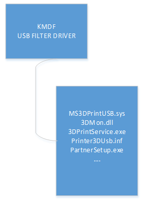
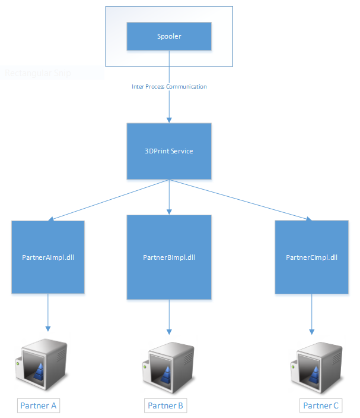
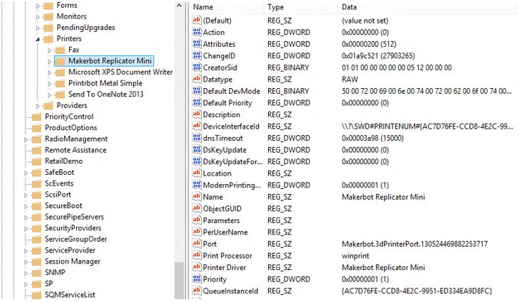

# Enable a custom USB interface for a 3D printer

The architecture described in this topic enables support for custom USB interface 3D printers in the v3 and v4 print ecosystems. A standard port monitor, **3dmon.dll**, forwards 3D print job commands to a **3DPrintService** windows service running with the local service credentials. The service loads and communicates with a partner DLL to execute the custom commands needed for a 3D print job. The partner DLL as well as the **3dmon.dll** and **3dprintservice.exe** redistributables are installed by the device USB driver package. The partner DLL needs to implement and export a set of functions to communicate with the **3DPrintService**. The rest of the required functionality to interact with the print spooler service is implemented in **3dmon.dll**.

**Note** This architecture requires the partner DLL to multi-instance, thread safe.

## Architecture Decisions

The **3DPrintService** windows service is used to load and invoke specific defined APIs in partner-provided DLLs during a print workflow. These APIs will allow for communication with the printer. We will be creating 

The KMDF USB Filter driver packages on windows update which will be available for install via PnP of a supported 3D printer

1.  KMDF USB Filter driver

    This KMDF driver will be responsible for installation of the partner software and creation of a 3D printer device node. This KMDF driver will be published by Partners on Windows Update. The 3D Printer device node will then be installed using a Partner published V4 print driver from windows update.

## Packaging Decisions

### Binaries and Binary Dependencies

The architecture will use a driver published by hardware manufacturer on Windows Update. This driver will include Microsoft provided redistributable binaries: 3dmon.dll, 3dprintservice.exe and ms3dprintusb.sys and their dependencies.

#### Kernel mode USB filter driver

The KMDF driver will be published by the partner and will consist of the components shown in the diagram below. It will match the device via a hardware id, typically a VID&PID. This driver will create a 3D printer device node on installation which triggers installation of the print queue and the slicer drivers. The partner will provide V4 printer drivers for the 3D printer device node created.



##### MS3DPrintUSB.sys

This is the kernel mode device driver that creates the 3D printer dev node under Enum\\3DPrint. It will be invoked by the PnP subsystem via a direct match of the VID & PID based on the device node created by winusb.sys. The INF of the driver sets up the CustomDLL to use as well as sets up the 3dprintservice if it was not already installed on the system.

##### 3dmon.dll

3DMon.dll is a Microsoft published port monitor redistributable binary which be invoked by the spooler to communicate with the 3D printer.

#####  3dprintservice.exe

3DPrintService.exe is a Microsoft published binary which is installed as a Windows Service during driver setup. 3DMon communicates with this service to perform operations like printing, bidi etc. with the 3D printer.

##### Partnerimpl.dll

PartnerImp.dll is the implementation by the partner of the published Microsoft interface. This implementation dll communicates with their device using their protocols. 3DPrintService.exe loads this DLL at runtime to drive the operations of the 3D Printer device.



### Printer usage sequence


1.  The spooler communicates with 3dmon.dll which in turn sends commands to the 3DPrintService windows service.

2.  3DPrintService.exe runs with the account credentials of NetworkService.

3.  Spooler via 3dmon.dll sends commands to the 3DPrintService anytime the 3D printer is used.

4.  3DPrintService in turn processes these commands and invokes the API’s at runtime on the partner provided implementation dlls.

5.  3DPrintService hands off the response from the partner provided dlls back to the spooler

## Interfaces and Interactions

The partner DLL must export the following functions.

### HRESULT Install(\[in\] LPCWSTR args);

This API is generally optional but it can be used by the manufacturer to install any custom software or registration that needs to be done for their device. Examples would be installation of modelling software that was included with the driver package for the device. This API will be invoked with SYSTEM credentials to enable such installation.

### DWORD PrintApiSupported();

This API will be used by the 3rd party manufacturer to indicate the version of the 3D Print Service API’s they support. The API’s described below are compatible with version 1 of the 3DPrintService.

### HRESULT InitializePrint(LPCWSTR pPrinterName, LPCWSTR pPortName, DWORD dwJobId, LPVOID\* ppPartnerData)

This API will be invoked prior to a print starting to initialize the printer. The printer can save any job specific state in the ppPartnerData parameter. This call is analogous to a StartDocPort invocation.

> jobId :- will be the job id used to track the job
>
> portName :- will be the portname for the 3D printer.
>
> printerName :- will be the name of the printer this print job is being sent to.
>
> ppPartnerData :- pointer to pointer that can be used to store any job specific data.

### HRESULT PrintFile(\[in\] DWORD jobId, \[in\] LPWSTR portName, \[in\] LPWSTR printerName, \[in\] LPWSTR pathToRenderedFile,\[in\]LPVOID\* ppPartnerData);

This API will be used by the 3rd party manufacturer to print the document on their printer.

> jobId :- will be the job id used to track the job
>
> portName :- will be the portname for the 3D printer.
>
> printerName :- will be the name of the printer this print job is being sent to.
>
> pathToRenderedFile :- this will be the UNC path to the location of the spooled file after rendering has been performed. The 3<sup>rd</sup> party manufacturer will process the file from this location and print the document on their device.
>
> ppPartnerData:- pointer to pointer that was used to store partner specific data setup during the InitializePrint API call.

The printerName can be obtained from the registry using the port name. 3rd Party manufacturers might not be able to use just the port name to communicate with their device. The printer name is unique on a windows machine and their software will be capable of identifying which printer to print the job on. All printers active on a machine can be found at

HKEY\_LOCAL\_MACHINE\\SYSTEM\\CurrentControlSet\\Control\\Print\\Printers



### HRESULT Query(\_In\_ LPCWSTR command, \_In\_ LPCWSTR commandData, \_Out\_ LPWSTR resultBuffer, \_Out\_ resultBufferSize, , \_In\_ LPVOID\* ppPartnerData)

| Parameter          | Description                                             |
|--------------------|---------------------------------------------------------|
| *Command*          | String command being sent as a Query                    |
| *commandData*      | Any command arguments (optional)                        |
| *resultBuffer*     | Result of invocation of the query argument              |
| *resultBufferSize* | Size of the result buffer string                        |
| *ppPartnerData*    | pointer to pointer for the current partner DLL instance |

The 3dprint service first invokes the partner DLL to get the size of the buffer to allocate for the command. After allocating the memory to hold the response string, the DLL will be invoked again to get the actual result. The DLL can use the instance data from a previous IntializePrint() call to communicate with the device without opening a new communication channel each time the Query() function is called.

This API is used to communicate with the printer to obtain information on the device configuration, print progress or to notify the partner DLL of device unplug events. Shown below are the commands and the commandData that will need to be supported by the manufacturer. With this approach we can add new commands as we evolve to support new requirements.

| Command | CommandData | Output | Comments |
|---------|-------------|--------|--------- |
| Job Commenced = {“Status”: “ok”} | Status to be used on Completion  {“Status”: ”Completed”} | The spooler will display any returned value in the print queue UI. This lets the device display relevant information during a print on the print queue UI. The device can return an arbitrary string here (for example “Busy” or “33% complete”) and this will be displayed verbatim in the print queue job status. |
| [\\\\Printer.3DPrint:JobCancel](file://Printer.3DPrint:JobCancel) |             | {“Status”: ”Completed”}                                           | The spooler will invoke this command when a user cancels a print. The partner DLL returns this value when the cancellation was successful and the handles and threads have been closed.                                                                                                                             |
| \\\\Printer.Capabilities:Data                                     |             | XML string conforming to the PrintDeviceCapabilites (PDC) schema. | The PDC query is invoked by apps that wish to obtain more information about the printer. The data is used to describe the capabilities of the device and can include the slicer settings if the driver relies on the Microsoft slicer. See below for a sample PDC.                                                  |
| \\\\Printer.3DPrint:Disconnect                                    |             | {“Status”: ”OK”}                                                  | This query is triggered whenever there is a PnP disconnection of the printer device. Partners can undertake any required actions, for example close any open handles to allow proper reconnect.                                                                                                                     |
| \\\\Printer.3DPrint:Connect                                       |             | {“Status”:”OK”}                                                   | This query is triggered whenever there is a PnP connection of the printer device. Partners can undertake any required actions.                                                                                                                                                                                      |

#### Sample PDC XML

```
<?xml version="1.0"?>
<PrintDeviceCapabilities
    xmlns:xsi="http://www.w3.org/2001/XMLSchema-instance"
    xmlns:xsd="http://www.w3.org/2001/XMLSchema"
    xmlns:xml="http://www.w3.org/XML/1998/namespace"
    xmlns:psk="http://schemas.microsoft.com/windows/2003/08/printing/printschemakeywords"
    xmlns:psk3d="http://schemas.microsoft.com/3dmanufacturing/2013/01/pskeywords3d"
    xmlns:psk3dx="http://schemas.microsoft.com/3dmanufacturing/2014/11/pskeywords3dextended"
    xmlns:pskv="http://schemas.microsoft.com/3dmanufacturing/2014/11/pskeywordsvendor"
    xmlns:psf="http://schemas.microsoft.com/windows/2003/08/printing/printschemaframework"
    xmlns:psf2="http://schemas.microsoft.com/windows/2013/12/printing/printschemaframework2"
    xmlns="http://schemas.microsoft.com/windows/2013/12/printing/printschemaframework2"
    version="2">
    <CapabilitiesChangeID xsi:type="xsd:string">{9F58AF07-DCB6-4865-8CA3-A52EA5DCB05F}</CapabilitiesChangeID>

  <psk3d:Job3DOutputArea psf2:psftype="Property">
    <psk3d:Job3DOutputAreaWidth>150001</psk3d:Job3DOutputAreaWidth>
    <psk3d:Job3DOutputAreaDepth>150001</psk3d:Job3DOutputAreaDepth>
    <psk3d:Job3DOutputAreaHeight>150001</psk3d:Job3DOutputAreaHeight>
  </psk3d:Job3DOutputArea>

  <psk3d:Job3DMaterials psf2:psftype="Property">

      <psk3dx:MaterialPLA>
         <psk:DisplayName>PLA</psk:DisplayName>
         <psk3d:Job3DMaterialType>psk3d:PLA</psk3d:Job3DMaterialType>
         <psk3d:MaterialColor>#FFFFFFFF</psk3d:MaterialColor>

         <psk3dx:platformtemperature>0</psk3dx:platformtemperature>
         <psk3dx:filamentdiameter>1750</psk3dx:filamentdiameter>
         <psk3dx:filamentcalibrationoverride>1.0</psk3dx:filamentcalibrationoverride>
         <psk3dx:extrudertemperature>207</psk3dx:extrudertemperature>

         <psk3dx:SpeedFactor>1.0</psk3dx:SpeedFactor>

         <psk3dx:SetupCommands>
            <!-- Executed during pre-commands: nozzle pre-heating, priming, etc --> 
            <psk3dx:command>M104 S207 T1</psk3dx:command>
            <psk3dx:command>M140 S50</psk3dx:command>
         </psk3dx:SetupCommands>

         <psk3dx:SelectCommands>
            <!-- Executed during printing: T0/T1 selection, nozzle wiping sequence,turn fan on/off/gradual, retract the material, temperature, etc--> 
            <psk3dx:command>; PLA on</psk3dx:command>
            <psk3dx:command>M108 T1</psk3dx:command>
         </psk3dx:SelectCommands>

         <psk3dx:DeselectCommands>
            <!-- Executed during printing: retract the material, park the nozzle, reduce temperature, etc --> 
            <psk3dx:command>; PLA off</psk3dx:command>
         </psk3dx:DeselectCommands>


      </psk3dx:MaterialPLA>
  </psk3d:Job3DMaterials>

  <psk3dx:customStatus>Slicing</psk3dx:customStatus>
  <psk3dx:userprompt>Confirm the 3D printer is calibrated and ready for the next print</psk3dx:userprompt>

   <!— Additional Slicer settings follow (optional) --> 

</PrintDeviceCapabilities>
```

For 3D printers that do not have on-board display and buttons to allow the user to interact with the device at the beginning of the print, we advocate returning a PDC xml with a suitable user prompt message set as shown above in “psdk3dx:userPrompt”. This is to prevent starting a new print on top of an existing one. The custom status message *&lt;psk3dx:customStatus&gt;* is used to display any message during slicing.

### HRESULT Cleanup(LPCWSTR pPrinterName, LPCWSTR pPortName, DWORD dwJobId, LPVOID\* ppPartnerData)

> dwJobId :- will be the job id used to track the job in the spooler
>
> pPortName:- will be the portname for the 3D printer.
>
> pPrinterName:- will be the name of the printer this print job is being sent to.
>
> ppPartnerData :- pointer to pointer that holds the job specific data setup during an InitializePrint API invocation.

Cleanup is invoked on successful completion of a print job, or on completion of a cancel query on a print job. It provides an opportunity for the Partner dll to cleanup and resources that were initialized for this print.

### HRESULT UnInstall(\[in\]LPCWSTR args);

This API will be called during uninstallation of the 3D Printer device and will provide a mechanism for the 3<sup>rd</sup> party manufacturer to uninstall any software they might have installed.


--------------------
[Send comments about this topic to Microsoft](mailto:wsddocfb@microsoft.com?subject=Documentation%20feedback%20%5Bprint\print%5D:%20Slicer%20settings%20%20RELEASE:%20%289/2/2016%29&body=%0A%0APRIVACY%20STATEMENT%0A%0AWe%20use%20your%20feedback%20to%20improve%20the%20documentation.%20We%20don't%20use%20your%20email%20address%20for%20any%20other%20purpose,%20and%20we'll%20remove%20your%20email%20address%20from%20our%20system%20after%20the%20issue%20that%20you're%20reporting%20is%20fixed.%20While%20we're%20working%20to%20fix%20this%20issue,%20we%20might%20send%20you%20an%20email%20message%20to%20ask%20for%20more%20info.%20Later,%20we%20might%20also%20send%20you%20an%20email%20message%20to%20let%20you%20know%20that%20we've%20addressed%20your%20feedback.%0A%0AFor%20more%20info%20about%20Microsoft's%20privacy%20policy,%20see%20http://privacy.microsoft.com/default.aspx. "Send comments about this topic to Microsoft")

