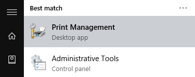
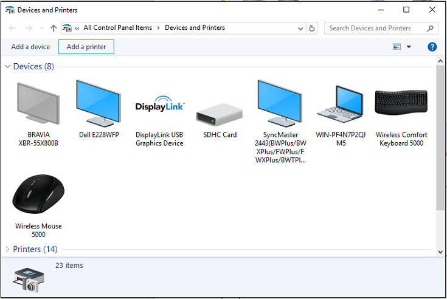
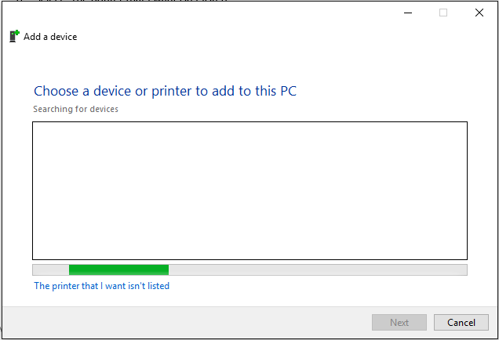
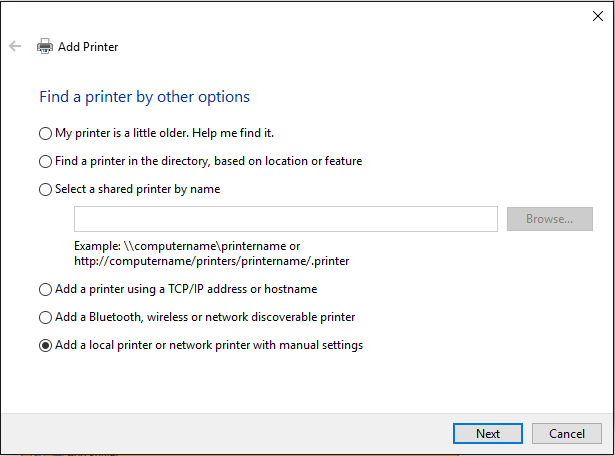
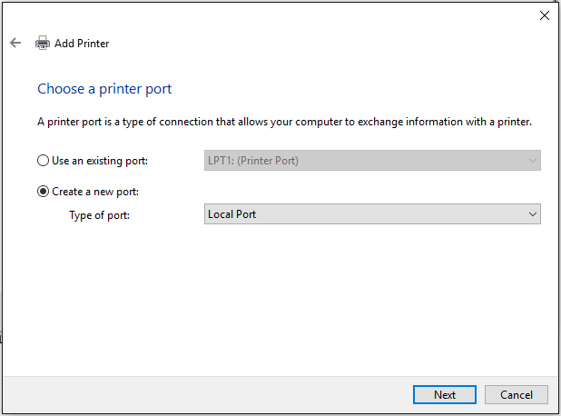
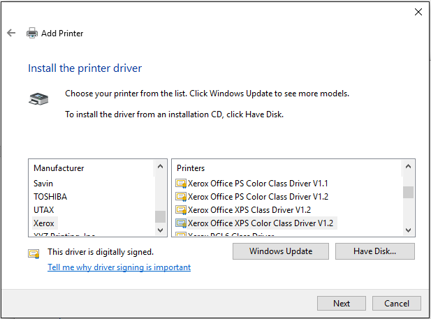
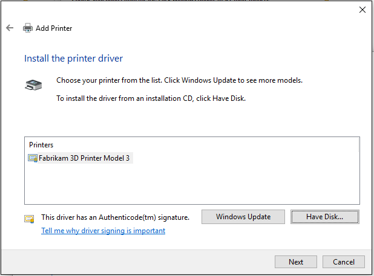
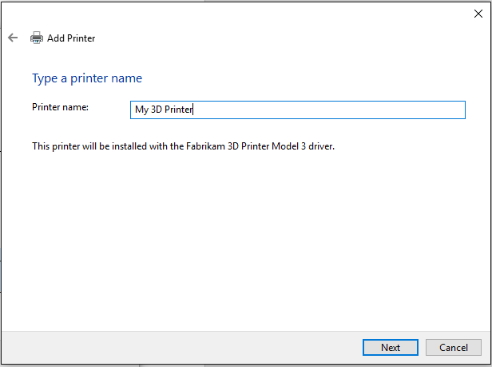

# Driver installation


The print driver provided in this SDK is an experimental 3D printer device driver still under development.

## Driver installation


To install the printer, use the following installation instructions:

- If the 3D printer implements a Microsoft OS descriptor 3DPRINT (“MS\_COMP\_3DPRINT”) or is one of the supported Vendor ID (VID)/Product ID (PID) combinations in the MS3DPrintUSB.inf file, follow the steps in *Automatic installation of the driver via PnP* section below.

- If the 3D printer is experimental or in development, follow the steps in *Install the driver manually* section below to print to an existing COM port or print G-Code to file.

For information on MS_COMP_3DPRINT, see [Getting started guide - Microsoft Standard Driver for 3D Printers](https://msdn.microsoft.com/windows/hardware/drivers/3dprint/microsoft-standard-driver-for-3d-printers-).

For more information on OS descriptors, see [Microsoft OS Descriptors for USB Devices](http://msdn.microsoft.com/library/windows/hardware/ff537430.aspx).

### Automatic installation of the driver via PnP

1.  If the device does not have a MSO descriptor or a supported hardware ID (VID/PID), add the new VID/PID combination to the MS3DPrintUSB\_{architecture}\\MS3DPrintUSB.inf file and restart Windows with advanced settings and driver signing disabled. This option should only be used temporarily and for development purposes.

2.  Execute these two commands from an elevated command prompt:

    ``` syntax
    pnputil -a {PathToSDK}\Bin\MS3DPrintUSB_{architecture}\MS3DPrintUSB.inf
    pnputil -a {PathToSDK}\Bin\RenderFilters_{architecture}\MS3DPrinter.inf
    ```

3.  Plug in the USB serial device. A new **Generic 3D Printer** device should be installed under **Devices and Printers**.

### Install the driver manually

1.  Search for printmanagement.msc in **Cortana**.

    

2.  Expand **Print Servers**, expand the name of your machine, right-click on **Drivers**, then select **Add Driver…**.

    

3.  Click **Next**, select **(x64)**, click **Next**, then click **Have Disk**.

4.  Navigate to the RenderFiltersV4\_x64 folder, select MS3DPrinter.inf, then click **OK**.

5.  Click **OK**, click **Next**, then click **Finish**.

6.  From **Windows Start**, type **Devices and Printers**.

7.  Click **Add a printer**.

    

8.  Select **The printer that I want isn’t listed**.

    

9.  Select **Add a local printer or network printer with manual settings**, then click **Next**.

    

10. Choose **Create a new port** and select **3D Port** for the type of port, then click **Next**.

    

11. Enter a port name and click **OK**.

    

12. Click **Have Disk…**.

    

13. Browse to the generic 3D Print Driver binary package from the SDK and click **OK**.

14. Click **Next**.

    

15. You can change the 3D printer name here if you want (it will show up in the printer UI), then click **Next**, then click **OK** to allow the command to be run as an Administrator.

    

16. After the installation completes, click **Finish**.

 

 


--------------------
[Send comments about this topic to Microsoft](mailto:wsddocfb@microsoft.com?subject=Documentation%20feedback%20%5Bprint\print%5D:%20Driver%20installation%20%20RELEASE:%20%289/2/2016%29&body=%0A%0APRIVACY%20STATEMENT%0A%0AWe%20use%20your%20feedback%20to%20improve%20the%20documentation.%20We%20don't%20use%20your%20email%20address%20for%20any%20other%20purpose,%20and%20we'll%20remove%20your%20email%20address%20from%20our%20system%20after%20the%20issue%20that%20you're%20reporting%20is%20fixed.%20While%20we're%20working%20to%20fix%20this%20issue,%20we%20might%20send%20you%20an%20email%20message%20to%20ask%20for%20more%20info.%20Later,%20we%20might%20also%20send%20you%20an%20email%20message%20to%20let%20you%20know%20that%20we've%20addressed%20your%20feedback.%0A%0AFor%20more%20info%20about%20Microsoft's%20privacy%20policy,%20see%20http://privacy.microsoft.com/default.aspx. "Send comments about this topic to Microsoft")


