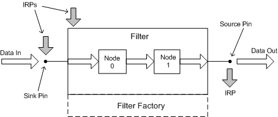

# Audio Filters

## 

A KS filter is a kernel object and is identified by a kernel object handle. In the following figure, the large box in the center is a KS filter that represents an audio device. The data stream flows into the filter from the left, passes through a couple of nodes for processing, and exits the filter on the right. The filter is created by a filter factory, which is shown as a box with dashed edges at the bottom of the filter.

In the figure, two pins are instantiated on the filter. The pin on the left is a data sink, and the pin on the right is a data source. Data flows into the filter through the sink pin and flows out of the filter through the source pin.

By convention, usage of the terms source and sink in KS is buffer-centric (or perhaps, more generally, connection-centric). A data buffer is frequently required at the point at which a source pin on one filter connects to the sink pin of another. The buffer smoothes out irregularities in the rates at which data arrives from the source pin and exits into the sink pin. (Of course, not all connections require buffering. A bufferless connection might occur between two devices on the same adapter card, for example, where the sink and source data rates are more easily matched.)

In contrast, the mixer API's terminology for SRC and DST (source and destination) mixer lines is device-centric:

-   The stream enters a mixer device through the SRC mixer line.

-   The stream exits a mixer device through the DST mixer line.

In other words, a SRC mixer line maps to a data-sink pin on a KS filter, and a DST mixer line maps to a data-source pin. For more information, see [Kernel Streaming Topology to Audio Mixer API Translation](kernel-streaming-topology-to-audio-mixer-api-translation.md).

For the sake of simplicity, the figure omits the filter's pin factories, which create the pin instances.

In addition to being data sinks and data sources, pins and filters can also be IRP sinks and IRP sources. Not only can pins and filters receive IRPs--they can send IRPs as well. The three dark arrows in the figure represent IRPs. The pin on the left side of the figure is an IRP sink. The pin on the right is an IRP source. The figure also shows an IRP being sent to the filter object itself.

 

 

--------------------
[Send comments about this topic to Microsoft](mailto:wsddocfb@microsoft.com?subject=Documentation%20feedback%20[audio\audio]:%20Audio%20Filters%20%20RELEASE:%20%287/18/2016%29&body=%0A%0APRIVACY%20STATEMENT%0A%0AWe%20use%20your%20feedback%20to%20improve%20the%20documentation.%20We%20don't%20use%20your%20email%20address%20for%20any%20other%20purpose,%20and%20we'll%20remove%20your%20email%20address%20from%20our%20system%20after%20the%20issue%20that%20you're%20reporting%20is%20fixed.%20While%20we're%20working%20to%20fix%20this%20issue,%20we%20might%20send%20you%20an%20email%20message%20to%20ask%20for%20more%20info.%20Later,%20we%20might%20also%20send%20you%20an%20email%20message%20to%20let%20you%20know%20that%20we've%20addressed%20your%20feedback.%0A%0AFor%20more%20info%20about%20Microsoft's%20privacy%20policy,%20see%20http://privacy.microsoft.com/default.aspx. "Send comments about this topic to Microsoft")

