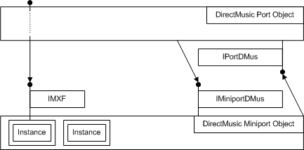

# DirectMusic Miniport Driver Interface

## 

The DMus miniport driver interface is based on the MIDI miniport driver interface, but it adds the following extensions to support advanced synthesizers:

-   DLS downloads greater than 16 channels per instance

-   Sequencing of note events in hardware

The DMus miniport driver interface differs from the MIDI miniport driver interface in several ways. A DMus miniport driver implements the interface [IMiniportDMus](https://msdn.microsoft.com/library/windows/hardware/ff536699) as opposed to [IMiniportMidi](https://msdn.microsoft.com/library/windows/hardware/ff536703). This interface is similar to **IMiniportMidi**, but the [**IMiniportDMus::NewStream**](https://msdn.microsoft.com/library/windows/hardware/ff536701) method creates an [IMXF](https://msdn.microsoft.com/library/windows/hardware/ff536782) (MIDI transform filter) interface and connects to an [IAllocatorMXF](https://msdn.microsoft.com/library/windows/hardware/ff536491) interface in the DMus port driver, as opposed to implementing an [IMiniportMidiStream](https://msdn.microsoft.com/library/windows/hardware/ff536704) interface. **IAllocatorMXF** and **IMXF** wrap the standard **GetMessage** and **PutMessage** calls (see [**IAllocatorMXF::GetMessage**](https://msdn.microsoft.com/library/windows/hardware/ff536494) and [**IMXF::PutMessage**](https://msdn.microsoft.com/library/windows/hardware/ff536791)). These calls deal with packaged events rather than with raw MIDI bytes.

The DMus miniport driver for a synthesizer can implement some or all of the DirectMusic properties. These properties allow the system to manage DLS downloads and channel allocations for the device. The dmusprop.h header file defines DirectMusic-specific property items. For a list of these properties, see [KSPROPSETID\_Synth](https://msdn.microsoft.com/library/windows/hardware/ff537486) and [KSPROPSETID\_Synth\_Dls](https://msdn.microsoft.com/library/windows/hardware/ff537488).

DMus miniport drivers are expected to allow the creation of multiple pin instances. Each pin instance acts as one virtual synthesizer and contains a set of channels and DLS downloads independent of the other pin instances.

Some of the synth properties described in [Audio Drivers Property Sets](https://msdn.microsoft.com/library/windows/hardware/ff536197) act on a pin instance, and others are global. To process the global properties, the synthesizer must have a synthesizer node in its topology. The description of each property item indicates whether that item is sent to the synthesizer node or to a pin instance. For each piece of hardware supporting synthesis, there exists a port driver object and a miniport driver object, as shown in the following figure.

The port driver object exposes one instance of an [IPortDMus](https://msdn.microsoft.com/library/windows/hardware/ff536879) interface, which is held by the miniport driver object. The miniport driver exports one instance of an **IMiniportDMus** interface, which is held by the port driver. For every instantiated pin, the port driver requests a matching **IMXF** interface. Communication between the system and this instance is the combination of property requests addressed to the pin and events flowing to or from the **IMXF** stream interface.

Two objects must be passed to the miniport driver when it is created:

-   Clock

-   Allocator object

The clock is very important for render and capture operations. The miniport driver needs to render notes at their specified times; when the miniport driver reads in MIDI data, it needs to know the time so it can time-stamp the kernel event. For more information, see [Latency Clocks](latency-clocks.md).

The [allocator](allocator.md) object, which has an **IAllocatorMXF** interface, is used as a memory pool to recycle memory. All MIDI messages in the system are allocated from this common pool. The allocator object should be used to create or destroy the individual messages.

This section includes:

[MIDI Transport](midi-transport.md)

[Latency Clocks](latency-clocks.md)

[Miniport Driver Property Item Requests](miniport-driver-property-item-requests.md)

[Making PortDMus the Default DirectMusic Port Driver](making-portdmus-the-default-directmusic-port-driver.md)

[Exposing Your Synthesizer as a Legacy Device](exposing-your-synthesizer-as-a-legacy-device.md)

 

 

[Send comments about this topic to Microsoft](mailto:wsddocfb@microsoft.com?subject=Documentation%20feedback%20[audio\audio]:%20DirectMusic%20Miniport%20Driver%20Interface%20%20RELEASE:%20%287/18/2016%29&body=%0A%0APRIVACY%20STATEMENT%0A%0AWe%20use%20your%20feedback%20to%20improve%20the%20documentation.%20We%20don't%20use%20your%20email%20address%20for%20any%20other%20purpose,%20and%20we'll%20remove%20your%20email%20address%20from%20our%20system%20after%20the%20issue%20that%20you're%20reporting%20is%20fixed.%20While%20we're%20working%20to%20fix%20this%20issue,%20we%20might%20send%20you%20an%20email%20message%20to%20ask%20for%20more%20info.%20Later,%20we%20might%20also%20send%20you%20an%20email%20message%20to%20let%20you%20know%20that%20we've%20addressed%20your%20feedback.%0A%0AFor%20more%20info%20about%20Microsoft's%20privacy%20policy,%20see%20http://privacy.microsoft.com/default.aspx. "Send comments about this topic to Microsoft")

