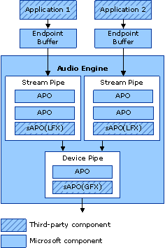

# Exploring the Windows Vista Audio Engine


This topic presents an overview of the Windows Vista audio engine. It focuses on concepts that will help you understand how APOs and sAPOs work together.

The following diagram presents a simplified layout of the internal structure of the audio engine.



As the diagram shows, system-supplied APOs and sAPOs are the basic building blocks of the audio engine. The audio engine configures the system-supplied APOs and sAPOs into components called pipes. There are two types of pipes in the audio engine:

-   Stream pipes are made up of APOs and sAPOs that perform digital audio processing that is local to the stream from a single application. The sAPO in this type of pipe is referred to as local effects sAPO (LFX sAPO).

-   Device pipes are made up of APOs and sAPOs that perform digital audio processing that affects all the streams globally. The sAPO in this type of pipe is called a global effects sAPO (GFX sAPO).

Be aware that a GFX sAPO is not the same as a [GFX Filter](gfx-filters.md). A GFX sAPO is an sAPO whose processing algorithm globally affects the audio streams from all the applications that channel their audio data through the audio engine.

In contrast with a GFX sAPO, which is a COM-based component, a GFX filter is packaged as an [AVStream minidriver](https://msdn.microsoft.com/library/windows/hardware/ff560765) with an associated INF file. Additionally, a typical GFX filter implements a digital signal transformation that is designed for a specific audio hardware device (for example, to compensate for the response characteristics of a particular set of speakers).

The following table shows the sAPOs that are available in the Windows Vista audio engine and the type of system effects that they apply.

<table>
<colgroup>
<col width="50%" />
<col width="50%" />
</colgroup>
<thead>
<tr class="header">
<th align="left">Windows Vista sAPO</th>
<th align="left">System effect</th>
</tr>
</thead>
<tbody>
<tr class="odd">
<td align="left"><p>Bass Boost</p></td>
<td align="left"><p>LFX</p></td>
</tr>
<tr class="even">
<td align="left"><p>Bass Management</p></td>
<td align="left"><p>LFX</p></td>
</tr>
<tr class="odd">
<td align="left"><p>Loudness Equalization</p></td>
<td align="left"><p>LFX</p></td>
</tr>
<tr class="even">
<td align="left"><p>Low Frequency Protection</p></td>
<td align="left"><p>LFX</p></td>
</tr>
<tr class="odd">
<td align="left"><p>Speaker Fill</p></td>
<td align="left"><p>LFX</p></td>
</tr>
<tr class="even">
<td align="left"><p>Speaker Phantoming</p></td>
<td align="left"><p>LFX</p></td>
</tr>
<tr class="odd">
<td align="left"><p>Virtual Surround</p></td>
<td align="left"><p>LFX</p></td>
</tr>
<tr class="even">
<td align="left"><p>Virtualized Surround over Headphones</p></td>
<td align="left"><p>LFX</p></td>
</tr>
<tr class="odd">
<td align="left"><p>Enhanced Sound for Portable Computers</p></td>
<td align="left"><p>GFX</p></td>
</tr>
<tr class="even">
<td align="left"><p>Room Correction</p></td>
<td align="left"><p>GFX</p></td>
</tr>
</tbody>
</table>

 

When an audio application initiates audio processing, the audio engine configures the system-supplied APOs and the sAPOs into an audio graph to process the digital audio data. The mechanism the audio engine uses for building the audio graph is a system detail and will not be discussed.

The audio application can initiate the connection in shared mode or exclusive mode. Although a default set of sAPOs is installed with Windows Vista, sAPOs are not considered to be system components and are therefore customizable.

### <span id="shared_mode"></span><span id="SHARED_MODE"></span>Shared mode

In shared mode, an audio application shares the audio hardware with other audio applications that are running in other processes. The audio engine mixes the streams from these applications and plays the resulting mix through the hardware. Any application that opens a stream in shared mode must select the mix format that is used by the audio engine. The advantage of using shared mode is that the Windows Vista audio engine provides a built-in Audio Processing Object (APO) to provide the necessary supporting functionality. The disadvantage of using shared mode is that audio stream latency is higher than it is in exclusive mode. The following code example shows the syntax for initializing an audio stream in shared mode.

```cpp
 hResult = pAudioClient->Initialize(
        AUDCLNT_SHAREMODE_SHARED, 
        0,
        0,
        0,
 pWfx,
        &m_SubmixGuid);
```

### <span id="exclusive_mode"></span><span id="EXCLUSIVE_MODE"></span>Exclusive mode

In contrast, when an application opens a stream in exclusive mode, the application has exclusive access to the audio hardware. In this mode the application can select any audio format that the endpoint supports. The advantage of using exclusive mode is that audio stream latency is lower than it is in shared mode. The disadvantage of using exclusive mode is that you must provide your own APO to handle the supporting functionality of the audio engine. Only a small number of professional level applications require this mode of operation. The following code example shows the syntax for initializing an audio stream in exclusive mode.

```cpp
 hResult = pAudioClient->Initialize(
            AUDCLNT_SHAREMODE_EXCLUSIVE,
            0,
            0,
            0,  
 pWfxEx,
            &m_SubmixGuid);
```

After an application initiates audio processing, the graph builder configures the sAPOs into an audio graph and also initializes the sAPOs. The audio service then negotiates with the LFX sAPO to establish the format for the audio data at the input and output of the sAPO. For more information, see [Format Negotiation](format-negotiation.md).

 

 


