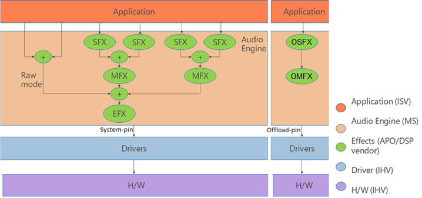

# Implementing Hardware Offloaded APO Effects


In Windows 10, version 1511 and later, offloading of audio processing objects (APOs) is supported. In addition to possible performance enhancements, there are significant possible power savings available when using hardware offloaded APOs.

Two types of APOs can be loaded during hardware offload playback.

1. Offload Stream Effects (OSFX)
2. Offload Mode Effects (OMFX)
## <span id="Hardware_Offloaded_APO_Effects_Overview"></span><span id="hardware_offloaded_apo_effects_overview"></span><span id="HARDWARE_OFFLOADED_APO_EFFECTS_OVERVIEW"></span>Hardware Offloaded APO Effects Overview


**Hardware Offloaded Audio Processing and Hardware Offloaded APOs**

In Windows 8, the audio engine has been redesigned to work with audio streams that have been offloaded to a hardware device that is separate from, but connected to, the computer's main audio system. This is referred to as hardware offloading. For more information, see [Hardware-Offloaded Audio Processing](hardware-offloaded-audio-processing.md).

The hardware offloading feature is primarily targeted for low power scenarios with larger buffer sizes. For example, during Low Power Audio (LPA) playback in the capable systems, the audio buffer size or periodicity is set to 1 second so that the CPU doesn’t wake up frequently to process small buffers (e.g., at every 10 milliseconds).

Implementing hardware offloaded APOs along with hardware offloaded audio processing provides the ability to maximize power efficiency.

The following diagram shows the audio processing objects architecture. The right side of the diagram shows an application communicating down to hardware offloaded OSFX and OMFX effects.



## <span id="Implementing_Hardware_Offloaded_APO_Effects"></span><span id="implementing_hardware_offloaded_apo_effects"></span><span id="IMPLEMENTING_HARDWARE_OFFLOADED_APO_EFFECTS"></span>Implementing Hardware Offloaded APO Effects


A hardware offloaded APO must follow the same basic requirements and design principles described in [Audio Processing Object Architecture](audio-processing-object-architecture.md) and [Implementing Audio Processing Objects](implementing-audio-processing-objects.md).

**Supported Audio Format Implementation Guidelines**

For hardware offloaded APOs, some additional consideration must be given to supported audio formats.

Each APO implements [**IAudioProcessingObject::IsInputFormatSupported**](https://msdn.microsoft.com/library/windows/hardware/ff536511) method which is used during audio graph building to determine the output audio format and whether any format conversion is needed.

```
HRESULT IsInputFormatSupported(
  [in, optional]  IAudioMediaType *pOppositeFormat,
  [in, optional]  IAudioMediaType *pRequestedInputFormat,
  [out, optional] IAudioMediaType **ppSupportedInputFormat
);
```

Offload render endpoint can support a variety of formats including the default format supported by the host/system pin rendering. An Offload APO should support all of these formats so that rendering streams (with the supported formats) don’t have to go through any additional format conversion.

An offload SFX can implement format conversions and accept a broader range of formats. For example, if the Offload SFX provides headphone virtualizations (i.e., convert 5.1 channel audio to stereo), then it should return S\_OK for the appropriate input/output pair in this method.

An offload SFX should review the offload pin supported formats and support/extend the capabilities together.

Offload MFX cannot change the format of the input stream, but it still needs to support the variety of formats offered by the offload endpoint and eliminate any unnecessary format conversion.

During rendering in the offload pin, only one stream is active and there is no mixing of streams. So, processing the audio at both stream-level and mode-level is not necessary. Thus audio effects should not be enabled as both a stream effect and mode effect.

**INF file entries**

Implement the following INF file entries to define the effects that will be loaded during offload playback. The INF file property key instructs the audio endpoint builder to set the CLSIDs for offloaded APOs into the effects property store. This information is used to build the audio graph that will be used to inform upper level apps what effects are in place.

|                                                                                                                                  |                                           |
|----------------------------------------------------------------------------------------------------------------------------------|-------------------------------------------|
| **Property Key**                                                                                                                 | **GUID**                                  |
| [PKEY\_FX\_Offload\_StreamEffectClsid](https://msdn.microsoft.com/library/windows/hardware/mt604869)                                                  | {D04E05A6-594B-4FB6-A80D-01AF5EED7D1D},11 |
| [PKEY\_FX\_Offload\_ModeEffectClsid](https://msdn.microsoft.com/library/windows/hardware/mt604868)                                                      | {D04E05A6-594B-4FB6-A80D-01AF5EED7D1D},12 |
| [PKEY\_SFX\_Offload\_ProcessingModes\_Supported\_For\_Streaming](https://msdn.microsoft.com/library/windows/hardware/mt604871) | {D3993A3F-99C2-4402-B5EC-A92A0367664B},11 |
| [PKEY\_MFX\_Offload\_ProcessingModes\_Supported\_For\_Streaming](https://msdn.microsoft.com/library/windows/hardware/mt604870) | {D3993A3F-99C2-4402-B5EC-A92A0367664B},12 |

 

## <span id="related_topics"></span>Related topics


[Implementing Audio Processing Objects](implementing-audio-processing-objects.md)

[Windows Audio Processing Objects](windows-audio-processing-objects.md)

 

 

[Send comments about this topic to Microsoft](mailto:wsddocfb@microsoft.com?subject=Documentation%20feedback%20[audio\audio]:%20Implementing%20Hardware%20Offloaded%20APO%20Effects%20%20RELEASE:%20%287/18/2016%29&body=%0A%0APRIVACY%20STATEMENT%0A%0AWe%20use%20your%20feedback%20to%20improve%20the%20documentation.%20We%20don't%20use%20your%20email%20address%20for%20any%20other%20purpose,%20and%20we'll%20remove%20your%20email%20address%20from%20our%20system%20after%20the%20issue%20that%20you're%20reporting%20is%20fixed.%20While%20we're%20working%20to%20fix%20this%20issue,%20we%20might%20send%20you%20an%20email%20message%20to%20ask%20for%20more%20info.%20Later,%20we%20might%20also%20send%20you%20an%20email%20message%20to%20let%20you%20know%20that%20we've%20addressed%20your%20feedback.%0A%0AFor%20more%20info%20about%20Microsoft's%20privacy%20policy,%20see%20http://privacy.microsoft.com/default.aspx. "Send comments about this topic to Microsoft")


