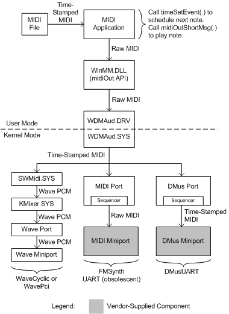
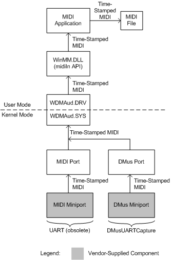
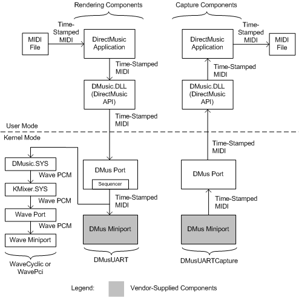

# MIDI and DirectMusic Components

## 

Application programs rely on a combination of user- and kernel-mode components to capture and play back MIDI and DirectMusic streams.

An application can use either of the following software interfaces for MIDI playback and capture:

-   Microsoft Windows Multimedia **midiOut***Xxx* and **midiIn***Xxx* functions

-   DirectMusic API

The behavior of the **midiOut***Xxx* and **midiIn***Xxx* functions is based on the capabilities of legacy MIDI drivers and devices. Beginning with Windows 98, the [WDMAud system driver](user-mode-wdm-audio-components.md#wdmaud_system_driver) translates calls to these functions into commands to WDM audio drivers. However, by emulating the behavior of older software and hardware, the **midiOut***Xxx* and **midiIn***Xxx* functions sacrifice the precision timing and enhanced functionality that are now available through the DirectMusic API. For more information about DirectMusic and the Windows Multimedia MIDI functions, see the Microsoft Windows SDK documentation.

DirectMusic and the Windows Multimedia MIDI functions are clients of the [SysAudio system driver](kernel-mode-wdm-audio-components.md#sysaudio_system_driver), which builds the audio filter graphs that process the MIDI and DirectMusic streams. Graph building is transparent to the applications that use these software interfaces.

### MIDI Components

The following figure shows the user-mode and kernel-mode components that a MIDI application uses to *play back* MIDI data. This application interfaces to the WDM audio drivers through the **midiOut***Xxx* functions, which are implemented in the [WinMM system component](user-mode-wdm-audio-components.md#winmm_system_component), Winmm.dll.

The MIDI application in the preceding figure reads time-stamped MIDI events from a MIDI file and plays them. The MIDI and DMus miniport drivers are shown as darkened boxes to indicate that they can be vendor-supplied components. If appropriate, a vendor might choose to use one of the system-supplied miniport drivers--FMSynth, UART, or DMusUART--instead of writing a custom miniport driver. All of the other components in the figure are system-supplied.

The main loop of a typical MIDI-playback application calls **timeSetEvent** to schedule the next note-on or note-off event. This call takes as one of its parameters a function pointer to the application's callback routine. When the event occurs and the operating system calls the callback routine, this routine calls **midiOutShortMsg** to turn on or turn off one or more scheduled notes. The **midiOutShortMsg** function stores the MIDI messages in page-locked data buffers to eliminate the need to page-in this memory during a call. For more information about the **timeSetEvent** and **midiOutShortMsg** calls, see the Microsoft Windows SDK documentation.

WDMAud, which consists of both user- and kernel-mode components (Wdmaud.drv and Wdmaud.sys), records the times at which the raw MIDI messages from the **midiOutShortMsg** calls arrive. WDMAud combines these time stamps with the MIDI messages to generate the MIDI stream that it sends to one of the kernel-mode components that appear below WDMAud in the figure.

When building the audio filter graph for the MIDI application, SysAudio selects only one of the three possible connections -- to SWMidi, the MIDI port, or the DMus port driver -- that appear in the preceding figure. If the application selects the default MIDI device, SysAudio first looks for a synthesizer device whose MIDI or DMus miniport driver has a MIDI pin. If it finds no such device in the registry, SysAudio will instead use the [SWMidi system driver](kernel-mode-wdm-audio-components.md#swmidi_system_driver) (Swmidi.sys). SWMidi is a KS filter that implements a wavetable synth in software, and it requires only a device that can render a wave audio stream.

SWMidi mixes all of its voices together to produce a single wave PCM stream, which it outputs to the [KMixer system driver](kernel-mode-wdm-audio-components.md#kmixer_system_driver). KMixer, in turn, passes a PCM-formatted wave stream to a WaveCyclic or WavePci device, whose port and miniport drivers appear at the lower-left corner of the figure. Alternatively, KMixer can pass its output stream to a USB audio device that is controlled by the [USBAudio class system driver](kernel-mode-wdm-audio-components.md#usbaudio_class_system_driver) (not shown in figure).

In the preceding figure, the MIDI port driver takes the time-stamped MIDI stream from WDMAud and converts it to raw MIDI messages, which the MIDI miniport driver plays through the synthesizer device. The MIDI port driver contains a sequencer, which is implemented in software and is able to schedule the raw MIDI messages with a timer resolution of one millisecond.

The DMus port driver is able to achieve a much higher timing accuracy than the MIDI port driver if the synthesizer device contains a hardware sequencer. In this case, the DMus miniport driver should specify a hardware buffer that is large enough to absorb the jitter resulting from competition for CPU time with ISRs (interrupt service routines) and other high-priority operations. The time stamps in the MIDI stream that the DMus port driver outputs to the miniport driver are 64-bit values with 100-nanosecond resolution.

If the DMusic synth does not have a hardware sequencer, it must rely on the DMus port driver's software sequencer, which, like the MIDI port driver's, has a timer resolution of one millisecond.

An adapter driver creates a MIDI or DMus port driver by calling [**PcNewPort**](https://msdn.microsoft.com/library/windows/hardware/ff537715) with a GUID value of **CLSID\_PortMidi** or **CLSID\_PortDMus**, respectively. In Windows XP and later, the MIDI and DMus port drivers share the same software implementation.

Appearing at the bottom of the preceding figure are the names of the system-supplied miniport drivers FMSynth, UART, and DMusUART, which are included in Portcls.sys. An adapter driver creates one of these miniport drivers by calling [**PcNewMiniport**](https://msdn.microsoft.com/library/windows/hardware/ff537714). FMSynth and UART provide [IMiniportMidi](https://msdn.microsoft.com/library/windows/hardware/ff536703) interfaces, and DMusUART provides an [IMiniportDMus](https://msdn.microsoft.com/library/windows/hardware/ff536699) interface. Note that UART is now obsolete (after Windows 98 Gold) and is supported only for existing drivers. New adapter drivers should instead use DMusUART (in Windows 98 SE and later, and in Windows 2000 and later), which implements a superset of UART's functionality. DMusUART is an example of a DMus miniport driver that supports neither DLS downloads nor hardware sequencing. The source code for the FMSynth and DMusUART miniport drivers is available in the sample audio drivers in the Windows Driver Kit (WDK).

The following figure shows the user-mode and kernel-mode components that a MIDI application program uses to *capture* MIDI data. This application interfaces to the WDM audio drivers through the **midiIn***Xxx* functions.

In the preceding figure, the MIDI and DMus miniport drivers are shown as darkened boxes to indicate that they can be vendor-supplied components. If appropriate, a vendor might instead choose to use one of the system-supplied miniport drivers, UART or DMusUARTCapture. All of the other components in the figure are system-supplied.

The source of the MIDI data is typically an MPU-401 device. By calling **PcNewMiniport**, an adapter driver can create one of the system-supplied miniport drivers, UART or DMusUARTCapture, to capture MIDI data from a MPU-401 device. Again, UART is obsolete, and new drivers instead should use DMusUARTCapture (in Windows 98 SE and later, and in Windows 2000 and later).

Each time a MIDI note-on or note-off event occurs, the MIDI or DMusic capture miniport driver (at the bottom of the preceding figure) adds a time stamp to the MIDI message before adding it to the MIDI stream that flows to the MIDI or DMus port driver.

The MIDI or DMusic capture port driver outputs a time-stamped MIDI stream to Wdmaud.sys, the kernel-mode half of the WDMAud system driver. The user-mode half, Wdmaud.drv, outputs the time-stamped MIDI stream to the application program through the **midiIn***Xxx* functions, which are implemented in Winmm.dll.

The MIDI application at the top of the figure writes time-stamped MIDI events to a MIDI file. At the time that the application calls **midiInOpen** to open the MIDI input stream, it passes in a function pointer to its callback routine. When a note-on or note-off event occurs, the operating system calls the callback routine with a data block that includes one or more time-stamped MIDI messages. The time stamps on these messages are essentially the same ones that the MIDI or DMus miniport driver originally generated.

### DirectMusic Components

The following figure shows the user- and kernel-mode components that are used by a DirectMusic application program to *play back* or *capture* MIDI data.

The playback components are shown in the left half of the preceding figure, and capture components appear on the right. The DMus miniport drivers are shown as darkened boxes to indicate that they can be vendor-supplied components. If appropriate, a vendor can instead use one of the system-supplied miniport drivers, DMusUART or DMusUARTCapture. The other components in the figure are system-supplied.

In the top left corner of the figure, a DirectMusic application directs a time-stamped MIDI stream from a file to the user-mode [DirectMusic system component](user-mode-wdm-audio-components.md#directmusic_system_component) (DMusic.dll), which in turn directs the stream to a DMus port driver. This driver can be bound to the miniport driver for a DirectMusic synth or MPU-401 device, if one is available. Alternatively, the port driver can be bound to the [DMusic system driver](kernel-mode-wdm-audio-components.md#dmusic_system_driver) (Dmusic.sys), which is a system-supplied DMus miniport driver that implements a DLS-capable wavetable synth in software, and that only requires a device that can render a wave audio stream.

Like SWMidi, the DMusic driver, Dmusic.sys, mixes all of its voices together to produce a single PCM-formatted wave stream, which it outputs to KMixer. KMixer, in turn, can pass a wave stream to a wave device, whose port and miniport drivers appear at the lower-left corner of the figure, or to a USB audio device that is controlled by the USBAudio system driver, which does not appear in the figure.

The DirectMusic capture components appear in the right half of the preceding figure. The DMusic capture miniport driver in the lower-right corner of the figure controls the capture hardware and time-stamps each MIDI message that it records. The DMus port driver directs the time-stamped MIDI stream to the user-mode DirectMusic component, DMusic.dll. The application accesses this stream through the DirectMusic API and writes the time-stamped MIDI data to a file.

An adapter driver can use the system-supplied DMusUARTCapture miniport driver to control an MPU-401 capture device. The adapter driver creates this miniport driver by calling **PcNewMiniport** with GUID value **CLSID\_DMusUARTCapture**. The resulting miniport driver object supports an **IMiniportDMus** interface. The source code for the DMusUARTCapture miniport driver is available in the sample audio drivers in the Windows Driver Kit (WDK).

A DirectMusic application can also run through a **midiOut***Xxx* device such as SWMidi (Swmidi.sys) if it chooses to. For simplicity, this path is omitted from the preceding figure. The DMusic driver (Dmusic.sys) requires an initial DLS download in order to operate correctly; using SWMidi avoids this requirement.

 

 

