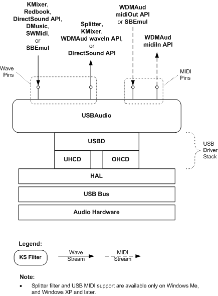

# Rendering and Capturing Audio Content by Using the USBAudio Driver

## 

The following figure shows how the [USBAudio class system driver](kernel-mode-wdm-audio-components.md#usbaudio-class-system-driver) is configured to render and capture audio content. In this figure, the USBAudio driver sprouts pins to represent the terminals on the USB Audio device. Audio components such as KMixer, WDMAud, and DirectSound connect to these pins to render output streams or capture input streams.

See the following for a description of the Microsoft Windows Driver Model (WDM) audio components:

[DirectSound System Component](user-mode-wdm-audio-components.md#directsound-system-component)

[WDMAud System Driver](user-mode-wdm-audio-components.md#wdmaud-system-driver)

[SBEmul System Driver](kernel-mode-wdm-audio-components.md#sbemul-system-driver)

[KMixer System Driver](kernel-mode-wdm-audio-components.md#kmixer-system-driver)

[Redbook System Driver](kernel-mode-wdm-audio-components.md#redbook-system-driver)

[Splitter System Driver](kernel-mode-wdm-audio-components.md#splitter-system-driver)

[SWMidi System Driver](kernel-mode-wdm-audio-components.md#swmidi-system-driver)

[DMusic System Driver](kernel-mode-wdm-audio-components.md#dmusic-system-driver)

See the following for more detail about the filter graphs located above the USBAudio driver:

[Rendering and Capturing Wave Content](rendering-and-capturing-wave-content.md)

[Rendering and Capturing MIDI Content](rendering-and-capturing-midi-content.md)

 

 

[Send comments about this topic to Microsoft](mailto:wsddocfb@microsoft.com?subject=Documentation%20feedback%20[audio\audio]:%20Rendering%20and%20Capturing%20Audio%20Content%20by%20Using%20the%20USBAudio%20Driver%20%20RELEASE:%20%287/18/2016%29&body=%0A%0APRIVACY%20STATEMENT%0A%0AWe%20use%20your%20feedback%20to%20improve%20the%20documentation.%20We%20don't%20use%20your%20email%20address%20for%20any%20other%20purpose,%20and%20we'll%20remove%20your%20email%20address%20from%20our%20system%20after%20the%20issue%20that%20you're%20reporting%20is%20fixed.%20While%20we're%20working%20to%20fix%20this%20issue,%20we%20might%20send%20you%20an%20email%20message%20to%20ask%20for%20more%20info.%20Later,%20we%20might%20also%20send%20you%20an%20email%20message%20to%20let%20you%20know%20that%20we've%20addressed%20your%20feedback.%0A%0AFor%20more%20info%20about%20Microsoft's%20privacy%20policy,%20see%20http://privacy.microsoft.com/default.aspx. "Send comments about this topic to Microsoft")

