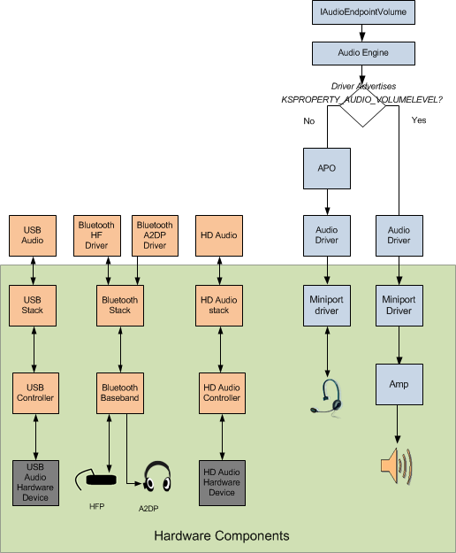

# Software Volume Control Support

In Windows Vista and later, software volume support is provided for audio hardware that does not include and amplifier with an associated physical volume control.

The following diagram shows a simplified representation of the Windows software volume support.

The diagram shows two separate audio data paths. One when an amplifier is present and one when the Windows APO software volume control is used. If an amplifier is present, the driver advertises, KSPROPERTY\_AUDIO\_VOLUMELEVEL. If the audio driver does not indicate that it supports KSPROPERTY\_AUDIO\_VOLUMELEVEL, the Windows audio engine creates a software volume control APO.

On a typical PC, only one of these data paths will be present, since there will typically be one set of audio components in the computer. The two paths are shown here for illustrative purposes.

The [**IAudioEndpointVolume**](coreaudio.iaudioendpointvolume) interface represents the volume controls on the audio stream to or from an audio endpoint device.

If Bluetooth or USB audio is present, their volume controls will be controlled separately.

## Data path with amplifier present

When a client application calls the [**IAudioEndpointVolume**](coreaudio.iaudioendpointvolume) interface in a configuration where there is an amplifier and a physical volume control present, the audio driver exposes a KSNODETYPE\_VOLUME node in the topology filter. The presence of the volume node makes **IAudioEndpointVolume** aware that the volume level of the audio signal will be modified by the hardware.

## Data path with no amplifier present

When there is no amplifier present, [**IAudioEndpointVolume**](coreaudio.iaudioendpointvolume) works with the audio engine to initialize the Windows software volume support APO.

Since there is no physical volume control to be modeled, a KSNODETYPE\_VOLUME node is not exposed in the topology filter. Volume attenuation and gain are performed by the APO software volume support component.

For information about the volume ranges and the default volume levels for the different versions of Windows, see [Default Audio Volume Settings](default-audio-volume-settings.md).

 

 

[Send comments about this topic to Microsoft](mailto:wsddocfb@microsoft.com?subject=Documentation%20feedback%20[audio\audio]:%20Software%20Volume%20Control%20Support%20%20RELEASE:%20%287/14/2016%29&body=%0A%0APRIVACY%20STATEMENT%0A%0AWe%20use%20your%20feedback%20to%20improve%20the%20documentation.%20We%20don't%20use%20your%20email%20address%20for%20any%20other%20purpose,%20and%20we'll%20remove%20your%20email%20address%20from%20our%20system%20after%20the%20issue%20that%20you're%20reporting%20is%20fixed.%20While%20we're%20working%20to%20fix%20this%20issue,%20we%20might%20send%20you%20an%20email%20message%20to%20ask%20for%20more%20info.%20Later,%20we%20might%20also%20send%20you%20an%20email%20message%20to%20let%20you%20know%20that%20we've%20addressed%20your%20feedback.%0A%0AFor%20more%20info%20about%20Microsoft's%20privacy%20policy,%20see%20http://privacy.microsoft.com/en-us/default.aspx. "Send comments about this topic to Microsoft")

