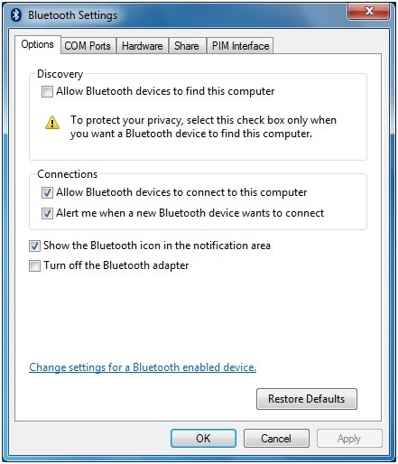

# Bluetooth User Interface

## What is the Bluetooth File Transfer Wizard?

The Bluetooth File Transfer Wizard enables users to transfer files between a computer and a Bluetooth device. For example, users can transfer files between a computer and a mobile phone or a personal digital assistant (PDA). The Bluetooth File Transfer Wizard can also transfer files between two computers that support Bluetooth.

**Note**  The default GUI that the Bluetooth File Transfer Wizard uses is implemented in the Fsquirt.exe file. This file can be unhooked from the underlying transfer wizard mechanism to enable replacement of the default Bluetooth File Transfer Wizard GUI. For more information, see the following question.

 

## How do I unhook Fsquirt.exe?

Software developers that desire to replace the in-box Bluetooth File Transfer Wizard with a proprietary application can unhook Fsquirt.exe from the underlying transfer wizard mechanism by performing the following steps:

1.  Create a DWORD value that is named **DisableFsquirt** under the HKLM\\System\\CurrentControlSet\\Services\\Bthport\\Parameters key in the registry.
2.  Set the value of **DisableFsquirt** to 0x1
3.  Either reboot or run the following command in a command prompt window: **fsquirt.exe -UnRegister**

To re-enable Fsquirt.exe, perform the following steps:

1.  Delete the **DisableFsquirt** value from the registry.
2.  Reboot or run the following command in a command prompt window: **fsquirt.exe -Register**

## In Windows Vista, why does the Bluetooth notification area icon sometimes disappear?

In Windows Vista RTM and Windows Vista with SP1, the Bluetooth notification area icon appears when the Bluetooth radio is connected to the computer. The icon is configured to stay active for up to 10 minutes, but after that period the icon disappears from the notification area.

If users want a persistent Bluetooth notification area icon, they can select the **Show the Bluetooth icon in the notification area** check box on the **Options** tab of the Control Panel Bluetooth Settings application.

**Note**  Even if no Bluetooth icon is in the notification area, you can still use the Control Panel Bluetooth Settings application to perform related tasks such as adding new Bluetooth devices, making the computer discoverable, and so on.

 

## Can vendors add tabs to the Control Panel Bluetooth Settings application?

Yes, vendors can add tabs by implementing a shell property sheet handler for the application. For example, IHVs that implement extensions to the in-box Bluetooth stack can implement a property sheet handler that adds tabs for profiles such as file transfer, enhancements added to version 2.1 of the Bluetooth specification, and so on. For more information about how to implement property sheet handlers, see **“Creating Property Sheet Handlers” on the MSDN Web site**.

## Why does Windows 7 and Windows Vista display a dialog box when a Bluetooth audio device is initially connected?

Windows might not provide default support for headset (HSP), hands-free (HFP), or advanced audio distribution (A2DP) audio profiles. If a Bluetooth audio device is paired with a system that does not have the necessary drivers, Windows typically displays the **Found New Hardware** dialog box. However, the dialog box does not appear if one of the following is true:

-   The computer’s OEM provided a profile pack that supports Bluetooth audio.
-   The end user previously installed a Bluetooth headset and downloaded the audio drivers from media that the IHV or Windows Update provided.

## How do I enhance the functionality and better represent my Bluetooth device in Devices and Printers?

You can create a device metadata package for your Bluetooth device so that Devices and Printers displays device-specific information about your device, such as photorealistic icons and custom descriptions. This can significantly improve a user’s experience with your Bluetooth device. For example, you might want to more effectively expose all the features that your device supports. Certain device classes can also take advantage of Device Stage, which enables IHVs to further enhance the device experience by providing a customized and branded device-specific user interface.

For more information about how to create a device metadata package for your device, see **“How to Create a Device Metadata Package for Devices and Printers” on the WHDC Web site**.

For more information about Device Stage, see **“Device Stage General Development Kit” on the MSDN Web site**.

**Note**  To take advantage of Device Stage, the Device ID Profile must be implemented, which includes the Hardware ID, Vendor ID, and PID.

 

 

 

[Send comments about this topic to Microsoft](mailto:wsddocfb@microsoft.com?subject=Documentation%20feedback%20[bltooth\bltooth]:%20Bluetooth%20User%20Interface%20%20RELEASE:%20%283/20/2017%29&body=%0A%0APRIVACY%20STATEMENT%0A%0AWe%20use%20your%20feedback%20to%20improve%20the%20documentation.%20We%20don't%20use%20your%20email%20address%20for%20any%20other%20purpose,%20and%20we'll%20remove%20your%20email%20address%20from%20our%20system%20after%20the%20issue%20that%20you're%20reporting%20is%20fixed.%20While%20we're%20working%20to%20fix%20this%20issue,%20we%20might%20send%20you%20an%20email%20message%20to%20ask%20for%20more%20info.%20Later,%20we%20might%20also%20send%20you%20an%20email%20message%20to%20let%20you%20know%20that%20we've%20addressed%20your%20feedback.%0A%0AFor%20more%20info%20about%20Microsoft's%20privacy%20policy,%20see%20http://privacy.microsoft.com/default.aspx. "Send comments about this topic to Microsoft")

