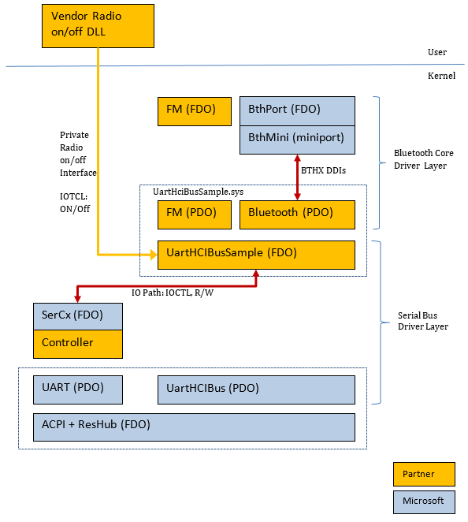

# Transport Bus Driver for Bluetooth

The following diagram of a sample system, depicts the driver stacks used to support a multifunction controller, using UART as its transport.

The device stack to support the Bluetooth function consists of two layers:

1.  The **Serial Bus Driver Layer** that is used to support a multifunction peripheral device (or so-called “combo” chip in the diagram to support Bluetooth and FM).
2.  The **Bluetooth Core Driver Layer** which is loaded based on a child PDO created by the Serial Bus driver to support the Bluetooth function.

The roles of these two layers in power management are discussed in the following topics:

-   [Bluetooth Core Driver Layer and Supported Power Transitions](bluetooth-core-driver-layer-and-supported-power-transitions.md)
-   [Serial Bus Driver Layer](serial-bus-driver-layer.md)

 

 

[Send comments about this topic to Microsoft](mailto:wsddocfb@microsoft.com?subject=Documentation%20feedback%20[bltooth\bltooth]:%20Transport%20Bus%20Driver%20for%20Bluetooth%20%20RELEASE:%20%283/20/2017%29&body=%0A%0APRIVACY%20STATEMENT%0A%0AWe%20use%20your%20feedback%20to%20improve%20the%20documentation.%20We%20don't%20use%20your%20email%20address%20for%20any%20other%20purpose,%20and%20we'll%20remove%20your%20email%20address%20from%20our%20system%20after%20the%20issue%20that%20you're%20reporting%20is%20fixed.%20While%20we're%20working%20to%20fix%20this%20issue,%20we%20might%20send%20you%20an%20email%20message%20to%20ask%20for%20more%20info.%20Later,%20we%20might%20also%20send%20you%20an%20email%20message%20to%20let%20you%20know%20that%20we've%20addressed%20your%20feedback.%0A%0AFor%20more%20info%20about%20Microsoft's%20privacy%20policy,%20see%20http://privacy.microsoft.com/default.aspx. "Send comments about this topic to Microsoft")

