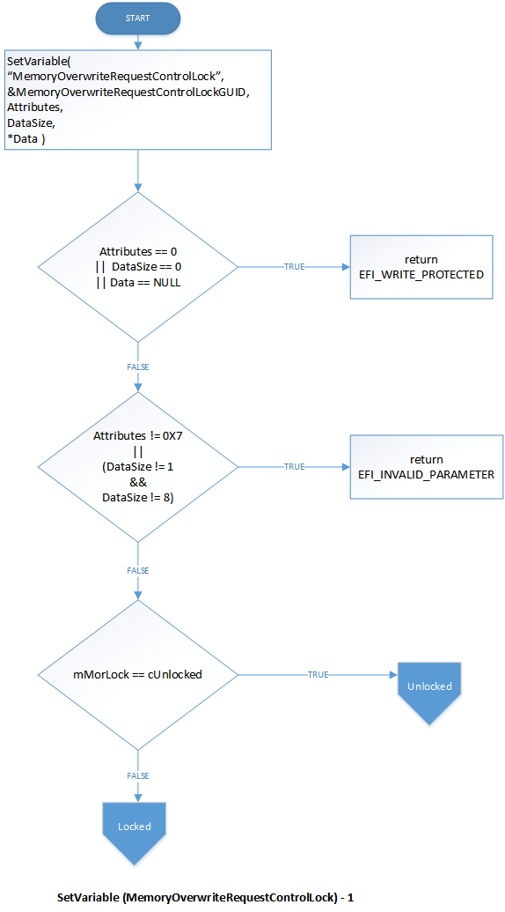
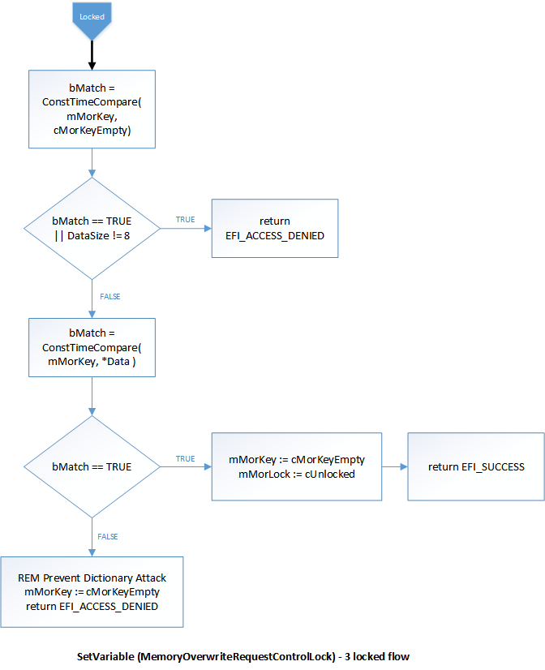

# Secure MOR implementation


**Summary**

-   Behavior of MorLock, revision 2

**Last updated**

-   January 2018

**Applies to**

-   Windows 10
-   OEMs and BIOS vendors who want to support the Credential Guard feature of Windows 10.

**Official specifications**

-   [UEFI Specifications](http://go.microsoft.com/fwlink/p/?LinkId=717873)
-   [PC Client Work Group Platform Reset Attack Mitigation Specification, Version 1.0](http://go.microsoft.com/fwlink/p/?LinkId=717870)

**Recommended reading**

-   [Blog post: Protecting BitLocker from Cold Attacks (and other threats)]( http://go.microsoft.com/fwlink/p/?LinkId=717871)
-   [Whitepaper: A Tour Beyond BIOS with the UEFI TPM2 Support in EDKII]( http://go.microsoft.com/fwlink/p/?LinkId=717872)
-   [Protect derived domain credentials with Credential Guard]( http://go.microsoft.com/fwlink/p/?LinkId=717899)

Describes the behavior and usage for the `MemoryOverwriteRequestControlLock` UEFI variable, revision 2.

To prevent advanced memory attacks, the existing system BIOS security mitigation **MemoryOverwriteRequestControl** is improved to support locking to defend against new threats.  The threat model is expanded to include the host OS kernel as an adversary, thus ACPI and UEFI Runtime Services executing at kernel privilege level are not trusted.  Similar to Secure Boot implementations, MorLock should be implemented in a privileged firmware execution context that cannot be tampered by the host OS kernel (e.g. System Management Mode, TrustZone, BMC, …).  The interface is built upon UEFI variable services, which are described in the UEFI Specification version 2.5, Section 7.2 named "Variable Services".

**Note**   This mitigation, called *MorLock*, must be implemented on all new systems and not only limited to systems with Trusted Platform Modules. Revision 2 adds a new capability, *unlock*, to mitigate boot performance concerns, especially on large memory systems.

**Note 2**      Regarding the ACPI \_DSM control method for setting the MOR bit state (as described in Section 6 of [PC Client Work Group Platform Reset Attack Mitigation Specification, Version 1.0](http://go.microsoft.com/fwlink/p/?LinkId=717870)):  
Microsoft recommends removing this \_DSM method from modern BIOS implementations.  However, if a BIOS implements this \_DSM method, it must respect the state of MorLock.  If the MorLock is locked, with or without a key, this \_DSM method must fail to change MOR and return a value of 1 corresponding to “General Failure”.  No ACPI mechanism is defined to unlock MorLock revision 2.  Note that Windows has not directly invoked this \_DSM method since Windows 7 and considers it deprecated.  Some BIOS *indirectly* invokes this \_DSM method when Windows invokes ACPI \_PTS as an implementation of MOR Auto Detection of Clean Shutdown (as described in Section 2.3 of [PC Client Work Group Platform Reset Attack Mitigation Specification, Version 1.0](http://go.microsoft.com/fwlink/p/?LinkId=717870)).  This ACPI \_PTS implementation of MOR Auto Detection is security deficient and should NOT be used.

## MemoryOverwriteRequestControlLock


BIOS containing the improved mitigation creates this UEFI variable during early boot:

**VendorGuid:** `{BB983CCF-151D-40E1-A07B-4A17BE168292}`

**Name:** `MemoryOverwriteRequestControlLock`

**Attributes:** NV+BS+RT

**GetVariable** value in *Data* parameter: 0x0 (unlocked); 0x1 (locked without key); 0x2 (locked with key)

**SetVariable** value in *Data* parameter: 0x0 (unlocked); 0x1 (locked)

## Locking with SetVariable


On every boot, BIOS shall initialize `MemoryOverwriteRequestControlLock` to a single-byte value of 0x00 (indicating *unlocked*) before the Boot Device Selection (BDS) phase (DRIVER\#\#\#\#, SYSPREP\#\#\#\#, BOOT\#\#\#\#, \*RECOVERY\*, …). For `MemoryOverwriteRequestControlLock` (and `MemoryOverwriteRequestControl`), BIOS shall prevent the deletion of the variable and attributes must be pinned to NV+BS+RT.

When **SetVariable** for `MemoryOverwriteRequestControlLock` is first called by passing a valid non-zero value in *Data*, the access mode for both `MemoryOverwriteRequestControlLock` and `MemoryOverwriteRequestControl` is changed to read-only, indicating that they are locked.

Revision 1 implementations only accept a single byte of 0x00 or 0x01 for `MemoryOverwriteRequestControlLock`.

Revision 2 additionally accepts an 8-byte value that represents a shared secret key. If any other value is specified in **SetVariable**, the call fails with status EFI\_INVALID\_PARAMETER. To generate that key, use a high-quality entropy source such as the Trusted Platform Module or hardware random number generator.

After setting a key, both the caller and firmware should save copies of this key in a confidentiality-protected location, such as SMRAM on IA32/X64 or a service processor with protected storage.

## Getting the system state


In Revision 2, when the `MemoryOverwriteRequestControlLock` and `MemoryOverwriteRequestControl` variables are locked, invocations of **SetVariable** (for those variables) are first checked against the registered key by using a constant-time algorithm. If both keys are present and match, the variables transition back to an unlocked state. After this first attempt or if no key is registered, subsequent attempts to set this variable fail with EFI\_ACCESS\_DENIED to prevent brute force attacks. In that case, system reboot shall be the only way to unlock the variables.

The operating system detects the presence of `MemoryOverwriteRequestControlLock` and its state by calling **GetVariable**. The system can then lock the current value of `MemoryOverwriteRequestControl` by setting the `MemoryOverwriteRequestControlLock` value to 0x1. Alternatively, it may specify a key to enable unlocking in the future after secret data has been securely purged from memory.

Calling **GetVariable** for `MemoryOverwriteRequestControlLock` returns 0x0, 0x1, or 0x2 to indicate unlocked, locked without key, or locked with key states.

**Note**  Setting `MemoryOverwriteRequestControlLock` does not commit to flash (just changes the internal lock state). Getting the variable returns the internal state and never exposes the key. The following figures detail the expected behavior.

 

Example usage by the operating system

``` syntax
if (gSecretsInMemory) 
{
    char data = 0x11;
    SetVariable(MemoryOverwriteRequestControl, sizeof(data), &data);
}
 
// check presence
status = GetVariable(MemoryOverwriteRequestControlLock, &value);  
    
if (SUCCESS(status)) 
{
    // first attempt to lock and establish a key 
    // note both MOR and MorLock are locked if successful

    GetRNG(8, keyPtr);
    status = SetVariable(MemoryOverwriteRequestControlLock, 8, keyPtr); 

    if (status != EFI_SUCCESS) 
    {
        // fallback to revision 1 behavior
        char data = 0x01;
        status = SetVariable(MemoryOverwriteRequestControlLock, 1, &data); 
        if (status != EFI_SUCCESS) { // log error, warn user }
    }
} 
else 
{
    // warn user about potentially unsafe system
}

// put secrets in memory

// … time passes …

// remove secrets from memory, flush caches

SetVariable(MemoryOverwriteRequestControlLock, 8, keyPtr)
```

## MorLock implementation flow


These flowcharts show the expected behavior of your implementation:

### Initialization


### SetVariable flow



### Unlocked state flow for SetVariable


### Locked state flow for SetVariable



### Flow for GetVariable


## Related topics
[UEFI requirements that apply to all Windows editions on SoC platforms](uefi-requirements-that-apply-to-all-windows-platforms.md#security-requirements)  
[PC Client Work Group Platform Reset Attack Mitigation Specification, Version 1.0](http://go.microsoft.com/fwlink/p/?LinkId=717870)  
[Protecting BitLocker from Cold Attacks (and other threats)]( http://go.microsoft.com/fwlink/p/?LinkId=717871)  
[A Tour Beyond BIOS with the UEFI TPM2 Support in EDKII]( http://go.microsoft.com/fwlink/p/?LinkId=717872)  
[Protect derived domain credentials with Credential Guard]( http://go.microsoft.com/fwlink/p/?LinkId=717899)  
[UEFI Specifications](http://go.microsoft.com/fwlink/p/?LinkId=717873)  

--------------------


