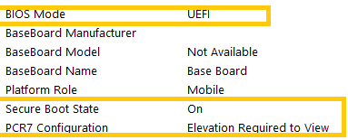

# How to convert an installed x64 Windows 7 system

The following steps are intended for when the ITPro is in a situation where they need to convert from Legacy MBR+CSM to UEFI+GPT. Usually they start with a system that was installed with Windows 7 x64. For x86 OS, see section in FAQ below about "What is the dependency on 32-bit vs. 64-bit UEFI". Installed in BIOS mode to Legacy MBR boot disk with CSM enabled, and you know or have checked with the OEM for that system to ensure that the system has the following:

1.  Ability to enable and disable the CSM

2.  Has UEFI firmware 2.3.1c or later

3.  The security features that you are interested in (Secure boot, Device Guard, and/or Credential Guard) has all the correct components already configured on the system.

**Note** Microsoft does not currently have a mechanism to convert Legacy MBR boot disks over to GPT disks without first wiping/cleaning the existing file system and creating the new file system with the clean disk.

For example; you will need to use Diskpart.exe to ‘clean’ the existing partition before they can run the ‘convert GPT’ command on that disk. This ‘clean’ command will wipe the entire disk.

1.  Once all data is backed up from the primary boot device, and USER/ITPro has confirmed that Primary boot device is Disk 0

2.  Primary boot device has been completely backed up (any data left on disk will be wiped)

3.  reboot to BIOS (contact Manufacture for steps to switch BIOS boot mode to UEFI boot mode) switch to UEFI+CSM

4.  Boot to USB Thumb drive with x64 Winpe

5.  Once booted in WinPE, at main command prompt:

    1.  Open Diskpart.exe

    2.  select disk 0

    3.  list par

    4.  list VOL <= to identify current drive letters so you know where existing OS is assigned (identify drive letter for OS, used later)

    5.  convert GPT

    6.  select partition 1

    7.  create par EFI size=800 (mg)

    8.  format fs=fat32 label=System

    9.  assign letter S

    10. create par MSR

    11. list par 

    12. exit

6.  back at command prompt, type in the following:

    1.  s:

    2.  BCDboot c:\\windows /s s: /f UEFI     <= drive letter identified in step c/d above

    3.  dir /a

    4.  should see s:\\EFI

7.  Reboot and attempt to boot to OS. <results?>

8.  <END>

### Method to verify system is booted in UEFI mode

#### Using MSINFO32

On a Windows 10 system:

1. Press <Windows key> + <R> to open the Run dialog

2. Type Msinfo32 and click **OK**.

The System Summary page will open by default Look for the following:

To run as an administrator, go through the following steps:

Press <Windows key>

Start typing "System Information"

If System information is highlighted, hold <ctrl> + <shift> and hit <enter> or use your mouse and right click and select "Run as Administrator"

You will be prompted by User Access Control (UAC) with the following message: "Do You want this app to make changes to your desktop?"

Through BCDEDIT

On Windows 7 and later systems

1.  Start an elevated command prompt.

2.  Run "BCDedit /enum {current}".

    **Note**: If booted from WinPE, use the "/store" switch in BCDedit.exe.

    1.  If you have UEFI, the path will show Winload.efi. If you have CSM, the path will show Winload.exe as listed in sample output.

> *Sample output*

Windows Boot Loader

-------------------

identifier {current}

device partition=C:

path \\WINDOWS\\system32\\winload.efi

Through NOTEPAD and SETUPACT.LOG

1.  Start an elevated command prompt.

2.  Run "notepad c:\\windows\\panther\\setupact.log."

3.  "ctrl + f" for find (or search).

4.  Search for "Callback\_BootEnvironmentDetect"

    1.  Results would look something like this:

        Callback\_BootEnvironmentDetect:FirmwareType 1.

        Callback\_BootEnvironmentDetect: Detected boot environment: BIOS

        Or

        Callback\_BootEnvironmentDetect:FirmwareType 2.

        Callback\_BootEnvironmentDetect: Detected boot environment: UEFI

You may need to consult with the Original Equipment Manufacturer (OEM) for configuration details on your specific system.

**Note** using diskpart.exe or Setup to ‘clean’ or ‘wipe’ the hard disk drive partition information will destroy data on disk. Consult PC manufacturer concerning factory image recovery methods or data backup options prior to making any of these changes.  

## Related resources

| [Recommended UEFI-Based Disk-Partition Configurations](https://technet.microsoft.com/en-us/library/dd744301(v=ws.10).aspx)                                      |
|-----------------------------------------------------------------------------------------------------------------------------------------------------------------|
| [Win7 Back up your programs, system settings, and files](http://windows.microsoft.com/en-us/windows/back-up-programs-system-settings-files#1TC=windows-7)       |
| [Win7 Protect your files and PC with Windows 7 Backup](https://blogs.technet.microsoft.com/filecab/2009/10/23/protect-your-files-and-pc-with-windows-7-backup/) |

--------------------
[Send comments about this topic to Microsoft](mailto:wsddocfb@microsoft.com?subject=Documentation%20feedback%20%5Bprint\print%5D:%20Slicer%20settings%20%20RELEASE:%20%289/2/2016%29&body=%0A%0APRIVACY%20STATEMENT%0A%0AWe%20use%20your%20feedback%20to%20improve%20the%20documentation.%20We%20don't%20use%20your%20email%20address%20for%20any%20other%20purpose,%20and%20we'll%20remove%20your%20email%20address%20from%20our%20system%20after%20the%20issue%20that%20you're%20reporting%20is%20fixed.%20While%20we're%20working%20to%20fix%20this%20issue,%20we%20might%20send%20you%20an%20email%20message%20to%20ask%20for%20more%20info.%20Later,%20we%20might%20also%20send%20you%20an%20email%20message%20to%20let%20you%20know%20that%20we've%20addressed%20your%20feedback.%0A%0AFor%20more%20info%20about%20Microsoft's%20privacy%20policy,%20see%20http://privacy.microsoft.com/default.aspx. "Send comments about this topic to Microsoft")

