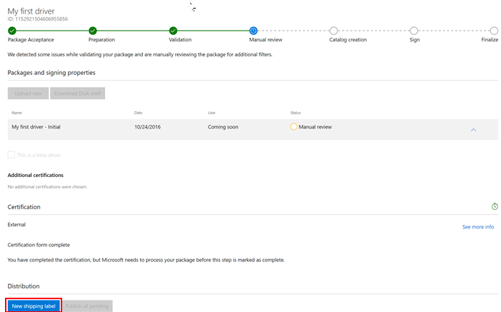
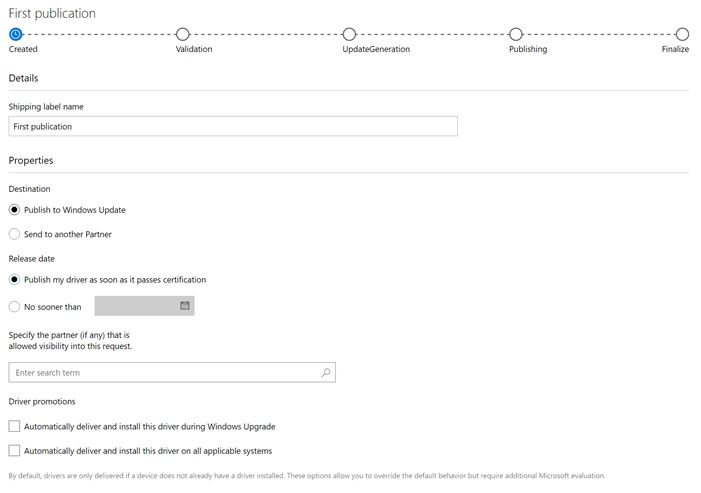
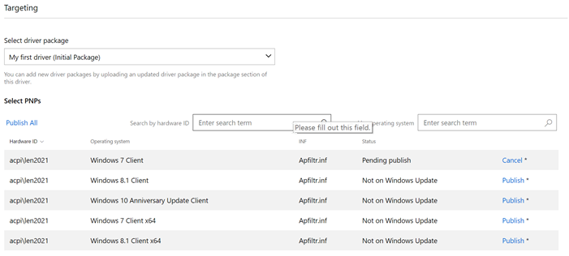
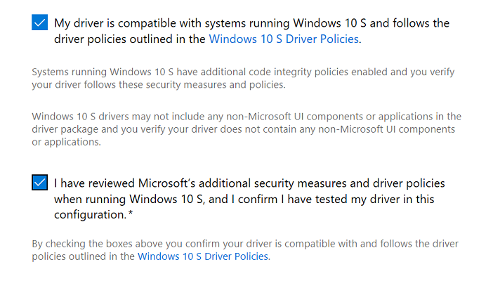

# Publish a driver to Windows Update

To publish a driver to Windows Update, [create a hardware submission](create-a-new-hardware-submission.md) and then follow the steps below.

1.  [Find the hardware submission](manage-your-hardware-submissions.md) that contains the driver you want to distribute.

2.  Go to the **Distribution** section of the hardware submission and select **New shipping label**.

    

3.  On the shipping label page, go to the **Details** section and enter a name for the shipping label in the **Shipping label name** field. This name allows you to organize and search for your shipping labels.

4.  In the **Properties** section, complete the following information:

    <table>
    <colgroup>
    <col width="50%" />
    <col width="50%" />
    </colgroup>
    <thead>
    <tr class="header">
    <th>Field</th>
    <th>Description</th>
    </tr>
    </thead>
    <tbody>
    <tr class="odd">
    <td>
<strong>Destination</strong>
</td>
    <td>
Select <strong>Publish to Windows Update</strong> to publish your driver to Windows Update. If you want to create a shared shipping label that allows you to share your driver with a partner, see [Share a driver with a partner](sharing-drivers-with-your-partners.md).

    

    <strong>Note</strong>  Shared drivers can only be shared by the organization that originally created it. An organization that receives a shared driver cannot share it again.
    

    

     
    
</td>
    </tr>
    <tr class="even">
    <td>
<strong>Release date</strong>
</td>
    <td>
Specify when you want your driver to be available for download on Windows Update.

    
If you want your driver to be published as soon as it passes certification, select <strong>Publish my driver as soon as it passes certification</strong>.

    
If you do not want your driver to be published before a certain date, select <strong>No sooner than</strong> and specify the date.
</td>
    </tr>
    <tr class="odd">
    <td>
<strong>Specify the partner (if any) that is allowed visibility into this request</strong>
</td>
    <td>
Enter a partner that you want to have read-only permissions to your driver and shipping label. Use this field when you want a partner to be aware of this shipping label request, such as when you publish a driver on their behalf. For more information, see [Publish a driver on behalf of a partner](https://msdn.microsoft.com/library/windows/hardware/mt786462).
</td>
    </tr>
    <tr class="even">
    <td>
<strong>Driver promotions</strong>
</td>
    <td>
By default, drivers on Windows Update are marked as Optional. This means that a driver is only delivered if the device does not have a driver installed already. These options allow you to override the default behavior but require additional Microsoft evaluation.

    
Select <strong>Automatically deliver and install this driver during Windows Upgrade</strong> to promote your driver to be available for Dynamic Update.

    
Select <strong>Automatically deliver and install this driver on all applicable systems</strong> to promote your driver to Critical.
</td>
    </tr>
    </tbody>
    </table>

    

5.  In the **Targeting** section, select the driver package that you want to publish.

6.  After you select your driver package, **Select PNPs** becomes available. Select the hardware IDs you want to target. You can search for a specific hardware ID or operating system by using the search boxes above the list of hardware IDs.

    To target all listed hardware IDs, select **Publish All**.

    To target specific hardware IDs, find each desired hardware ID and select **Publish**.

    If you targeted all hardware IDs and want to remove them, select **Expire All**.

    To remove targeting for specific hardware IDs, find each hardware ID and select **Expire**.

    

7.  If you want to add Computer Hardware IDs (CHIDs), enter each CHID into the text box and select **Add CHID(s)**. To bulk add multiple CHIDs, ensure that each CHID is separated by a newline, select **Add multiple CHIDs**, and paste your CHIDs into the text box. You can view all added CHIDs in the list below the text box. To remove a CHID from the list, select **Remove**

8. If your driver targets Windows 10 S, you must select both boxes, confirming the following:

  *	Your driver is compatible with and follows the driver policies outlined in the Windows 10 S Engineering Guide.
  * You verify that your driver follows the additional code integrity policies outlined in the Windows 10 S Engineering Guide.
  * Your driver does not contain any non-Microsoft UI components or applications in the driver package.

  

9.  Select **Publish** to send your request to Windows Update. If you do not want to publish the shipping label right now, you can select **Save**. You can publish the shipping label later by either opening the shipping label and selecting **Publish**, or you can select **Publish all pending** from the hardware submission page. Note that selecting **Publish all pending** will publish all unpublished shipping labels.

 

 

[Send comments about this topic to Microsoft](mailto:wsddocfb@microsoft.com?subject=Documentation%20feedback%20%5Bhw_dashboard\hw_dashboard%5D:%20Publish%20a%20driver%20to%20Windows%20Update%20%20RELEASE:%20%281/3/2017%29&body=%0A%0APRIVACY%20STATEMENT%0A%0AWe%20use%20your%20feedback%20to%20improve%20the%20documentation.%20We%20don't%20use%20your%20email%20address%20for%20any%20other%20purpose,%20and%20we'll%20remove%20your%20email%20address%20from%20our%20system%20after%20the%20issue%20that%20you're%20reporting%20is%20fixed.%20While%20we're%20working%20to%20fix%20this%20issue,%20we%20might%20send%20you%20an%20email%20message%20to%20ask%20for%20more%20info.%20Later,%20we%20might%20also%20send%20you%20an%20email%20message%20to%20let%20you%20know%20that%20we've%20addressed%20your%20feedback.%0A%0AFor%20more%20info%20about%20Microsoft's%20privacy%20policy,%20see%20http://privacy.microsoft.com/default.aspx. "Send comments about this topic to Microsoft")
