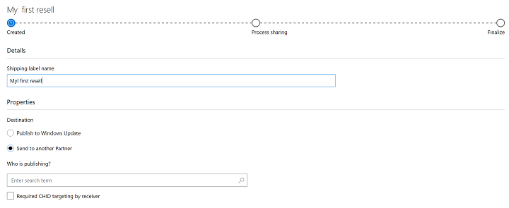
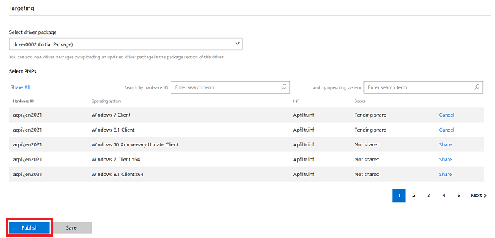

# Share a driver with a partner

To share a driver with one of your partners, [create a hardware submission](create-a-new-hardware-submission.md) and follow the steps below.

**Note**  Shared drivers can only be shared by the organization that originally created it. An organization that receives a shared driver cannot share it again.

 

1.  [Find the hardware submission](manage-your-hardware-submissions.md) that contains the driver you want to share.

2.  Go to the **Distribution** section of the hardware submission and select **New shipping label**.

    

3.  On the shipping label page, go to the **Details** section and enter a name for the shipping label in the **Shipping label name** field. This name is private and is not viewable by your partner. The name allows you to organize and search for your shipping labels.

    

4.  In the **Properties** section, complete the following information:

    <table>
    <colgroup>
    <col width="50%" />
    <col width="50%" />
    </colgroup>
    <thead>
    <tr class="header">
    <th>Field</th>
    <th>Description</th>
    </tr>
    </thead>
    <tbody>
    <tr class="odd">
    <td>
<strong>Destination</strong>
</td>
    <td>
Select <strong>Send to another Partner</strong> to share your driver with a partner. If you want to create a shipping label for Windows Update, see [Publish a driver to Windows Update](publish-a-driver-to-windows-update.md).
</td>
    </tr>
    <tr class="even">
    <td>
<strong>Who is publishing?</strong>
</td>
    <td>
Search for the company name of your partner, and select it.
</td>
    </tr>
    <tr class="odd">
    <td>
<strong>Required CHID targeting by receiver</strong>
</td>
    <td>
This option forces your partner to apply CHIDs to any publication requests they create based on your driver. This allows you to protect your users when a Hardware ID may be shared among many partner companies.
</td>
    </tr>
    </tbody>
    </table>

     

5.  In the **Targeting** section, select the driver package that you want to share.

    

6.  After you select your driver package, **Select PNPs** becomes available. Select the hardware IDs you want to share. Your partner is limited to the selected hardware ID values for any publications they create. You can search for a specific hardware ID or operating system by using the search boxes above the list of hardware IDs.

    -   To target all listed hardware IDs, select **Publish All**.

    -   To target specific hardware IDs, find each desired hardware ID and select **Publish**.

    -   If you targeted all hardware IDs and want to remove them, select **Expire All**.

    -   To remove targeting for specific hardware IDs, find each hardware ID and select **Expire**.

7.  Select **Publish** to share the driver. If you do not want to publish the shipping label right now, you can select **Save**. You can publish the shipping label later by either opening the shipping label and selecting **Publish**, or you can select **Publish all pending** from the hardware submission page. Note that selecting **Publish all pending** will publish all unpublished shipping labels.

 

 

[Send comments about this topic to Microsoft](mailto:wsddocfb@microsoft.com?subject=Documentation%20feedback%20%5Bhw_dashboard\hw_dashboard%5D:%20Share%20a%20driver%20with%20a%20partner%20%20RELEASE:%20%281/3/2017%29&body=%0A%0APRIVACY%20STATEMENT%0A%0AWe%20use%20your%20feedback%20to%20improve%20the%20documentation.%20We%20don't%20use%20your%20email%20address%20for%20any%20other%20purpose,%20and%20we'll%20remove%20your%20email%20address%20from%20our%20system%20after%20the%20issue%20that%20you're%20reporting%20is%20fixed.%20While%20we're%20working%20to%20fix%20this%20issue,%20we%20might%20send%20you%20an%20email%20message%20to%20ask%20for%20more%20info.%20Later,%20we%20might%20also%20send%20you%20an%20email%20message%20to%20let%20you%20know%20that%20we've%20addressed%20your%20feedback.%0A%0AFor%20more%20info%20about%20Microsoft's%20privacy%20policy,%20see%20http://privacy.microsoft.com/default.aspx. "Send comments about this topic to Microsoft")

