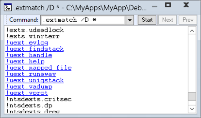

# .extmatch (Display All Matching Extensions)


The **.extmatch** command displays extension commands exported by the currently loaded extension DLLs that match the specified pattern.

``` syntax
.extmatch [Options] Pattern 
```

## <span id="Parameters"></span><span id="parameters"></span><span id="PARAMETERS"></span>Parameters


<span id="_______Options______"></span><span id="_______options______"></span><span id="_______OPTIONS______"></span> *Options*   
Specifies the searching options. You can use one or more of the following options:

<span id="_e_ExtDLLPattern"></span><span id="_e_extdllpattern"></span><span id="_E_EXTDLLPATTERN"></span>**/e** **** *ExtDLLPattern*  
Limits the enumeration to extension commands exported by extension DLLs that match the specified pattern string. *ExtDLLPattern* is matched against the extension DLL filename.

<span id="_n"></span><span id="_N"></span>**/n**  
Excludes the extension name when the extensions are displayed. Thus, if this option is specified, then only the extension name itself will be displayed.

<span id="________D______"></span><span id="________d______"></span> **/D**   
Displays the output using [Debugger Markup Language (DML)](debugger-markup-language-commands.md). In the output, each listed extension is a link that you can click to get more information about the extension. Not all extension modules support DML.

<span id="_______Pattern______"></span><span id="_______pattern______"></span><span id="_______PATTERN______"></span> *Pattern*   
Specifies a pattern that the extension must contain. *Pattern*can contain a variety of wildcard characters and specifiers. For more information about the syntax, see [String Wildcard Syntax](string-wildcard-syntax.md).

### <span id="Environment"></span><span id="environment"></span><span id="ENVIRONMENT"></span>Environment

<table>
<colgroup>
<col width="50%" />
<col width="50%" />
</colgroup>
<tbody>
<tr class="odd">
<td align="left"><p><strong>Modes</strong></p></td>
<td align="left"><p>User mode, kernel mode</p></td>
</tr>
<tr class="even">
<td align="left"><p><strong>Targets</strong></p></td>
<td align="left"><p>Live, crash dump</p></td>
</tr>
<tr class="odd">
<td align="left"><p><strong>Platforms</strong></p></td>
<td align="left"><p>All</p></td>
</tr>
</tbody>
</table>

 

Remarks
-------

To display a list of loaded extension DLLs, use the [**.chain**](-chain--list-debugger-extensions-.md) command.

Here is an example of this command, showing all the loaded extension DLLs that have an export named !help:

```
0:000> .extmatch help 
!ext.help
!exts.help
!uext.help
!ntsdexts.help
```

The following example lists all extension commands beginning with the string "he" that are exported by extension DLLs whose names begin with the string "ex":

```
0:000> .extmatch /e ext* he* 
!ext.heap
!ext.help
!exts.heap
!exts.help
```

The following example lists all extension commands, so we can see which ones support DML.



 

 

[Send comments about this topic to Microsoft](mailto:wsddocfb@microsoft.com?subject=Documentation%20feedback%20[debugger\debugger]:%20.extmatch%20%28Display%20All%20Matching%20Extensions%29%20%20RELEASE:%20%285/15/2017%29&body=%0A%0APRIVACY%20STATEMENT%0A%0AWe%20use%20your%20feedback%20to%20improve%20the%20documentation.%20We%20don't%20use%20your%20email%20address%20for%20any%20other%20purpose,%20and%20we'll%20remove%20your%20email%20address%20from%20our%20system%20after%20the%20issue%20that%20you're%20reporting%20is%20fixed.%20While%20we're%20working%20to%20fix%20this%20issue,%20we%20might%20send%20you%20an%20email%20message%20to%20ask%20for%20more%20info.%20Later,%20we%20might%20also%20send%20you%20an%20email%20message%20to%20let%20you%20know%20that%20we've%20addressed%20your%20feedback.%0A%0AFor%20more%20info%20about%20Microsoft's%20privacy%20policy,%20see%20http://privacy.microsoft.com/default.aspx. "Send comments about this topic to Microsoft")


