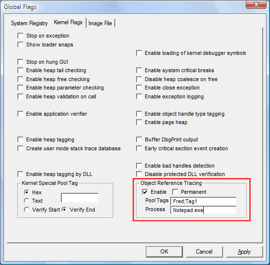

# Configuring Object Reference Tracing

You can use Gflags to enable, disable, and configure the Object Reference Tracing feature of Windows. Object Reference Tracing records sequential stack traces whenever an object reference counter is incremented or decremented. The traces can help you to detect object reference errors, including double-dereferencing, failure to reference, and failure to dereference objects. This feature is supported only in Windows Vista and later versions of Windows. For detailed information about this feature, see [Object Reference Tracing](object-reference-tracing.md).

**To enable Object Reference Tracing**

1.  In the Gflags dialog box, select the **System Registry** tab or the **Kernel Flags** tab.

2.  In the Object Reference Tracing section, select **Enable**.

    You must limit the trace to objects with specified pool tags, to objects created by a specified process, or both.

3.  To limit the trace to objects with a particular pool tag, type the pool tag name. To list multiple pool tags, use semicolons (;) to separate the pool tags. When you list multiple pool tags, the trace includes objects with any of the specified pool tags. Pool tags are case sensitive.

    For example, Fred;Tag1.

4.  To limit the trace to objects that are created by a particular process, type the image name of the process. You can specify only one image file name.

    When you specify both pool tags and a process, the trace includes objects that are created by the process that have any of the specified pool tags.

5.  To retain the trace after the trace object is destroyed, select **Permanent**.

    When you select **Permanent**, the trace is retained until you disable object reference tracing, or shut down or restart Windows.

6.  Click **Apply** or **OK**.

The following screen shot shows Object Reference Tracing enabled on the **Kernel Flags** tab.

This trace will include only objects that were created by the notepad.exe process that have the pool tag **Fred** or **Tag1**. Because this is a run time (kernel flags) setting, the trace starts immediately. If it were a registry setting, you would have to restart Windows to start the trace.

**To disable Object Reference Tracing**

1.  In the Gflags dialog box, select the **System Registry** tab or the **Kernel Flags** tab. Object Reference Tracing will appear on the latter tab only in Windows Vista and later versions of Windows.

2.  In the Object Reference Tracing section, clear the **Enable** check box.

 

 

[Send comments about this topic to Microsoft](mailto:wsddocfb@microsoft.com?subject=Documentation%20feedback%20[debugger\debugger]:%20Configuring%20Object%20Reference%20Tracing%20%20RELEASE:%20%284/24/2017%29&body=%0A%0APRIVACY%20STATEMENT%0A%0AWe%20use%20your%20feedback%20to%20improve%20the%20documentation.%20We%20don't%20use%20your%20email%20address%20for%20any%20other%20purpose,%20and%20we'll%20remove%20your%20email%20address%20from%20our%20system%20after%20the%20issue%20that%20you're%20reporting%20is%20fixed.%20While%20we're%20working%20to%20fix%20this%20issue,%20we%20might%20send%20you%20an%20email%20message%20to%20ask%20for%20more%20info.%20Later,%20we%20might%20also%20send%20you%20an%20email%20message%20to%20let%20you%20know%20that%20we've%20addressed%20your%20feedback.%0A%0AFor%20more%20info%20about%20Microsoft's%20privacy%20policy,%20see%20http://privacy.microsoft.com/default.aspx. "Send comments about this topic to Microsoft")

