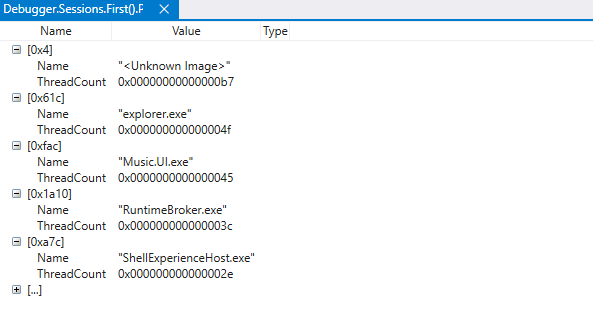
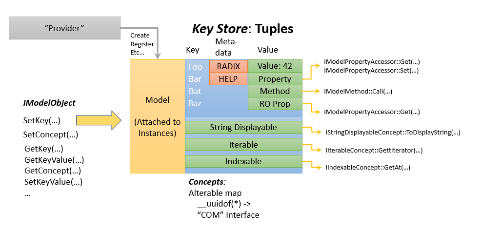
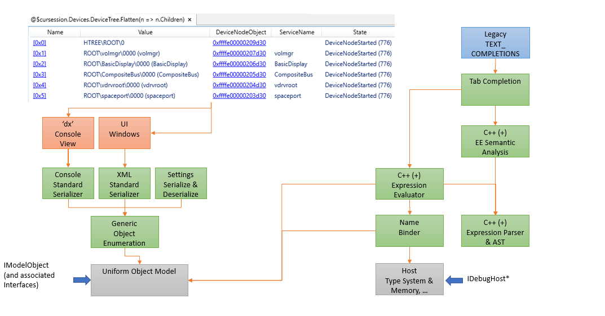
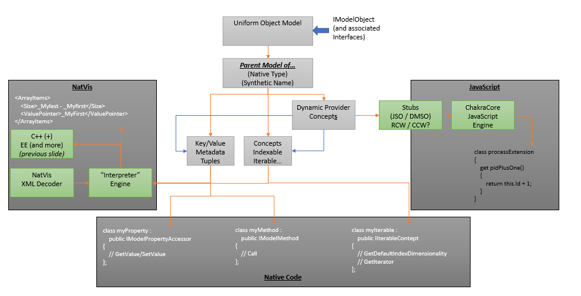
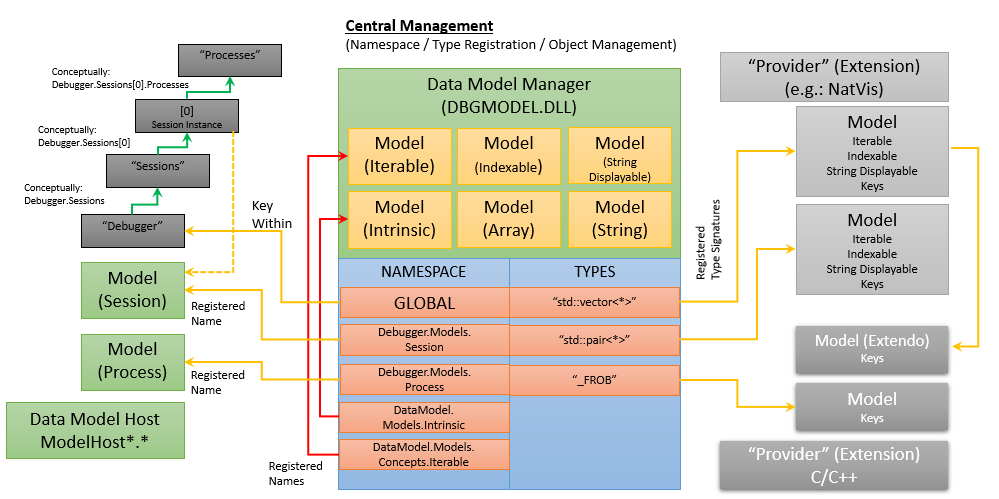

# Debugger Data Model C++ Overview

This topic provides an overview of how to use Debugger Data Model C++ Interfaces to extend and customize the capabilities of the debugger.

This topic is part of a series which describes the interfaces accessible from C++, how to use them to build a C++ based
debugger extension, and how to make use of other data model constructs (e.g.: JavaScript or NatVis) from a C++ data model extension.

[Debugger Data Model C++ Overview](data-model-cpp-overview.md)

[Debugger Data Model C++ Interfaces](data-model-cpp-interfaces.md)

[Debugger Data Model C++ Objects](data-model-cpp-objects.md)

[Debugger Data Model C++ Additional Interfaces](data-model-cpp-additional-interfaces.md)

[Debugger Data Model C++ Concepts](data-model-cpp-concepts.md)

[Debugger Data Model C++ Scripting](data-model-cpp-scripting.md)

---

## Topic Sections

This topic includes the following sections.

[Overview of Debugger Data Model C++ Interfaces](#overview)

[Summary of Debugger Data Model Interfaces](#summary)

---

## <span id="overview"> Overview of the Debugger Data Model C++ Interface

The debugger data model is an extensible object model that is central to the way in which new debugger extensions (including those in JavaScript, NatVis, and C++) both consume information from the debugger and produce information that can be accessed from the debugger as well as other extensions. Constructs which are written to the data model APIs are available in the debugger's newer (dx) expression evaluator as well as from JavaScript extensions or C++ extensions. 

To illustrate the goals of the debugger data model, consider this traditional debugger command.

```
0: kd> !process 0 0 
PROCESS ffffe0007e6a7780
    SessionId: 1  Cid: 0f68    Peb: 7ff7cfe7a000  ParentCid: 0f34
    DirBase: 1f7fb9000  ObjectTable: ffffc001cec82780  HandleCount:  34.
    Image: echoapp.exe
...
```
The debugger command is using a binary mask and it provides text only output in non-standard ways. The text output is difficult to consume, format, or extend and the layout is specific to this command.

Contrast this to  the debugger data model [dx (Display Debugger Object Model Expression)](https://docs.microsoft.com/windows-hardware/drivers/debugger/dx--display-visualizer-variables-) command.

```
dx @$cursession.Processes.Where(p => p.Threads.Count() > 5)
```
This command uses a standard data model that is discoverable, extensible and composable in uniform ways.

Logically name spacing things and extending on specific objects allows for the discovery of debugger extension functionality.  

The data model is the way that the new [WinDbg Preview](debugging-using-windbg-preview.md) debugger, shows most things. Many elements in the new UI can be queried, extended, or scripted, because they are powered by the data model. For more information, see [WinDbg Preview - Data Model](windbg-data-model-preview.md).




### Data Model Architectural View

The following diagram summarizes the major elements of the debugger data model architecture.

- To the left side, UI elements are shown that provide access to the objects and support such functionality as LINQ queries.  
- On the right side of the diagram are components that provide data to debugger data model. This includes custom NatVis, JavaScript and C++ debugger data model extensions. 


### Object Model

At the center of the Debugger Data Model is a uniform object representation in which everything is an instance of the IModelObject interface.  While such an object may represent an intrinsic (e.g.: an integer value) or another data model interface, it often represents a dynamic object – a dictionary of key/value/metadata tuples and a set of concepts which describe abstract behaviors.   

This diagram shows how the IModelObject uses Key Stores to contain values that a provider can create, register and manipulate.

- It shows a *provider*, that provides information to the object model
- On the left it shows the *IModelObject*, that is the common object model that is used to manipulate objects.
- In the center is the *Key Store* that is used to store and access values.
- At the bottom it shows *Concepts* that support objects with functionality such as the ability to convert to a displayable string or be indexed.




### The Data Model: A Consumer View

The next diagram shows a consumer view of the data model. In the example the [dx (Display Debugger Object Model Expression)](https://docs.microsoft.com/windows-hardware/drivers/debugger/dx--display-visualizer-variables-) command is being used to query information. 

- The Dx command communicates through a serializer to the object enumeration interface. 
- IDebugHost* objects are used to gather information from the debugger engine. 
- Expression and semantic evaluators are used to send the request to the debugger engine.




### The Data Model: A Producer View

This diagram shows a producer view of the data model.

- A NatVis provider is shown on the left that consumes XML that defines additional functionality.
- A JavaScript provider can take advantage of *Dynamic Provider Concepts* to manipulate information in real time.
- The bottom shows a native code provider that can also define additional functionality.




### Data Model Manager 

This diagram shows the central role that the data model manager plays in the management of objects.

- The Data Model Manager acts as a central registrar for all objects. 
- On the left it shows how standard debugger elements such as sessions and process are registered.
- The namespace block shows the central registration list.
- The right side of the diagram shows two providers, one for NatVis on the top, and a C/C++ extension on the bottom.




## <span id="summary"> Summary of Debugger Data Model Interfaces

There are a multitude of C++ interfaces which comprise different pieces of the data model. In order to approach these interfaces in a consistent and easy manner, they are broken down by general category. The main areas here: 

**The General Object Model**

The first and most important set of interfaces define how to get access to the core data model and how to access and manipulate objects. IModelObject is the interface which represents every object in the data model (much like C#'s object). This is the main interface of interest for both consumers of and producers to the data model. The other interfaces are mechanisms for accessing different aspects of objects. 
The following interfaces are defined for this category: 


*Bridges Between DbgEng and the Data Model*

[IHostDataModelAccess](https://docs.microsoft.com/windows-hardware/drivers/ddi/content/dbgmodel/nn-dbgmodel-ihostdatamodelaccess) 

*Main Interfaces* 

[IModelObject](https://docs.microsoft.com/windows-hardware/drivers/ddi/content/dbgmodel/nn-dbgmodel-imodelobject) 

[IKeyStore](https://docs.microsoft.com/windows-hardware/drivers/ddi/content/dbgmodel/nn-dbgmodel-ikeystore) 

[IModelIterator](https://docs.microsoft.com/windows-hardware/drivers/ddi/content/dbgmodel/nn-dbgmodel-imodeliterator) 

[IModelPropertyAccessor](https://docs.microsoft.com/windows-hardware/drivers/ddi/content/dbgmodel/nn-dbgmodel-imodelpropertyaccessor) 

[IModelMethod](https://docs.microsoft.com/windows-hardware/drivers/ddi/content/dbgmodel/nn-dbgmodel-imodelmethod) 

[IKeyEnumerator](https://docs.microsoft.com/windows-hardware/drivers/ddi/content/dbgmodel/nn-dbgmodel-ikeyenumerator) 

[IRawEnumerator](https://docs.microsoft.com/windows-hardware/drivers/ddi/content/dbgmodel/nn-dbgmodel-irawenumerator) 

[IModelKeyReference](https://docs.microsoft.com/windows-hardware/drivers/ddi/content/dbgmodel/nn-dbgmodel-imodelkeyreference)  / [IModelKeyReference2](https://docs.microsoft.com/windows-hardware/drivers/ddi/content/dbgmodel/nn-dbgmodel-imodelkeyreference2) 

*Concept Interfaces*

[IStringDisplayableConcept](https://docs.microsoft.com/windows-hardware/drivers/ddi/content/dbgmodel/nn-dbgmodel-istringdisplayableconcept) 

[IIterableConcept](https://docs.microsoft.com/windows-hardware/drivers/ddi/content/dbgmodel/nn-dbgmodel-iiterableconcept) 

[IIndexableConcept](https://docs.microsoft.com/windows-hardware/drivers/ddi/content/dbgmodel/nn-dbgmodel-iindexableconcept) 

[IPreferredRuntimeTypeConcept](https://docs.microsoft.com/windows-hardware/drivers/ddi/content/dbgmodel/nn-dbgmodel-ipreferredruntimetypeconcept) 

[IDataModelConcept](https://docs.microsoft.com/windows-hardware/drivers/ddi/content/dbgmodel/nn-dbgmodel-idatamodelconcept) 

[IDynamicKeyProviderConcept](https://docs.microsoft.com/windows-hardware/drivers/ddi/content/dbgmodel/nn-dbgmodel-idynamickeyproviderconcept) 

[IDynamicConceptProviderConcept](https://docs.microsoft.com/windows-hardware/drivers/ddi/content/dbgmodel/nn-dbgmodel-idynamicconceptproviderconcept) 


**Management of Data Models and Extensibility**

The Data Model Manager is the core component which manages how all extensibility occurs. It is the central repository of a set of tables which map both native types to extension points as well as synthetic constructs to extension points. In addition, it is the entity which is responsible for the boxing of objects (conversion of ordinal values or strings into IModelObject's). 

The following interfaces are defined for this category: 

*General Data Model Manager Access* 

[IDataModelManager](https://docs.microsoft.com/windows-hardware/drivers/ddi/content/dbgmodel/nn-dbgmodel-idatamodelmanager)  / [IDataModelManager2](https://docs.microsoft.com/windows-hardware/drivers/ddi/content/dbgmodel/nn-dbgmodel-idatamodelmanager2) 

*Script Management* 

[IDataModelScriptManager](https://docs.microsoft.com/windows-hardware/drivers/ddi/content/dbgmodel/nn-dbgmodel-idatamodelscriptmanager) 

[IDataModelScriptProviderEnumerator](https://docs.microsoft.com/windows-hardware/drivers/ddi/content/dbgmodel/nn-dbgmodel-idatamodelscriptproviderenumerator) 


**Access to the Debugger's Type System and Memory Spaces**

The underlying type system and memory spaces of the debugger are exposed in detail for extensions to make use of. 
The following interfaces are defined for this category: 

*General Host (Debugger) Interfaces*

[IDebugHost](https://docs.microsoft.com/windows-hardware/drivers/ddi/content/dbgmodel/nn-dbgmodel-idebughost) 

[IDebugHostStatus](https://docs.microsoft.com/windows-hardware/drivers/ddi/content/dbgmodel/nn-dbgmodel-idebughoststatus) 

[IDebugHostContext](https://docs.microsoft.com/windows-hardware/drivers/ddi/content/dbgmodel/nn-dbgmodel-idebughostcontext) 

[IDebugHostMemory](https://docs.microsoft.com/windows-hardware/drivers/ddi/content/dbgmodel/nn-dbgmodel-idebughostmemory)  / [IDebugHostMemory2](https://docs.microsoft.com/windows-hardware/drivers/ddi/content/dbgmodel/nn-dbgmodel-idebughostmemory2) 

[IDebugHostErrorSink](https://docs.microsoft.com/windows-hardware/drivers/ddi/content/dbgmodel/nn-dbgmodel-idebughosterrorsink) 

[IDebugHostEvaluator](https://docs.microsoft.com/windows-hardware/drivers/ddi/content/dbgmodel/nn-dbgmodel-idebughostevaluator)  / [IDebugHostEvaluator2](https://docs.microsoft.com/windows-hardware/drivers/ddi/content/dbgmodel/nn-dbgmodel-idebughostevaluator2) 

[IDebugHostExtensibility](https://docs.microsoft.com/windows-hardware/drivers/ddi/content/dbgmodel/nn-dbgmodel-idebughostextensibility) 

*Host (Debugger) Type System Interfaces* 

[IDebugHostSymbols](https://docs.microsoft.com/windows-hardware/drivers/ddi/content/dbgmodel/nn-dbgmodel-idebughostsymbols) 

[IDebugHostSymbol](https://docs.microsoft.com/windows-hardware/drivers/ddi/content/dbgmodel/nn-dbgmodel-idebughostsymbol)  / [IDebugHostSymbol2](https://docs.microsoft.com/windows-hardware/drivers/ddi/content/dbgmodel/nn-dbgmodel-idebughostsymbol2) 

[IDebugHostModule](https://docs.microsoft.com/windows-hardware/drivers/ddi/content/dbgmodel/nn-dbgmodel-idebughostmodule) 

[IDebugHostType](https://docs.microsoft.com/windows-hardware/drivers/ddi/content/dbgmodel/nn-dbgmodel-idebughosttype)  / [IDebugHostType2](https://docs.microsoft.com/windows-hardware/drivers/ddi/content/dbgmodel/nn-dbgmodel-idebughosttype2) 

[IDebugHostConstant](https://docs.microsoft.com/windows-hardware/drivers/ddi/content/dbgmodel/nn-dbgmodel-idebughostconstant) 

[IDebugHostField](https://docs.microsoft.com/windows-hardware/drivers/ddi/content/dbgmodel/nn-dbgmodel-idebughostfield) 

[IDebugHostData](https://docs.microsoft.com/windows-hardware/drivers/ddi/content/dbgmodel/nn-dbgmodel-idebughostdata) 

[IDebugHostBaseClass](https://docs.microsoft.com/windows-hardware/drivers/ddi/content/dbgmodel/nn-dbgmodel-idebughostbaseclass) 
[IDebugHostPublic](https://docs.microsoft.com/windows-hardware/drivers/ddi/content/dbgmodel/nn-dbgmodel-idebughostpublic) 

[IDebugHostModuleSignature](https://docs.microsoft.com/windows-hardware/drivers/ddi/content/dbgmodel/nn-dbgmodel-idebughostmodulesignature) 

[IDebugHostTypeSignature](https://docs.microsoft.com/windows-hardware/drivers/ddi/content/dbgmodel/nn-dbgmodel-idebughosttypesignature) 

*Host (Debugger) Support for Scripting* 

[IDebugHostScriptHost](https://docs.microsoft.com/windows-hardware/drivers/ddi/content/dbgmodel/nn-dbgmodel-idebughostscript) 


**Authoring and Consuming Scripts**

The Data Model also has a general notion of what a script is and how to debug one. It is entirely possible for a debugger extension to come along and define a general bridge between the data model and another dynamic language (usually a scripting environment). This set of interfaces is how that is accomplished as well as how a debugger UI can make use of such scripts. 

The following interfaces are defined for this category: 

*General Script Interfaces* 

[IDataModelScriptProvider](https://docs.microsoft.com/windows-hardware/drivers/ddi/content/dbgmodel/nn-dbgmodel-idatamodelscript) 

[IDataModelScript](https://docs.microsoft.com/windows-hardware/drivers/ddi/content/dbgmodel/nn-dbgmodel-idatamodelscript) 

[IDataModelScriptClient](https://docs.microsoft.com/windows-hardware/drivers/ddi/content/dbgmodel/nn-dbgmodel-idatamodelscriptclient) 

[IDataModelScriptHostContext](https://docs.microsoft.com/windows-hardware/drivers/ddi/content/dbgmodel/nn-dbgmodel-idatamodelscripthostcontext) 

[IDataModelScriptTemplate](https://docs.microsoft.com/windows-hardware/drivers/ddi/content/dbgmodel/nn-dbgmodel-idatamodelscripttemplate) 

[IDataModelScriptTemplateEnumerator](https://docs.microsoft.com/windows-hardware/drivers/ddi/content/dbgmodel/nn-dbgmodel-idatamodelscriptenumerator) 

[IDataModelNameBinder](https://docs.microsoft.com/windows-hardware/drivers/ddi/content/dbgmodel/nn-dbgmodel-idatamodelnamebinder) 


*Script Debugger Interfaces* 

[IDataModelScriptDebug](https://docs.microsoft.com/windows-hardware/drivers/ddi/content/dbgmodel/nn-dbgmodel-idatamodelscriptdebug) 

[IDataModelScriptDebugClient](https://docs.microsoft.com/windows-hardware/drivers/ddi/content/dbgmodel/nn-dbgmodel-idatamodelscriptdebugclient) 

[IDataModelScriptDebugStack](https://docs.microsoft.com/windows-hardware/drivers/ddi/content/dbgmodel/nn-dbgmodel-idatamodelscriptdebugstack) 

[IDataModelScriptDebugStackFrame](https://docs.microsoft.com/windows-hardware/drivers/ddi/content/dbgmodel/nn-dbgmodel-idatamodelscriptdebugstackframe) 

[IDataModelScriptDebugVariableSetEnumerator](https://docs.microsoft.com/windows-hardware/drivers/ddi/content/dbgmodel/nn-dbgmodel-idatamodelscriptdebugvariablesetenumerator) 

[IDataModelScriptDebugBreakpoint](https://docs.microsoft.com/windows-hardware/drivers/ddi/content/dbgmodel/nn-dbgmodel-idatamodelscriptdebugbreakpoint) 

[IDataModelScriptDebugBreakpointEnumerator](https://docs.microsoft.com/windows-hardware/drivers/ddi/content/dbgmodel/nn-dbgmodel-idatamodelscriptdebugbreakpointenumerator) 


---

## <span id="related_topics"></span>Related topics

[Debugger Data Model C++ Overview](data-model-cpp-overview.md)

[Debugger Data Model C++ Interfaces](data-model-cpp-interfaces.md)

[Debugger Data Model C++ Objects](data-model-cpp-objects.md)

[Debugger Data Model C++ Additional Interfaces](data-model-cpp-additional-interfaces.md)

[Debugger Data Model C++ Concepts](data-model-cpp-concepts.md)

[Debugger Data Model C++ Scripting](data-model-cpp-scripting.md)
