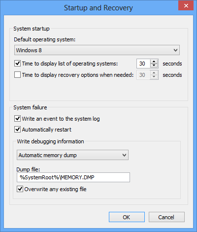

# Enabling a Kernel-Mode Dump File

## 

During a system crash, the Windows crash dump settings determine whether a dump file will be created, and if so, what size the dump file will be.

The Windows Control Panel controls the kernel-mode crash dump settings. Only a system administrator can modify these settings.

To change these settings, go to **Control Panel &gt; System and Security &gt; System**. Click **Advanced system settings**. Under **Startup and Recovery**, click **Settings**.

You will see the following dialog box:

Under **Write Debugging Information**, you can specify a kernel-mode dump file setting. Only one dump file can be created for any given crash. See [Varieties of Kernel-Mode Dump Files](varieties-of-kernel-mode-dump-files.md) for a description of different dump file settings.

You can also select or deselect the **Write an event to the system log** and **Automatically restart** options.

The settings that you select will apply to any kernel-mode dump file created by a system crash, regardless of whether the system crash was accidental or whether it was caused by the debugger. See [Forcing a System Crash](forcing-a-system-crash.md) for details on causing a deliberate crash.

However, these settings do not affect dump files created by the [**.dump**](-dump--create-dump-file-.md) command. See [Creating a Dump File Without a System Crash](creating-a-dump-file-without-a-system-crash.md) for details on using this command.

## Related topics

[Kernel-Mode Dump Files](kernel-mode-dump-files.md)

[Varieties of Kernel-Mode Dump Files](varieties-of-kernel-mode-dump-files.md)

 

 

[Send comments about this topic to Microsoft](mailto:wsddocfb@microsoft.com?subject=Documentation%20feedback%20[debugger\debugger]:%20Enabling%20a%20Kernel-Mode%20Dump%20File%20%20RELEASE:%20%285/15/2017%29&body=%0A%0APRIVACY%20STATEMENT%0A%0AWe%20use%20your%20feedback%20to%20improve%20the%20documentation.%20We%20don't%20use%20your%20email%20address%20for%20any%20other%20purpose,%20and%20we'll%20remove%20your%20email%20address%20from%20our%20system%20after%20the%20issue%20that%20you're%20reporting%20is%20fixed.%20While%20we're%20working%20to%20fix%20this%20issue,%20we%20might%20send%20you%20an%20email%20message%20to%20ask%20for%20more%20info.%20Later,%20we%20might%20also%20send%20you%20an%20email%20message%20to%20let%20you%20know%20that%20we've%20addressed%20your%20feedback.%0A%0AFor%20more%20info%20about%20Microsoft's%20privacy%20policy,%20see%20http://privacy.microsoft.com/default.aspx. "Send comments about this topic to Microsoft")

