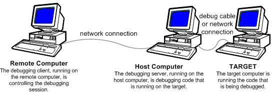

# Remote Debugging Using KD


Remote debuggng involves two debuggers running at two different locations. The debugger that performs the debugging is called the *debugging server*. The second debugger, called the *debugging client*, controls the debugging session from a remote location. To establish a remote session, you must set up the debugging server first and then activate the debugging client.

The code that is being debugged could be running on the same computer that is running the debugging server, or it could be running on a separate computer. If the debugging server is performing user-mode debugging, then the process that is being debugged can run on the same computer as the debugging server. If the debugging server is performing kernel-mode debugging, then the code being debugged would typcially run on a separate target computer.

The following diagram illustrates a remote session where the debugging server, running on a host computer, is performing kernel-mode debugging of code that is running on a separate target computer.



There are several transport protocols you can use for a remote debugging connection: TCP, NPIPE, SPIPE, SSL, and COM Port. Suppose you have chosen to use TCP as the protocol and you have chosen to use KD as both the debugging client and the debugging server. You can use the following procedure to establish a remote kernel-mode debugging session:

1.  On the host computer, open KD and establish a kernel-mode debugging session with a target computer. (See [Performing Kernel-Mode Debugging Using KD](performing-kernel-mode-debugging-using-kd.md).)
2.  Break in by pressing CRTL-Break.
3.  Enter the following command.

    **.server tcp:port=5005**

    **Note**  The port number 5005 is arbitrary. The port number is your choice.

     

4.  KD will respond with output similar to the following.

    ```
    Server started.  Client can connect with any of these command lines
    0: <debugger> -remote tcp:Port=5005,Server=YourHostComputer
    ```

5.  On the remote computer, open a Command Prompt window, and enter the following command.

    **kd -remote tcp:Port=5005,Server=***YourHostComputer*

    where *YourHostComputer* is the name of your host computer, which is running the debugging server.

## <span id="Additional_Information"></span><span id="additional_information"></span><span id="ADDITIONAL_INFORMATION"></span>Additional Information


For complete information about launching KD (and establishing remote debugging) at the command line, see [**KD Command-Line Options**](kd-command-line-options.md).

 

 

[Send comments about this topic to Microsoft](mailto:wsddocfb@microsoft.com?subject=Documentation%20feedback%20[debugger\debugger]:%20Remote%20Debugging%20Using%20KD%20%20RELEASE:%20%285/15/2017%29&body=%0A%0APRIVACY%20STATEMENT%0A%0AWe%20use%20your%20feedback%20to%20improve%20the%20documentation.%20We%20don't%20use%20your%20email%20address%20for%20any%20other%20purpose,%20and%20we'll%20remove%20your%20email%20address%20from%20our%20system%20after%20the%20issue%20that%20you're%20reporting%20is%20fixed.%20While%20we're%20working%20to%20fix%20this%20issue,%20we%20might%20send%20you%20an%20email%20message%20to%20ask%20for%20more%20info.%20Later,%20we%20might%20also%20send%20you%20an%20email%20message%20to%20let%20you%20know%20that%20we've%20addressed%20your%20feedback.%0A%0AFor%20more%20info%20about%20Microsoft's%20privacy%20policy,%20see%20http://privacy.microsoft.com/default.aspx. "Send comments about this topic to Microsoft")


