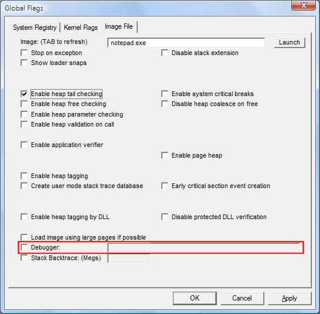

# Running a Program in a Debugger

## 

This feature configures the program so that it always runs in a debugger with the specified options. This setting is saved in the registry. It affects all new instances of the program and remains effective until you change it.

**To run a program in a debugger**

1.  Click the **Image File** tab.

2.  In the **Image** box, type the name of an executable file or DLL, including the file name extension,and then press the TAB key.

    This activates the check boxes on the **Image File** tab.

3.  Click the **Debugger** check box to select it.

    The following screen shot shows the **Debugger** check box on the **Image File** tab in Windows Vista.

    

4.  In the **Debugger** box, type the command to run the debugger, including the path (optional) and name of the debugger and parameters. For example, **ntsd -d -g -G -x** or **c:\\debuggers\\cdb.exe -g -G**.

5.  Click **Apply**.

 

 

[Send comments about this topic to Microsoft](mailto:wsddocfb@microsoft.com?subject=Documentation%20feedback%20[debugger\debugger]:%20Running%20a%20Program%20in%20a%20Debugger%20%20RELEASE:%20%284/24/2017%29&body=%0A%0APRIVACY%20STATEMENT%0A%0AWe%20use%20your%20feedback%20to%20improve%20the%20documentation.%20We%20don't%20use%20your%20email%20address%20for%20any%20other%20purpose,%20and%20we'll%20remove%20your%20email%20address%20from%20our%20system%20after%20the%20issue%20that%20you're%20reporting%20is%20fixed.%20While%20we're%20working%20to%20fix%20this%20issue,%20we%20might%20send%20you%20an%20email%20message%20to%20ask%20for%20more%20info.%20Later,%20we%20might%20also%20send%20you%20an%20email%20message%20to%20let%20you%20know%20that%20we've%20addressed%20your%20feedback.%0A%0AFor%20more%20info%20about%20Microsoft's%20privacy%20policy,%20see%20http://privacy.microsoft.com/default.aspx. "Send comments about this topic to Microsoft")

