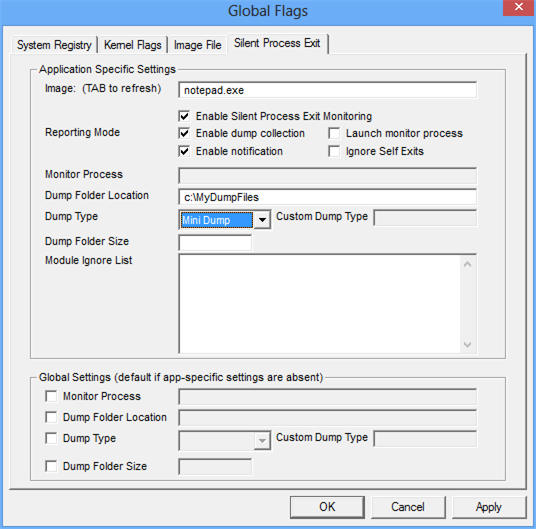

# Configuring Silent Process Exit Monitoring

Beginning in Windows 7, you can use the **Silent Process Exit** tab to enable and configure monitoring of silent exit for a process.

## 

Settings that you specify in the **Silent Process Exit** tab are saved in the registry and remain effective until you change them.

**To enable and configure silent process exit monitoring**

1.  Click the **Silent Process Exit** tab.

    The following screen shot shows the **Silent Process Exit** tab in Windows 8.

    

2.  In the **Image** box, type the name of an executable file, including the file name extension, and then press the TAB key.

    This activates the check boxes on the **Silent Process Exit** tab.

3.  Specify your preferences by selecting or clearing check boxes and by entering values in text boxes.

4.  When you specified all of your preferences, click **Apply**.

## Related topics

[Monitoring Silent Process Exit](registry-entries-for-silent-process-exit.md)

[Enable silent process exit monitoring](enable-silent-process-exit-monitoring.md)

 

 

[Send comments about this topic to Microsoft](mailto:wsddocfb@microsoft.com?subject=Documentation%20feedback%20[debugger\debugger]:%20Configuring%20Silent%20Process%20Exit%20Monitoring%20%20RELEASE:%20%285/15/2017%29&body=%0A%0APRIVACY%20STATEMENT%0A%0AWe%20use%20your%20feedback%20to%20improve%20the%20documentation.%20We%20don't%20use%20your%20email%20address%20for%20any%20other%20purpose,%20and%20we'll%20remove%20your%20email%20address%20from%20our%20system%20after%20the%20issue%20that%20you're%20reporting%20is%20fixed.%20While%20we're%20working%20to%20fix%20this%20issue,%20we%20might%20send%20you%20an%20email%20message%20to%20ask%20for%20more%20info.%20Later,%20we%20might%20also%20send%20you%20an%20email%20message%20to%20let%20you%20know%20that%20we've%20addressed%20your%20feedback.%0A%0AFor%20more%20info%20about%20Microsoft's%20privacy%20policy,%20see%20http://privacy.microsoft.com/default.aspx. "Send comments about this topic to Microsoft")

