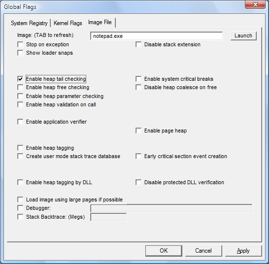

# Setting and Clearing Image File Flags

## 

Image file settings affect instances of the specified program that start after the command completes. They are saved in the registry and remain effective until you change them.

**To set and clear the image file registry flags**

1.  Click the **Image File** tab.

    The following screen shot shows the **Image File** tab in Windows Vista.

    

2.  In the **Image** box, type the name of an executable file or DLL, including the file name extension,and then press the TAB key.

    This activates the check boxes on the **Image File** tab.

3.  Set or clear a flag by selecting or clearing the check box associated with the flag.

4.  When you have selected or cleared all of the flags you want, click **Apply**.

 

 

