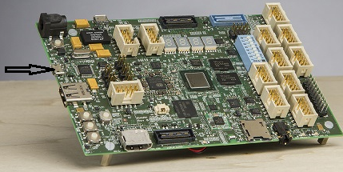
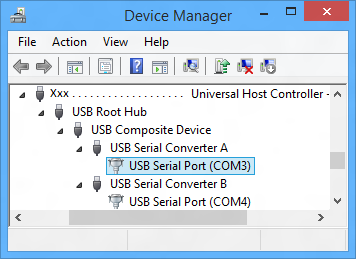
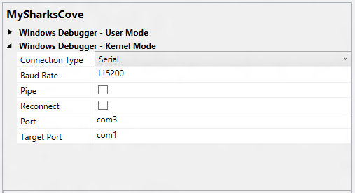

# Setting Up Kernel-Mode Debugging using Serial over USB in Visual Studio

The [Sharks Cove development board](http://go.microsoft.com/fwlink/p?linkid=403168) supports serial debugging over a USB cable.

To use Microsoft Visual Studio for kernel-mode debugging, you must have the Windows Driver Kit (WDK) integrated with Visual Studio. For information about how to install the integrated environment, see [Windows Driver Kit (WDK)](http://go.microsoft.com/fwlink/p?linkid=301383).

As an alternative to using Visual Studio to set up serial debugging over a USB cable, you can do the setup manually. For more information, see [Setting Up Kernel-Mode Debugging using Serial over USB Manually](setting-up-kernel-mode-debugging-using-serial-over-usb-manually-.md).

The computer that runs the debugger is called the *host computer*, and the computer being debugged is called the *target computer*. In this topic, the Sharks Cove board is the target computer.

## Setting up a Host Computer for debugging the Sharks Cove board

1.  On the host computer, open Device Manager. On the **View** menu, choose **Devices by Type**.

2.  On the Sharks Cove board, locate the debug connector. This is the micro USB connector shown in the following picture.

    

3.  Use a USB 2.0 cable to connect the host computer to the debug connector on the Sharks cove board.

4.  On the host computer, in Device Manager, two COM ports will get enumerated. Select the lowest numbered COM port. On the **View** menu, choose **Devices by Connection**. Verify that the COM port is listed under one of the USB host controllers.

    

    Make a note of the COM port number. This is the lowest COM port number that shows under the USB host controller node. For example, in the preceding screen shot, the lowest COM port number under the USB host controller is COM3. You will need this COM port number later when you start a debugging session. If the driver is not already installed for the COM port, right click the COM port node, and choose **Update Driver**. Then select **Search automatically for updated driver software**. You will need an internet connection for this.

## Configuring the host and target computers

In these steps, the Sharks Cove board is the target computer.

1.  Begin configuring your host and target computer as described in [Provision a computer for driver deployment and testing (WDK 8.1)](https://msdn.microsoft.com/library/windows/hardware/dn745909).
2.  On the host computer, in Visual Studio, when you come to the Computer Configuration dialog box, select **Provision computer and choose debugger settings**.
3.  For **Connection Type**, choose **Serial**.

    

    For **Baud Rate**, enter 115200. For **Port**, enter the name of the COM port that you noted previously in Device Manager (for example, com3). For **Target Port**, enter com1.

4.  The configuration process takes several minutes and might automatically reboot the target computer once or twice. When the process is complete, click **Finish**.

## Starting the Debugging Session

1.  On the host computer, in Visual Studio, on the **Tools** menu, choose **Attach to Process**.
2.  For **Transport**, choose **Windows Kernel Mode Debugger**.
3.  For **Qualifier**, select the name of the target computer that you previously configured.
4.  Click **Attach**.

## Troubleshooting Tips for Serial Debugging over a USB Cable

### Specify correct COM port on both host and target

On the target computer (Sharks Cove board), verify that you are using COM1 for debugging. Open a Command Prompt window as Administrator, and enter **bcdedit /dbgsettings**. The output of **bcdedit** should show `debugport 1`.

On the host computer, verify that you are using the COM port that you noted earlier in Device Manager.

1.  On the host computer, in Visual Studio, on the **Driver** menu, choose **Test &gt; Configure Computers**.
2.  Select the name of your test computer, and click **Next**.
3.  Select **Provision computer and choose debugger settings**. Click **Next**.
4.  Verify that the correct COM port number is listed for **Port**.

### Baud rate must be the same on host and target

The baud rate must be 115200 on both the host and target computers.

On the target computer (Sharks Cove board), open a Command Prompt window as Administrator, and enter **bcdedit /dbgsettings**. The output of **bcdedit** should show `baudrate 115200`.

On the host computer, verify that you are using a baud rate of 115200.

1.  On the host computer, in Visual Studio, on the **Driver** menu, choose **Test &gt; Configure Computers**.
2.  Select the name of your test computer, and click **Next**.
3.  Select **Provision computer and choose debugger settings**. Click **Next**.
4.  Verify that the **Baud Rate** is 115200.

## Related topics

[Setting Up Kernel-Mode Debugging in Visual Studio](setting-up-kernel-mode-debugging-in-visual-studio.md)

 

 

[Send comments about this topic to Microsoft](mailto:wsddocfb@microsoft.com?subject=Documentation%20feedback%20[debugger\debugger]:%20Setting%20Up%20Kernel-Mode%20Debugging%20using%20Serial%20over%20USB%20in%20Visual%20Studio%20%20RELEASE:%20%285/15/2017%29&body=%0A%0APRIVACY%20STATEMENT%0A%0AWe%20use%20your%20feedback%20to%20improve%20the%20documentation.%20We%20don't%20use%20your%20email%20address%20for%20any%20other%20purpose,%20and%20we'll%20remove%20your%20email%20address%20from%20our%20system%20after%20the%20issue%20that%20you're%20reporting%20is%20fixed.%20While%20we're%20working%20to%20fix%20this%20issue,%20we%20might%20send%20you%20an%20email%20message%20to%20ask%20for%20more%20info.%20Later,%20we%20might%20also%20send%20you%20an%20email%20message%20to%20let%20you%20know%20that%20we've%20addressed%20your%20feedback.%0A%0AFor%20more%20info%20about%20Microsoft's%20privacy%20policy,%20see%20http://privacy.microsoft.com/default.aspx. "Send comments about this topic to Microsoft")

