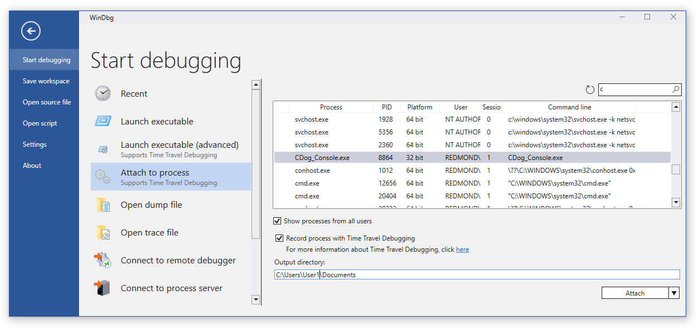
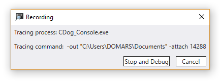

> [!NOTE]
> The information in this topic is preliminary. Updated information will be provided in a later release of the documentation. 
>

#  Time Travel Debugging - Record a trace 

This section describes how to record time travel debugging (TTD) traces. There are two ways to record a Trace in WinDbg Preview, *Launch Executable (advanced)* and *Attach to a process*. 


## Launch executable (advanced)

To launch an executable and record a TTD trace, follow these steps.

1. In WinDbg Preview, select **File** > **Start debugging** > **Launch executable (advanced)**.

2. Enter the path to the user mode executable that you wish to record or select **Browse** to navigate to the executable. For information about working with the Launch Executable menu in WinDbg Preview, see [WinDbg Preview - Start a user-mode session](windbg-user-mode-preview.md).

    


3. Check the **Record process with Time Travel Debugging** box to record a trace when the executable is launched. 

4. Click **OK** to launch the executable and start recording. 

5. The recording dialog appears indicating the trace is being recorded.

    

6. See [How to record](#HOWTORECORD) for information on recording.


## Attach to a process

To attach to a process and record a TTD trace, follow these steps.

1. In WinDbg Preview, select **File** > **Start debugging** > **Attach to process**.

2. Select the user mode process that you wish to trace. For information about working with *Attach to a process* menu in WinDbg Preview, see [WinDbg Preview - Start a user-mode session](windbg-user-mode-preview.md).

    


3. Check the **Record Process with Time Travel Debugging** box to create a trace when the executable is launched. 

4. Click **Attach** to start recording. 

5. The recording dialog appears indicating the trace is being recorded.

    

6. See [How to record](#HOWTORECORD) for information on recording.

## <span id="HOWTORECORD"></span><span id="howtorecord"></span>How to record

1. The process is being recorded, so this is where you need to cause the issue that you wish to debug. You may open a problematic file or click on a specific button in the app to cause the event of interest to occur. 

2. While the recording dialog box is being displayed you can:

    - **Stop and debug** - Choosing this will stop the recording, create the trace file and open the trace file so you can start debugging. 
    - **Cancel** - Choosing this will stop the recording and create the trace file. You can open the trace file at a later time. 
   
3. Once your recording is complete, close your app or hit **Stop and debug**.

   > [!NOTE]
   > Both *Stop and debug* and *Cancel* will terminate the associated process. 
   >   

4. When the application being recorded terminates, the trace file will be closed and written out to disk. This is the case if your program crashes as well.

5. When a trace file is opened, the debugger will automatically index the trace file. Indexing allows for more accurate and faster memory value look ups. This indexing process will take longer for larger trace files.

    ```
    ...
    00007ffc`61f789d4 c3              ret
    0:000> !index
    Indexed 1/1 keyframes
    Successfully created the index in 96ms.
    ```
   > [!NOTE]
   > A keyframe is a location in a trace used for indexing. Keyframes are generated automatically. Larger traces will contain more keyframes. When the trace is indexed, the number of keyframes is displayed. 
   >   
 
6. At this point you are at the beginning of the trace file and are ready to travel forward and backward in time.

    > [!TIP]
    > Using breakpoints is a common approach to pause code execution at some event of interest.  Unique to TTD, you can set a breakpoint and travel back in time until that breakpoint is hit after the trace has been recorded. The ability to examine the process state after an issue has happened, to determine the best location for a breakpoint, enables additional debugging workflows. For an example of using a breakpoint in the past, see [Time Travel Debugging - Sample App Walkthrough](time-travel-debugging-walkthrough.md).

## Next Steps

Now that you have a recorded a TTD trace, you can replay the trace back or work with the trace file, for example sharing it with a co-worker. For more information, see these topics.

[Time Travel Debugging - Replay a trace](time-travel-debugging-replay.md)

[Time Travel Debugging - Working with trace files](time-travel-debugging-trace-file-information.md)

[Time Travel Debugging - Troubleshooting](time-travel-debugging-troubleshooting.md)

[Time Travel Debugging - Sample App Walkthrough](time-travel-debugging-walkthrough.md)


## See Also

[Time Travel Debugging - Overview](time-travel-debugging-overview.md)

---


