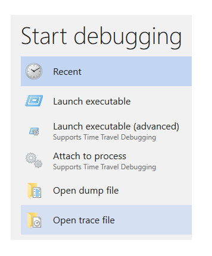

> [!NOTE]
> The information in this topic is preliminary. Updated information will be provided in a later release of the documentation. 
>


#  Time Travel Debugging - Working with Trace Files

This section describes how to work with files created and consumed by time travel debugging.

## Trace File Overview

Time Travel Debugging uses the following files to debug code execution.

- The trace file contains the code execution recording and has a .RUN extension.

- The index file enables quick access to information in the Trace file and has an .IDX extension.

- Recording errors and other recording output is written to the debugger log file.


## Trace .RUN files  

Trace .RUN files can be opened after they are recorded using **File** > **Start debugging** > **Open trace file**.

 

All of the trace output files are stored in the users document folder by default. For example, for User1 the TTD files would be stored here:

```
C:\Users\User1\Documents
```
You can change the location of the trace files when you start to record. For more information, see [Time Travel Debugging - Recording](time-travel-debugging-recording.md).

The most recently used list of files allows you to quickly access previously used target configuration files. Any recently used trace files or dump files are listed as well. 

 


## Index .IDX files  

An index .IDX file is created for the associated trace .RUN file automatically when opening the trace file in WinDbg Preview. You can manually create the index file by using the !index command. An index allows for faster access to the trace information. 

IDX files can also be large, typically twice the size of the  .RUN file.  

## Recreating the .IDX file
You can recreate the .IDX file from the .RUN file, using the ```!index``` command. For more information, see [Time Travel Debugging - !index (time travel)](time-travel-debugging-extension-index.md).

```
0:0:001> !index
Indexed 3/3 keyframes
Successfully created the index in 49ms.
```

## Sharing TTD Trace .RUN files

TTD trace files can be shared with others by copying the .RUN file. This can be handy for having a coworker help you figure out the problem. They don't need to install the crashing app or do any other related setup to attempt to reproduce the issue. They can just load the trace file and debug the app as if it was installed on their PC. 

You can rename the file to include any additional information, such as the date or a bug number.

The .IDX file does not need to be copied as it can be re-created using the !index command as described above.


> [!TIP]
> When collaborating with others, pass on any relevant trace positions related to the problem at hand. The collaborator can use the ```!tt x:y``` command to move to that exact point in time in the execution of the code. Time position ranges can be included in bug descriptions to track where the possible issue may be occurring.
>


## Error - Log File

Recording errors and other recording output is written to the debugger log file. To view the log file, select **View** > **Logs**. 

This example shows the error log text when attempting to launch and record an executable named Foo.exe that is not in the C:\Windows directory.

```
2017-09-21:17:18:10:320 : Information : DbgXUI.dll : TTD: Output: 
Microsoft (R) TTD 1.01.02
Release: 10.0.16366.1000
Copyright (C) Microsoft Corporation. All rights reserved.
Launching C:\Windows\Foo.exe
2017-09-21:17:18:10:320 : Error : DbgXUI.dll : TTD: Errors: 
Error: Trace of C:\Windows\Foo.exe PID:0 did not complete successfully: status:27
Error: Could not open 'Foo.exe'; file not found.
Error: Corrupted trace dumped to C:\Users\ivcarr.REDMOND\Documents\Foo01.run.err.
```


## See Also

[Time Travel Debugging - Overview](time-travel-debugging-overview.md)

---


[Send comments about this topic to Microsoft](mailto:wsddocfb@microsoft.com?subject=Documentation%20feedback%20[debugger\debugger]:%20Debugging%20Using%20WinDbg%20%20RELEASE:%20%285/15/2017%29&body=%0A%0APRIVACY%20STATEMENT%0A%0AWe%20use%20your%20feedback%20to%20improve%20the%20documentation.%20We%20don't%20use%20your%20email%20address%20for%20any%20other%20purpose,%20and%20we'll%20remove%20your%20email%20address%20from%20our%20system%20after%20the%20issue%20that%20you're%20reporting%20is%20fixed.%20While%20we're%20working%20to%20fix%20this%20issue,%20we%20might%20send%20you%20an%20email%20message%20to%20ask%20for%20more%20info.%20Later,%20we%20might%20also%20send%20you%20an%20email%20message%20to%20let%20you%20know%20that%20we've%20addressed%20your%20feedback.%0A%0AFor%20more%20info%20about%20Microsoft's%20privacy%20policy,%20see%20http://privacy.microsoft.com/default.aspx. "Send comments about this topic to Microsoft")


