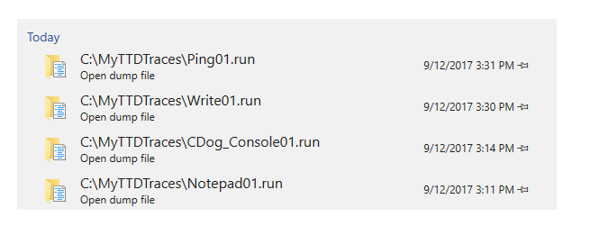

> [!NOTE]
> The information in this topic is preliminary. Updated information will be provided in a later release of the documentation. 
>


#  Time Travel Debugging - Working with Trace Files

This section describes how to work with time travel trace files.

## Trace File Overview

.RUN files are used to record code execution.

.IDX files are created when the trace file is closed and enable quick acess to memory locations in the trace file. 

.OUT files are used to log error messages, when failures occur.

## Trace .RUN files  

Trace .RUN files can be opened after they are recorded using **File** > **Open Trace**.

 

All of the output files are stored in the users document folder by default. For example, for User1 the TTD files would be stored here:

```
C:\Users\User1\Documents
```
The most recently used list of trace files allows you to work with previously used files.

 


## Trace .IDX index files  

Once the tracing is stopped an index (.IDX) file is created to allow for faster access to the trace information.

IDX files can also be large, typically ??? TBD *x to y size* larger than the .RUN file. 

## Recreating the .IDX file
You can recreate the index file from the .RUN file using the ```!tt.index``` command.

```
0:0:001> !tt.index
Indexed 3/3 keyframes
Successfully created the index in 49ms.
```

## Sharing TTD Trace .RUN files

TTD trace files can be shared with others by copying the .RUN file. You can rename the file to include any addtional information, such as the date or a bug number.

The .IDX file does not need to be copied as it can be re-created using the !tt.index command.


> [!TIP]
> When collaborating with others, pass on any relevant trace positions realted to the problem at hand. The collaborator can use the ```!tt x:y``` command to move to that exact point in time in the execution of the code. Time position ranges can be included in bug descriptions to track where the possible issue be occuring.
>


## .OUT files

Recording errors and other recording output is written to an .out file. 

TBD ??? - Need to confirm that an out file is only created on error.

```
Initializing Time Travel Tracing for Launch of "C:\Windows\Notepad.exe test.txt"
Time: 08/03/2017 17:23:33
OS:10.0.15063 EDITION:x64
Group tracing GUID: f8295bed-5a11-401c-8650-5f0c74390c0e

Running "C:\Windows\Notepad.exe test.txt"
Error: Failed starting the guest process "C:\Windows\Notepad.exe test.txt" : error:(2)The system cannot find the file specified.

   (onecore\sdktools\debuggers\ttd\dev\idna\tracer\client.cpp:StartGuestProcess:2426)
Trace dumped to C:\Users\User1\Documents\Notepad.exe test01.run
```


## See Also

[Time Travel Debugging - Overview](time-travel-debugging-overview.md)

---


[Send comments about this topic to Microsoft](mailto:wsddocfb@microsoft.com?subject=Documentation%20feedback%20[debugger\debugger]:%20Debugging%20Using%20WinDbg%20%20RELEASE:%20%285/15/2017%29&body=%0A%0APRIVACY%20STATEMENT%0A%0AWe%20use%20your%20feedback%20to%20improve%20the%20documentation.%20We%20don't%20use%20your%20email%20address%20for%20any%20other%20purpose,%20and%20we'll%20remove%20your%20email%20address%20from%20our%20system%20after%20the%20issue%20that%20you're%20reporting%20is%20fixed.%20While%20we're%20working%20to%20fix%20this%20issue,%20we%20might%20send%20you%20an%20email%20message%20to%20ask%20for%20more%20info.%20Later,%20we%20might%20also%20send%20you%20an%20email%20message%20to%20let%20you%20know%20that%20we've%20addressed%20your%20feedback.%0A%0AFor%20more%20info%20about%20Microsoft's%20privacy%20policy,%20see%20http://privacy.microsoft.com/default.aspx. "Send comments about this topic to Microsoft")


