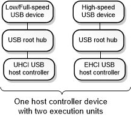

# USB 2.0 Extensions

This section describes the USB 2.0 debugger extension commands. These commands display information from data structures maintained by drivers in the USB 2.0 driver stack. For more information about these three drivers, see [USB Driver Stack Architecture](http://go.microsoft.com/fwlink/p?LinkId=251983).

The USB 2.0 debugger extension commands are implemented in Usbkd.dll. To load the Usbkd commands, enter **.load usbkd.dll** in the debugger.

## USB 2.0 Tree

The USB 2.0 tree contains the device nodes that represent execution units on EHCI host controller devices along with the child nodes that represent hubs and connected devices. This diagram shows an example of a USB 2.0 tree.

The diagram shows one physical host controller device that has two execution units. Each execution unit appears as a device node in the Plug and Play device tree. One execution unit appears as a UHCI USB host controller node, and the other execution unit shows as an EHCI USB host controller node. Each of those nodes has a child node that represents a USB root hub. Each root hub has a single child node that represents a connected USB device.

Notice that the diagram is not a tree in the sense that not all nodes descend from a single parent node. However, when we use the term *USB 2.0 tree*, we are referring to the set of device nodes that represent execution units on EHCI host controller devices along with the nodes for hubs and connected devices.

## Getting started with USB 2.0 debugging

To start debugging a USB 2.0 issue, enter the [**!usb2tree**](-usbkd-usb2tree.md) command. The **!usb2tree** command displays a list of commands and addresses that you can use to investigate host controllers, hubs, ports, devices, endpoints, and other elements of the USB 2.0 tree.

## In this section

-   [**!usbkd.usbhelp**](-usbkd-usbhelp.md)
-   [**!usbkd.\_ehcidd**](-usbkd--ehcidd.md)
-   [**!usbkd.\_ehciep**](-usbkd--ehciep.md)
-   [**!usbkd.\_ehciframe**](-usbkd--ehciframe.md)
-   [**!usbkd.\_ehciqh**](-usbkd--ehciqh.md)
-   [**!usbkd.\_ehciregs**](-usbkd--ehciregs.md)
-   [**!usbkd.\_ehcisitd**](-usbkd--ehcisitd.md)
-   [**!usbkd.\_ehcistq**](-usbkd--ehcistq.md)
-   [**!usbkd.\_ehcitd**](-usbkd--ehcitd.md)
-   [**!usbkd.\_ehcitfer**](-usbkd--ehcitfer.md)
-   [**!usbkd.\_ehciitd**](-usbkd--ehciitd.md)
-   [**!usbkd.doesdumphaveusbdata**](-usbkd-doesdumphaveusbdata.md)
-   [**!usbkd.isthisdumpasyncissue**](-usbkd-isthisdumpasyncissue.md)
-   [**!usbkd.urbfunc**](-usbkd-urbfunc.md)
-   [**!usbkd.usb2**](-usbkd-usb2.md)
-   [**!usbkd.usb2tree**](-usbkd-usb2tree.md)
-   [**!usbkd.usbchain**](-usbkd-usbchain.md)
-   [**!usbkd.usbdevobj**](-usbkd-usbdevobj.md)
-   [**!usbkd.usbdpc**](-usbkd-usbdpc.md)
-   [**!usbkd.ehci\_info\_from\_fdo**](-usbkd-ehci-info-from-fdo.md)
-   [**!usbkd.usbdevh**](-usbkd-usbdevh.md)
-   [**!usbkd.usbep**](-usbkd-usbep.md)
-   [**!usbkd.usbfaildata**](-usbkd-usbfaildata.md)
-   [**!usbkd.usbhcdext**](-usbkd-usbhcdext.md)
-   [**!usbkd.usbdstatus**](-usbkd-usbdstatus.md)
-   [**!usbkd.usbhcdhccontext**](-usbkd-usbhcdhccontext.md)
-   [**!usbkd.usbhcdlist**](-usbkd-usbhcdlist.md)
-   [**!usbkd.usbhcdlistlogs**](-usbkd-usbhcdlistlogs.md)
-   [**!usbkd.usbhcdlog**](-usbkd-usbhcdlog.md)
-   [**!usbkd.usbhcdlogex**](-usbkd-usbhcdlogex.md)
-   [**!usbkd.usbhcdpnp**](-usbkd-usbhcdpnp.md)
-   [**!usbkd.usbhcdpow**](-usbkd-usbhcdpow.md)
-   [**!usbkd.hub2\_info\_from\_fdo**](-usbkd-hub2-info-from-fdo.md)
-   [**!usbkd.usbhuberr**](-usbkd-usbhuberr.md)
-   [**!usbkd.usbhubext**](-usbkd-usbhubext.md)
-   [**!usbkd.usbhubinfo**](-usbkd-usbhubinfo.md)
-   [**!usbkd.usbhublog**](-usbkd-usbhublog.md)
-   [**!usbkd.usbhubmddevext**](-usbkd-usbhubmddevext.md)
-   [**!usbkd.usbhubmdpd**](-usbkd-usbhubmdpd.md)
-   [**!usbkd.usbhubpd**](-usbkd-usbhubpd.md)
-   [**!usbkd.usbhubs**](-usbkd-usbhubs.md)
-   [**!usbkd.usblist**](-usbkd-usblist.md)
-   [**!usbkd.usbpo**](-usbkd-usbpo.md)
-   [**!usbkd.usbpdos**](-usbkd-usbpdos.md)
-   [**!usbkd.usbpdoxls**](-usbkd-usbpdoxls.md)
-   [**!usbkd.usbpnp**](-usbkd-usbpnp.md)
-   [**!usbkd.usbportisasyncadv**](-usbkd-usbportisasyncadv.md)
-   [**!usbkd.usbportmdportlog**](-usbkd-usbportmdportlog.md)
-   [**!usbkd.usbportmddcontext**](-usbkd-usbportmddcontext.md)
-   [**!usbkd.usbportmddevext**](-usbkd-usbportmddevext.md)
-   [**!usbkd.usbtriage**](-usbkd-usbtriage.md)
-   [**!usbkd.usbtt**](-usbkd-usbtt.md)
-   [**!usbkd.usbtx**](-usbkd-usbtx.md)
-   [**!usbkd.usbusb2ep**](-usbkd-usbusb2ep.md)
-   [**!usbkd.usbusb2tt**](-usbkd-usbusb2tt.md)
-   [**!usbkd.usbver**](-usbkd-usbver.md)

## Related topics

[USB 3.0 Extensions](usb-3-extensions.md)

[RCDRKD Extensions](rcdrkd-extensions.md)

 

 

[Send comments about this topic to Microsoft](mailto:wsddocfb@microsoft.com?subject=Documentation%20feedback%20[debugger\debugger]:%20USB%202.0%20Extensions%20%20RELEASE:%20%285/15/2017%29&body=%0A%0APRIVACY%20STATEMENT%0A%0AWe%20use%20your%20feedback%20to%20improve%20the%20documentation.%20We%20don't%20use%20your%20email%20address%20for%20any%20other%20purpose,%20and%20we'll%20remove%20your%20email%20address%20from%20our%20system%20after%20the%20issue%20that%20you're%20reporting%20is%20fixed.%20While%20we're%20working%20to%20fix%20this%20issue,%20we%20might%20send%20you%20an%20email%20message%20to%20ask%20for%20more%20info.%20Later,%20we%20might%20also%20send%20you%20an%20email%20message%20to%20let%20you%20know%20that%20we've%20addressed%20your%20feedback.%0A%0AFor%20more%20info%20about%20Microsoft's%20privacy%20policy,%20see%20http://privacy.microsoft.com/default.aspx. "Send comments about this topic to Microsoft")

