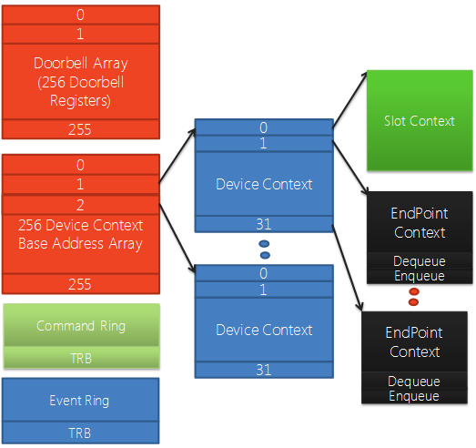
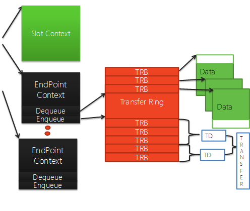

# USB 3.0 Data Structures

This topic describes the data structures used by the USB 3.0 host controller driver. Understanding these data structures will help you use the [USB 3.0](usb-3-extensions.md) and [RCDRKD](rcdrkd-extensions.md) debugger extension commands effectively. The data structures presented here have names that are consistent with the [USB 3.0 specification](http://go.microsoft.com/fwlink/p?LinkID=224892). Familiarity with the USB 3.0 specification will further enhance your ability to use the extension commands to debug USB 3.0 drivers.

The USB 3.0 host controller driver is part of the USB 3.0 core driver stack. For more information, see [USB Driver Stack Architecture](http://go.microsoft.com/fwlink/p?LinkID=251983).

Each USB 3.0 host controller can have up to 255 devices, and each device can have up to 31 endpoints. The following diagram shows some of the data structures that represent one host controller and the connected devices.

## Device Context Base Array

The Device Context Base Array is an array of pointers to Device Context structures. There is one Device Context structure for each device connected to the host controller. Elements 1 through 255 point to Device Context structures. Element 0 points to a context structure for the host controller.

## Device Context and Slot Context

A Device Context structure holds an array of pointers to Endpoint Context structures. There is one Endpoint Context structure for each endpoint on the device. Elements 1 through 31 point to Endpoint Context structures. Element 0 points to a Slot Context structure, which holds context information for the device.

## Command Ring

The Command Ring is used by software to pass commands to the host controller. Some of these commands are directed at the host controller, and some are directed at particular devices connected to the host controller.

## Event Ring

The Event Ring is used by the host controller to pass events to software. That is, the Event Ring is a structure that the host controller uses to inform drivers that an action has completed.

## Doorbell Register Array

The Doorbell Register Array is an array of doorbell registers, one for each device connected to the host controller. Elements 1 through 255 are doorbell registers. Element 0 indicates whether there is a pending command in the Command Ring.

Software notifies the host controller that it has device-related or endpoint-related work to perform by writing context information into the doorbell register for the device.

The following diagram continues to the right of the preceding diagram. It shows additional data structures that represent a single endpoint.

## Transfer Ring

Each endpoint has one or more Transfer Rings. A Transfer Ring is an array of Transfer Request Blocks (TRBs). Each TRB points to a block of contiguous data (up to 64 KB) that will be transferred between hardware and memory as a single unit.

When the USB 3.0 core stack receives a transfer request from a USB client driver, it identifies the Endpoint Context for the transfer, and then breaks the transfer request into one or more Transfer Descriptors (TDs). Each TD contains one or more TRBs.

## Endpoint Context

An Endpoint Context structure holds context information for a single endpoint. It also has **Dequeue** and **Enqueue** members, which are used to track where TRBs are being consumed by the hardware and where TRBs are being added by software.

## Related topics

[USB Debugging Innovations in Windows 8](http://go.microsoft.com/fwlink/p/?LinkID=249153)

 

 

[Send comments about this topic to Microsoft](mailto:wsddocfb@microsoft.com?subject=Documentation%20feedback%20[debugger\debugger]:%20USB%203.0%20Data%20Structures%20%20RELEASE:%20%285/15/2017%29&body=%0A%0APRIVACY%20STATEMENT%0A%0AWe%20use%20your%20feedback%20to%20improve%20the%20documentation.%20We%20don't%20use%20your%20email%20address%20for%20any%20other%20purpose,%20and%20we'll%20remove%20your%20email%20address%20from%20our%20system%20after%20the%20issue%20that%20you're%20reporting%20is%20fixed.%20While%20we're%20working%20to%20fix%20this%20issue,%20we%20might%20send%20you%20an%20email%20message%20to%20ask%20for%20more%20info.%20Later,%20we%20might%20also%20send%20you%20an%20email%20message%20to%20let%20you%20know%20that%20we've%20addressed%20your%20feedback.%0A%0AFor%20more%20info%20about%20Microsoft's%20privacy%20policy,%20see%20http://privacy.microsoft.com/default.aspx. "Send comments about this topic to Microsoft")

