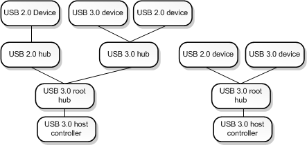

# USB 3.0 Extensions

This section describes the USB 3.0 debugger extension commands. These commands display information from data structures maintained by three drivers in the USB 3.0 stack: the USB 3.0 hub driver, the USB host controller extension driver, and the USB 3.0 host controller driver. For more information about these three drivers, see [USB Driver Stack Architecture](http://go.microsoft.com/fwlink/p?LinkId=251983). For an explanation of the data structures used by the drivers in the USB 3.0 stack, see [USB 3.0 Data Structures](usb-3-0-data-structures.md) and Part 2 of the [USB Debugging Innovations in Windows 8](http://go.microsoft.com/fwlink/p/?LinkID=249153) video.

The USB 3.0 debugger extension commands are implemented in Usb3kd.dll. To load the Usb3kd commands, enter **.load usb3kd.dll** in the debugger.

## USB 3.0 Tree

The USB 3.0 tree contains all USB 3.0 host controllers and all hubs and devices that are connected to USB 3.0 host controllers. The following diagram shows an example of a USB 3.0 tree.

The tree shown in the diagram has two USB 3.0 host controllers. Notice that not every device shown in the diagram is a USB 3.0 device. But all of the devices shown (including the hubs) are part of the USB 3.0 tree, because each device is on a branch that originates at a USB 3.0 host controller.

You can think of the diagram as two trees, one for each host controller. However, when we use the term *USB 3.0 tree*, we are referring to the set of all USB 3.0 host controllers along with their connected hubs and devices.

## Getting started with USB 3.0 debugging

To start debugging a USB 3.0 issue, enter the [**!usb\_tree**](-usb3kd-usb-tree.md) command. The **!usb\_tree** command displays a list of commands and addresses that you can use to investigate host controllers, hubs, ports, devices, endpoints, and other elements of the USB 3.0 tree.

## Hub commands

The following extension commands display information about USB 3.0 hubs, devices, and ports. The displayed information is based on data structures maintained by the USB 3.0 hub driver.

-   [**!usb3kd.usb\_tree**](-usb3kd-usb-tree.md)
-   [**!usb3kd.hub\_info**](-usb3kd-hub-info.md)
-   [**!usb3kd.hub\_info\_from\_fdo**](-usb3kd-hub-info-from-fdo.md)
-   [**!usb3kd.device\_info**](-usb3kd-device-info.md)
-   [**!usb3kd.device\_info\_from\_pdo**](-usb3kd-device-info-from-pdo.md)
-   [**!usb3kd.port\_info**](-usb3kd-port-info.md)

## UCX commands

The following extension commands display information about USB 3.0 host controllers, devices, and ports. The displayed information is based on data structures maintained by the USB host controller extension driver.

-   [**!usb3kd.ucx\_controller\_list**](-usb3kd-ucx-controller-list.md)
-   [**!usb3kd.ucx\_controller**](-usb3kd-ucx-controller.md)
-   [**!usb3kd.ucx\_device**](-usb3kd-ucx-device.md)
-   [**!usb3kd.ucx\_endpoint**](-usb3kd-ucx-endpoint.md)

## Host controller commands

The following extension commands display information from data structures maintained by the USB 3.0 host controller driver.

-   [**!usb3kd.xhci\_dumpall**](-usb3kd-xhci-dumpall.md)
-   [**!usb3kd.xhci\_capability**](-usb3kd-xhci-capability.md)
-   [**!usb3kd.xhci\_commandring**](-usb3kd-xhci-commandring.md)
-   [**!usb3kd.xhci\_deviceslots**](-usb3kd-xhci-deviceslots.md)
-   [**!usb3kd.xhci\_eventring**](-usb3kd-xhci-eventring.md)
-   [**!usb3kd.xhci\_registers**](-usb3kd-xhci-registers.md)
-   [**!usb3kd.xhci\_resourceusage**](-usb3kd-xhci-resourceusage.md)
-   [**!usb3kd.xhci\_trb**](-usb3kd-xhci-trb.md)
-   [**!usb3kd.xhci\_transferring**](-usb3kd-xhci-transferring.md)
-   [**!usb3kd.xhci\_findowner**](-xhci-findowner.md)

## Miscellaneous commands

-   [**!usb3kd.usbdstatus**](-usb3kd-usbdstatus.md)
-   [**!usb3kd.urb**](-usb3kd-urb.md)

## Related topics

[RCDRKD Extensions](rcdrkd-extensions.md)

 

 

[Send comments about this topic to Microsoft](mailto:wsddocfb@microsoft.com?subject=Documentation%20feedback%20[debugger\debugger]:%20USB%203.0%20Extensions%20%20RELEASE:%20%285/15/2017%29&body=%0A%0APRIVACY%20STATEMENT%0A%0AWe%20use%20your%20feedback%20to%20improve%20the%20documentation.%20We%20don't%20use%20your%20email%20address%20for%20any%20other%20purpose,%20and%20we'll%20remove%20your%20email%20address%20from%20our%20system%20after%20the%20issue%20that%20you're%20reporting%20is%20fixed.%20While%20we're%20working%20to%20fix%20this%20issue,%20we%20might%20send%20you%20an%20email%20message%20to%20ask%20for%20more%20info.%20Later,%20we%20might%20also%20send%20you%20an%20email%20message%20to%20let%20you%20know%20that%20we've%20addressed%20your%20feedback.%0A%0AFor%20more%20info%20about%20Microsoft's%20privacy%20policy,%20see%20http://privacy.microsoft.com/default.aspx. "Send comments about this topic to Microsoft")

