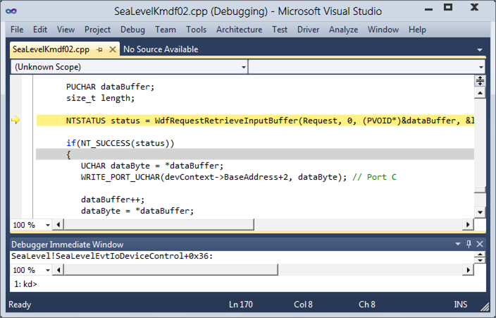

# Source Code Debugging in Visual Studio

The procedures shown in this topic require that you have the Windows Driver Kit integrated into Visual Studio. To get the integrated environment, first install Microsoft Visual Studio, and then install the Windows Driver Kit (WDK). For more information, see [Windows Driver Development](https://msdn.microsoft.com/library/windows/hardware/ff557573).

To use source debugging, you must have your compiler or linker create symbol files (.pdb files) when the binaries are built. These symbol files show the debugger how the binary instructions correspond to the source lines. Also, the debugger must be able to access the actual source files. For more information, see [Source Path](source-path.md).

When you break in to the target computer, or when code running on the target computer hits a breakpoint, Visual Studio displays source code if it can find the source file. You can step through the source code by choosing one of the **Step** commands from the **Debug** menu. You can also set breakpoints by clicking in the left column of the source window. The following screen shot shows a source code window in the Visual Studio debugger.

 

 

[Send comments about this topic to Microsoft](mailto:wsddocfb@microsoft.com?subject=Documentation%20feedback%20[debugger\debugger]:%20Source%20Code%20Debugging%20in%20Visual%20Studio%20%20RELEASE:%20%285/15/2017%29&body=%0A%0APRIVACY%20STATEMENT%0A%0AWe%20use%20your%20feedback%20to%20improve%20the%20documentation.%20We%20don't%20use%20your%20email%20address%20for%20any%20other%20purpose,%20and%20we'll%20remove%20your%20email%20address%20from%20our%20system%20after%20the%20issue%20that%20you're%20reporting%20is%20fixed.%20While%20we're%20working%20to%20fix%20this%20issue,%20we%20might%20send%20you%20an%20email%20message%20to%20ask%20for%20more%20info.%20Later,%20we%20might%20also%20send%20you%20an%20email%20message%20to%20let%20you%20know%20that%20we've%20addressed%20your%20feedback.%0A%0AFor%20more%20info%20about%20Microsoft's%20privacy%20policy,%20see%20http://privacy.microsoft.com/default.aspx. "Send comments about this topic to Microsoft")

