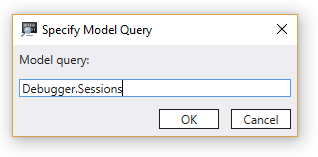
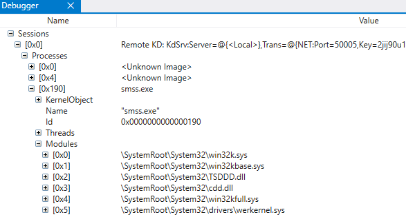
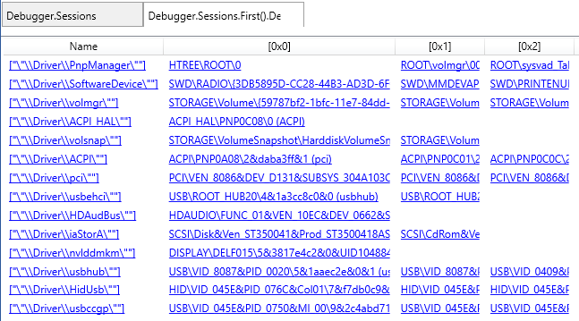

## WinDbg Preview - Data Model 

This section describes how to work with the data model menu in the WinDbg Preview debugger.


### New Model Query

Use the New Model Query dialog to create a new model query.

For example, specify `Debugger.Sessions` to examine the debugger sessions objects. 



For general information about the debugger objects refer to [dx (Display Debugger Object Model Expression)](dx--display-visualizer-variables-.md).

Use LINQ queries to dig deeper into the session. This query shows the top 5 processes running the most threads. 

```
Debugger.Sessions.First().Processes.Select(p => new { Name = p.Name, ThreadCount = p.Threads.Count() }).OrderByDescending(p => p.ThreadCount),5
```


### Data Model Explore

Use the data model explore to browse the data model objects. The data model explore window uses the current data object query. 




### Change Query

Use change query to change the query that is used in data model explore.


### Display Mode

Use display mode to toggle between grid and hierarchy display mode.

Grid mode can be useful to dig down in the objects. For example this query shows the devices in the plug and play device tree grouped by the name of the physical device object's driver.

>>> TBD  - Happy to replace this with a handles or module example, if you provide the query string.


```
Debugger.Sessions.First().Devices.DeviceTree.Flatten(n => n.Children).GroupBy(n => n.PhysicalDeviceObject->Driver->DriverName.ToDisplayString()) 
```



When you click on any underlined item a new tab is opened and a query is run to display that information.


 
## See Also

[Debugging Using WinDbg Preview](debugging-using-windbg-preview.md)
 
 

 

[Send comments about this topic to Microsoft](mailto:wsddocfb@microsoft.com?subject=Documentation%20feedback%20[debugger\debugger]:%20Debugging%20Using%20WinDbg%20%20RELEASE:%20%285/15/2017%29&body=%0A%0APRIVACY%20STATEMENT%0A%0AWe%20use%20your%20feedback%20to%20improve%20the%20documentation.%20We%20don't%20use%20your%20email%20address%20for%20any%20other%20purpose,%20and%20we'll%20remove%20your%20email%20address%20from%20our%20system%20after%20the%20issue%20that%20you're%20reporting%20is%20fixed.%20While%20we're%20working%20to%20fix%20this%20issue,%20we%20might%20send%20you%20an%20email%20message%20to%20ask%20for%20more%20info.%20Later,%20we%20might%20also%20send%20you%20an%20email%20message%20to%20let%20you%20know%20that%20we've%20addressed%20your%20feedback.%0A%0AFor%20more%20info%20about%20Microsoft's%20privacy%20policy,%20see%20http://privacy.microsoft.com/default.aspx. "Send comments about this topic to Microsoft")


