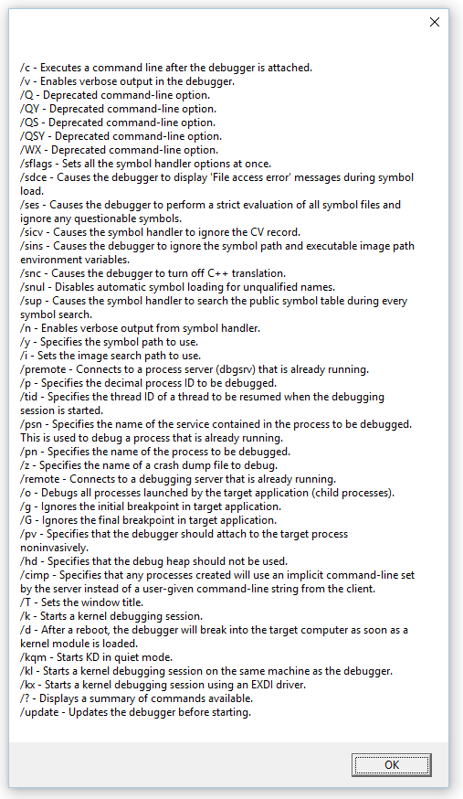

> [!NOTE]
> The information in this topic is preliminary. Updated information will be provided in a later release of the documentation. 
>

# WinDbg Preview - Installation and command line startup options


## Installation

This section describes how to install the WinDbg Preview debugger.

The WinDbg Preview debugger is available in the Windows Store. 

To install it, open the Windows Store and search for "Window Debugger Preview".

Once the app is a located, click on it to download and install.


## Checking for updates

1. Open the Store app and click on your account picture next to the search box. 

2. Click on **Downloads and Updates** to check for updates.

3. On the downloads and updates page, select **Get updates**.


## Installation Location

WinDbg Preview installs to:
```C:\Program Files\WindowsApps\Microsoft.WinDbg_Version_bit_id```

 Where the *bit* will be 32 bit or 64 bit and the *id* will be a unique identifier for the app.


## Command line startup options

You can use /? to list the supported command line options.



This following tables summarizes the available command line options.


**General Options**

Option | Description
|------ | -----------|
? | Displays a summary of commands available.


**Kernel Options**

Option | Description
|------ | -----------|
k | Starts a kernel debugging session. 
d | After a reboot, the debugger will break into the target computer as soon as a kernel module is loaded.
kqm | Starts KD in quiet mode. 
kl | Starts a kernel debugging session on the same machine as the debugger. 
kx | Starts a kernel debugging session using an EXDI driver.
 

**User Mode Options**

Option | Description
|------ | -----------|
o | Debugs all processes launched by the target application (child processes). 
g | Ignores the initial breakpoint in target application. 
G |Ignores the final breakpoint in target application. 
pv | Specifies that the debugger should attach to the target process noninvasively.
cimp | Specifies that any processes created will use an implicit command-line set by the server instead of a user-given command-line string from the client. 


**Target Options**

Option | Description
|------ | -----------|
premote | Connects to a process server (dbgsrv) that is already running. 
p| Specifies the decimal process ID to be debugged.
tid | Specifies the thread ID of a thread to be resumed when the debugging session is started. 
psn | Specifies the name of the service contained in the process to be debugged. This is used to debug a process that is already running.
pn | Specifies the name of the process to be debugged.
z | Specifies the name of a crash dump file to debug. 
remote | Connects to a debugging server that is already running

**Symbol Options**
(Content Pending)

Option | Description
|------ | -----------|
|
|
| 
|
|


For general information on the startup parameters, see [WinDbg Command-Line Options](windbg-command-line-options.md).


## Debugger coexistence  

The WinDbg preview coexists with the classic WinDbg debugger on the same machine, so you can work with both versions at the same time. 


---

## See Also

[Debugging Using WinDbg Preview](debugging-using-windbg-preview.md)

 

[Send comments about this topic to Microsoft](mailto:wsddocfb@microsoft.com?subject=Documentation%20feedback%20[debugger\debugger]:%20Debugging%20Using%20WinDbg%20%20RELEASE:%20%285/15/2017%29&body=%0A%0APRIVACY%20STATEMENT%0A%0AWe%20use%20your%20feedback%20to%20improve%20the%20documentation.%20We%20don't%20use%20your%20email%20address%20for%20any%20other%20purpose,%20and%20we'll%20remove%20your%20email%20address%20from%20our%20system%20after%20the%20issue%20that%20you're%20reporting%20is%20fixed.%20While%20we're%20working%20to%20fix%20this%20issue,%20we%20might%20send%20you%20an%20email%20message%20to%20ask%20for%20more%20info.%20Later,%20we%20might%20also%20send%20you%20an%20email%20message%20to%20let%20you%20know%20that%20we've%20addressed%20your%20feedback.%0A%0AFor%20more%20info%20about%20Microsoft's%20privacy%20policy,%20see%20http://privacy.microsoft.com/default.aspx. "Send comments about this topic to Microsoft")


