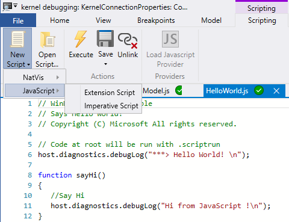

> [!NOTE]
> The information in this topic is preliminary. Updated information will be provided in a later release of the documentation. 
>


# WinDbg Preview - Scripting 

This section describes how to how to use the scripting support in the WinDbg Preview.



The WinDbg Preview script window features basic syntax highlighting, IntelliSense, and error recognition. 

Use the ribbon buttons to:
- Create a new script 
- Open an existing script
- Execute a script
- Save a script 
- Unlink a script
- Load the JavaScript Provider

You can also automatically execute scripts by right-clicking in the script window and selecting *Execute Script on Save*. When you successfully load a script, a green check box will appear on the script title bar. If there are errors in the script, a red x will be displayed.

## JavaScript Scripting 

To start using JavaScript, you must first be debugging a target. When you're ready to start working on your JavaScript, click "Load JavaScript Provider". After that you can create a new JavaScript, by picking between these two types of script templates.

- **Extension Script** - A script which is designed to act as an extension to the debugger.  It manipulates the object model of the debugger and provides continued functionality.  No action happens upon hitting the <i>Execute</i> button on the ribbon.

- **Imperative Script** - A script which is designed to perform an action each and every time the <i>Execute</i> button is clicked on the ribbon. Such a script does not generally modify the object model of the debugger.

For more information about working with JavaScript, see these topics:

[JavaScript Debugger Scripting](javascript-debugger-scripting.md)

[Native Debugger Objects in JavaScript Extensions](native-objects-in-javascript-extensions.md)

[JavaScript Debugger Example Scripts](javascript-debugger-example-scripts.md)

## NatVis Scripting 

Use **New Script** > **NatVis** to open the following blank NatVis template.

```
<AutoVisualizer xmlns="http://schemas.microsoft.com/vstudio/debugger/natvis/2010">
  <Type Name="">
  </Type>
</AutoVisualizer>
```

For more information about working with NatVis, see [Debugger Objects in NatVis](native-debugger-objects-in-natvis.md).

 
---

## See Also

[Debugging Using WinDbg Preview](debugging-using-windbg-preview.md)

 

[Send comments about this topic to Microsoft](mailto:wsddocfb@microsoft.com?subject=Documentation%20feedback%20[debugger\debugger]:%20Debugging%20Using%20WinDbg%20%20RELEASE:%20%285/15/2017%29&body=%0A%0APRIVACY%20STATEMENT%0A%0AWe%20use%20your%20feedback%20to%20improve%20the%20documentation.%20We%20don't%20use%20your%20email%20address%20for%20any%20other%20purpose,%20and%20we'll%20remove%20your%20email%20address%20from%20our%20system%20after%20the%20issue%20that%20you're%20reporting%20is%20fixed.%20While%20we're%20working%20to%20fix%20this%20issue,%20we%20might%20send%20you%20an%20email%20message%20to%20ask%20for%20more%20info.%20Later,%20we%20might%20also%20send%20you%20an%20email%20message%20to%20let%20you%20know%20that%20we've%20addressed%20your%20feedback.%0A%0AFor%20more%20info%20about%20Microsoft's%20privacy%20policy,%20see%20http://privacy.microsoft.com/default.aspx. "Send comments about this topic to Microsoft")


