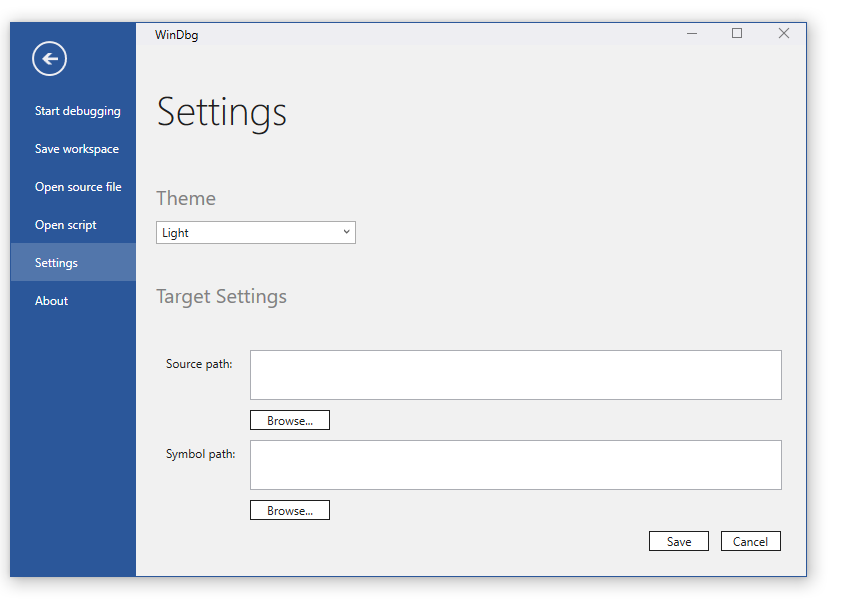

# WinDbg Preview - Setup

This section describes how to setup and configure the WinDbg Preview debugger.


## Settings

Use the settings menu to set the source and symbol path as well as choose the light and dark theme for the debugger. 



For more information on setting the paths, see [Accessing Symbols for Debugging](accessing-symbols-for-debugging.md) and [Source Code Debugging in WinDbg](source-window.md).

## Workspace

The workspace feature saves configuration information in the target connection information file.

When you change settings TBD TBD.

The workspace and target connection information is stored in XML format. 

The following file, shows an example workspace configuration file.

```
<?xml version="1.0" encoding="utf-8"?>
<TargetConfig Name="C:\paint.dmp" LastUsed="2017-08-03T21:34:20.1013837Z">
  <EngineConfig />
  <EngineOptions>
    <Property name="FinalBreak" value="true" />
    <Property name="SourceDebugging" value="true" />
    <Property name="DebugChildProcesses" value="false" />
    <Property name="Noninvasive" value="false" />
    <Property name="NoDebugHeap" value="false" />
    <Property name="Verbose" value="false" />
    <Property name="SymbolOptionsOverride" value="0" />
    <Property name="ShouldOverrideSymbolOptions" value="false" />
    <Property name="SymOptExactSymbols" value="false" />
    <Property name="SymOptFailCriticalErrors" value="false" />
    <Property name="SymOptIgnoreCvRec" value="false" />
    <Property name="SymOptIgnoreNtSympath" value="false" />
    <Property name="SymOptNoCpp" value="false" />
    <Property name="SymOptNoUnqualifiedLoads" value="false" />
    <Property name="SymOptAutoPublics" value="false" />
    <Property name="SymOptDebug" value="false" />
    <Property name="Elevate" value="false" />
    <Property name="Restartable" value="true" />
    <Property name="UseImplicitCommandLine" value="false" />
  </EngineOptions>
  <TargetOptions>
    <Option name="OpenDump">
      <Property name="DumpPath" value="C:\paint.dmp" />
    </Option>
  </TargetOptions>
</TargetConfig>

```

Note that this file format will continue to evolve as more featured are added to WinDbg Preview.

*Additional content pending*

 
## See Also

[Debugging Using WinDbg Preview](debugging-using-windbg-preview.md)
 

[Send comments about this topic to Microsoft](mailto:wsddocfb@microsoft.com?subject=Documentation%20feedback%20[debugger\debugger]:%20Debugging%20Using%20WinDbg%20%20RELEASE:%20%285/15/2017%29&body=%0A%0APRIVACY%20STATEMENT%0A%0AWe%20use%20your%20feedback%20to%20improve%20the%20documentation.%20We%20don't%20use%20your%20email%20address%20for%20any%20other%20purpose,%20and%20we'll%20remove%20your%20email%20address%20from%20our%20system%20after%20the%20issue%20that%20you're%20reporting%20is%20fixed.%20While%20we're%20working%20to%20fix%20this%20issue,%20we%20might%20send%20you%20an%20email%20message%20to%20ask%20for%20more%20info.%20Later,%20we%20might%20also%20send%20you%20an%20email%20message%20to%20let%20you%20know%20that%20we've%20addressed%20your%20feedback.%0A%0AFor%20more%20info%20about%20Microsoft's%20privacy%20policy,%20see%20http://privacy.microsoft.com/default.aspx. "Send comments about this topic to Microsoft")


