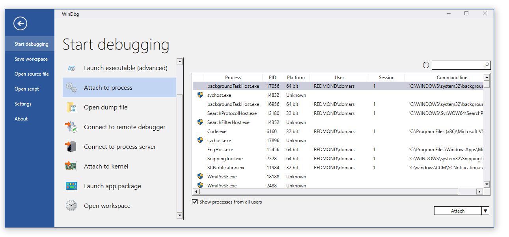

# WinDbg Preview - Start a user mode session  

This section describes how to start a user mode session with the WinDbg preview debugger.

Select *File*, *Start debugging*, and select either of these four options:

- *Launch Executable* - Starts an executable and attaches to it by browsing for the target.
- *Launch Executable (advanced)* - Starts an executable and attaches to it using a set of dialog boxes with advanced options.
- *Attach to a process* - Attaches to an existing process.
- *Launch App Package* - Launches and attaches to an app package.

All four options are described here.

## Launch Executable

Use this option to starts an executable and attach to it.

Browse to the desired executable in the provided file dialog and open it. 

## Launch Executable (advanced)

Use this option to start an executable and attach to it it using a set of dialog boxes with advanced options. 

Specify the following options:
- Path to the executable, such as *C:\Windows\notepad.exe*
- Optional arguments to provide to the executable when launched
- Optional start directory location

## Attach to a process

Use this option to attach to an existing process.

Select *Show process from all users* to show additional processes.

Use the pull down dialog on the *Attach* button to select *non-invasive attach*.

## Launch App Package

Use this option to launch and attach to an app package. Use the search box to locate a specific app or background task.

## See Also

[Debugging Using WinDbg Preview](debugging-using-windbg-preview.md)

[Send comments about this topic to Microsoft](mailto:wsddocfb@microsoft.com?subject=Documentation%20feedback%20[debugger\debugger]:%20Debugging%20Using%20WinDbg%20%20RELEASE:%20%285/15/2017%29&body=%0A%0APRIVACY%20STATEMENT%0A%0AWe%20use%20your%20feedback%20to%20improve%20the%20documentation.%20We%20don't%20use%20your%20email%20address%20for%20any%20other%20purpose,%20and%20we'll%20remove%20your%20email%20address%20from%20our%20system%20after%20the%20issue%20that%20you're%20reporting%20is%20fixed.%20While%20we're%20working%20to%20fix%20this%20issue,%20we%20might%20send%20you%20an%20email%20message%20to%20ask%20for%20more%20info.%20Later,%20we%20might%20also%20send%20you%20an%20email%20message%20to%20let%20you%20know%20that%20we've%20addressed%20your%20feedback.%0A%0AFor%20more%20info%20about%20Microsoft's%20privacy%20policy,%20see%20http://privacy.microsoft.com/default.aspx. "Send comments about this topic to Microsoft")

