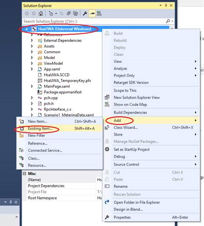
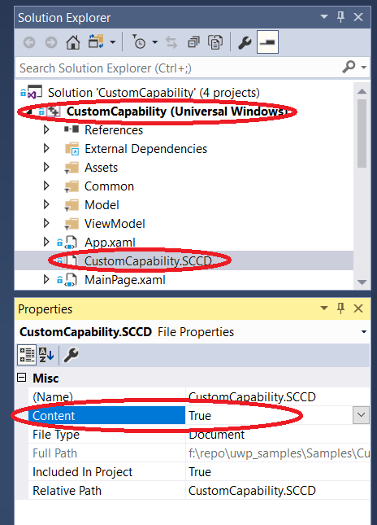

# Hardware Support App (HSA): Steps for App Developers

This topic describes how to associate a device-specific app with a driver or [RPC (Remote Procedure Call)](https://msdn.microsoft.com/library/windows/desktop/aa378651) endpoint.  When paired in this fashion, the app is referred to as a Hardware Support App (HSA).  You can distribute and update a Hardware Support App through the Microsoft Store.

Start with either a [Universal Windows Platform (UWP) app](https://docs.microsoft.com/windows/uwp/get-started/universal-application-platform-guide) or a desktop (Win32) app.  If you would like to use a desktop app, use the [Desktop Bridge](https://docs.microsoft.com/windows/uwp/porting/desktop-to-uwp-root) to create a Windows App Package that you can upload to the Store.

This page describes the procedure for a UWP app, but the steps are similar for the Win32 option. 

The steps for the driver developer are described in [Hardware Support App (HSA): Steps for Driver Developers](hardware-support-app--hsa--steps-for-driver-developers.md).

## Getting Started

First, install the latest version of Visual Studio and create a UWP app project.  To build a UWP app with a custom capability, you'll need Windows SDK version 10.0.15063 (Windows 10 Creators Update) or later. Your project file must also specify version 10.0.15063 or higher. For more help getting configured, see [Develop UWP apps using Visual Studio](https://developer.microsoft.com/en-us/windows/apps/develop).

Starting in Windows 10 version 1709, you can specify that a Universal Windows Platform (UWP) app should only load if a specific driver is present.  To learn how, see [Pairing a driver with a UWP app](../install/pairing-app-and-driver-versions.md).

## Create a Microsoft Store account

A developer account on the Microsoft Store is required. Hardware partners will need a Microsoft Store account that is different from their Hardware partner account. You'll need the publisher name when you author the app manifest and the device metadata in later steps. You can also reserve a name for your app once you've created a store profile.

To create a Microsoft Store account, go to the [UWP apps sign up page](http://go.microsoft.com/fwlink/p/?LinkId=302197). For more info, see [Opening a developer account](https://docs.microsoft.com/windows/uwp/publish/opening-a-developer-account).

## Choosing a programming language for the app

If your app will communicate with a driver, you can use [Windows.Devices.Custom](https://docs.microsoft.com/uwp/api/windows.devices.custom), which is part of the WinRT API, and therefore available in JavaScript, C#, and C++.

If your app will communicate with an NT service, then you need to use the RPC APIs.  Because RPC APIs are Win32 APIs that are not available in WinRT, you need to either use C++, or wrap the RPC calls using .NET interop (PInvoke).  For more info, see [Calling Native Functions from Managed Code](https://docs.microsoft.com/cpp/dotnet/calling-native-functions-from-managed-code).

## Contact the custom capability owner

Now you're ready to request access to a custom capability from a capability owner.  You'll need to gather the following info:

-   App PFN (Package Family Name) from the Microsoft Store
-   Name of the custom capability
-   Signature Hash of the app signing cert which can be generated from your .cer file using certutil.exe. The certificate must be SHA-256.

To generate the signature hash, run `C:\Windows\System32\certutil.exe -dump CertificateName.cer`.

Look for the signature hash near the bottom and ensure it's SHA256.  Otherwise, use a SHA256 cert to sign your app.  The result should look like this:

```
Signature Hash:
ca9fc964db7e0c2938778f4559946833e7a8cfde0f3eaa07650766d4764e86c4
```

The capability owner uses this info to generate a [Signed custom capability Descriptor](hardware-support-app--hsa--steps-for-driver-developers.md#sccd-xml-schema) file and sends this file to the app developer.

The app developer can continue developing an app with custom capabilities in developer mode while waiting for the capability owner to approve the request. For example, use the following in the SCCD on a desktop PC in [Developer Mode](https://docs.microsoft.com/en-us/windows/uwp/get-started/enable-your-device-for-development):

-   Catalog entry in the SCCD.

    ```xml
    <Catalog>FFFF</Catalog>
    ```
-   Certificate Signature Hash in the authorized entity entry in the SCCD. While it is
    neither enforced nor validated, please put a 64-char sequence.

    ```xml
    <AuthorizedEntity AppPackageFamilyName="MicrosoftHSATest.Microsoft.SDKSamples.Hsa.CPP_q536wpkpf5cy2" CertificateSignatureHash="ca9fc964db7e0c2938778f4559946833e7a8cfde0f3eaa07650766d4764e86c4"></AuthorizedEntity>
    ```

## Add a custom capability to the App Package Manifest

Next, modify your [app package manifest](https://msdn.microsoft.com/library/windows/apps/BR211474) source file (`Package.appxmanifest`) to include a capabilities attribute.

```xml
<?xml version="1.0" encoding="utf-8"?>
<Package
  ...
  xmlns:uap4="http://schemas.microsoft.com/appx/manifest/uap/windows10/4">
...
<Capabilities>
    <uap4:CustomCapability Name="CompanyName.customCapabilityName_PublisherID"/>
</Capabilities>
</Package>
```

Then copy the SCCD file to the package root of the appx package. In Visual Studio's solution explorer, right-click on “project-&gt; Add -&gt; Existing Item…” to add the SCCD to your project.



Mark the SCCD as build content by right clicking on the SCCD file and changing **Content** to **True**.  For a C# project, use the property `Build Action = Content`, and for a JavaScript project, use `Package Action = Content`. 



Finally, right-click the project, select **Store**, then **Create App Packages**.

**Note**: There is no support for UWP apps with custom capabilities on mobile platforms.

## Install the App

To pre-install a UWP app with custom capabilities, use [DISM - Deployment Image Servicing and Management](https://docs.microsoft.com/windows-hardware/manufacture/desktop/dism---deployment-image-servicing-and-management-technical-reference-for-windows).

## Troubleshooting

When the target machine is in Developer Mode, you can try the following steps to debug app registration failure:

1.	Remove the custom capability entry from your AppX manifest.
2.	Build your app and deploy it.
3.	In a PowerShell window, type `Get-AppxPackage`.
4.	Look for your app in the list and verify the exact package family name for your app.
5.	Update your SCCD with the package family name.
6.	Add the custom capability entry back into your AppX manifest.
7.	Rebuild and deploy. 

## See Also

* [Hardware Support App (HSA): Steps for Driver Developers](hardware-support-app--hsa--steps-for-driver-developers.md)
* [Enable your device for development](https://docs.microsoft.com/windows/uwp/get-started/enable-your-device-for-development)
* [Custom Capability sample](https://github.com/Microsoft/Windows-universal-samples/tree/master/Samples/CustomCapability)
* [Getting Started with Universal Windows drivers](../develop/getting-started-with-universal-drivers.md)
* [Pairing a driver with a Universal Windows Platform (UWP) app](../install/pairing-app-and-driver-versions.md)
* [Intro to the Universal Windows Platform](https://docs.microsoft.com/windows/uwp/get-started/universal-application-platform-guide)
* [Universal Windows Platform (UWP)](https://docs.microsoft.com/windows/uwp/design/basics/design-and-ui-intro)
