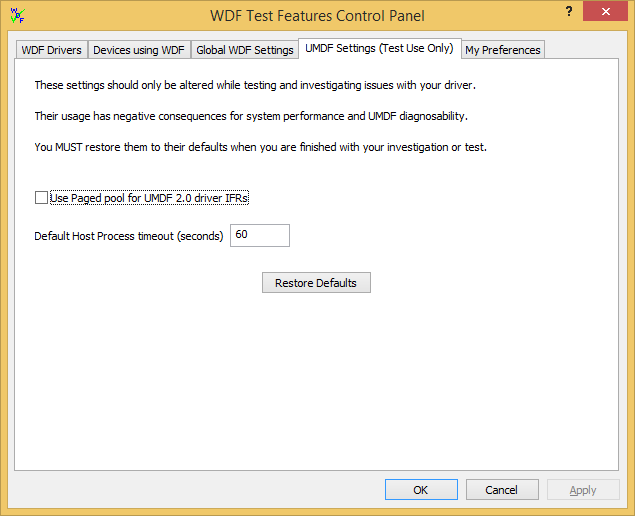

---
title: UMDF Settings (Test Use Only) Tab
description: This topic details WDF Verifier's UMDF Settings (Test Use Only) page.
ms.assetid: cce75c2e-fc93-4c17-9560-aef55451528b
ms.author: windows-driver-content
ms.date: 04/20/2017
ms.topic: article
ms.prod: windows-hardware
ms.technology: windows-devices
---

# UMDF Settings (Test Use Only) Tab

This topic details WDF Verifier's **UMDF Settings (Test Use Only)** page. On this page, you can change settings that can help test an overall system with one or more User-Mode Driver Framework (UMDF) drivers.

Use these settings for testing purposes. When you're done testing, click the **Restore Defaults** button. Otherwise, your computer may exhibit significant performance reduction.

By default, the [UMDF In-Flight Recorder (IFR)](https://msdn.microsoft.com/library/windows/hardware/ff545531) is stored in non-paged memory so that the log can be preserved in the event of a system crash. In rare cases, however, you might need to free up space in non-paged memory. For example, perhaps you are stress testing a system with multiple UMDF drivers, [device pooling](https://msdn.microsoft.com/library/windows/hardware/hh463993) is off, and non-paged memory is at a premium. You can obtain a small increase in available non-paged memory by selecting the **Use Paged pool** box.

Also, sometimes analysis tools such as Driver Verifier can decrease system performance enough in CPU-intensive tests that the default UMDF timeout triggers even though the driver did nothing wrong. In this case, increasing the timeout value may reduce this type of accidental timeout.

**Warning**  
Using these options actually reduces the likelihood of catching or diagnosing a UMDF driver failure, so you should use them only when needed. They are more likely to be of use for testing an overall system.

 

 

 

[Send comments about this topic to Microsoft](mailto:wsddocfb@microsoft.com?subject=Documentation%20feedback%20[devtest\devtest]:%20UMDF%20Settings%20%28Test%20Use%20Only%29%20Tab%20%20RELEASE:%20%2811/17/2016%29&body=%0A%0APRIVACY%20STATEMENT%0A%0AWe%20use%20your%20feedback%20to%20improve%20the%20documentation.%20We%20don't%20use%20your%20email%20address%20for%20any%20other%20purpose,%20and%20we'll%20remove%20your%20email%20address%20from%20our%20system%20after%20the%20issue%20that%20you're%20reporting%20is%20fixed.%20While%20we're%20working%20to%20fix%20this%20issue,%20we%20might%20send%20you%20an%20email%20message%20to%20ask%20for%20more%20info.%20Later,%20we%20might%20also%20send%20you%20an%20email%20message%20to%20let%20you%20know%20that%20we've%20addressed%20your%20feedback.%0A%0AFor%20more%20info%20about%20Microsoft's%20privacy%20policy,%20see%20http://privacy.microsoft.com/default.aspx. "Send comments about this topic to Microsoft")

