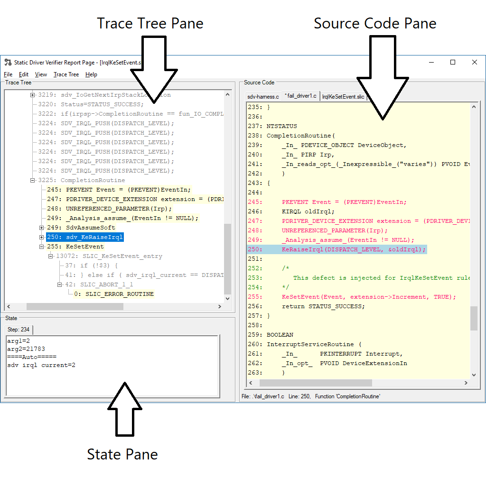

# Understanding the Trace Viewer

The Trace Viewer is available when SDV detects at least one rule violation of a rule selected for verification.

The Trace Viewer consists of three windows.

-   [Trace Tree pane](trace-tree-pane.md)

-   [Source Code pane](source-code-pane.md)

-   [State pane](state-pane.md)

The following screen shot shows the Defect Viewer window and its Trace-Tree, Source-Code.

SDV automatically coordinates the display in the three Defect Viewer windows. For example, if you select a source code element in the **Trace Tree** pane, SDV automatically moves the cursor to the corresponding line of code in the **Source Code** pane (and vice versa).

Similarly, if the source code element that is selected in the **Trace Tree** or **Source Code** panes changes the values of variables that SDV monitors, those changes automatically appear in the **State** pane.

 

 

[Send comments about this topic to Microsoft](mailto:wsddocfb@microsoft.com?subject=Documentation%20feedback%20[devtest\devtest]:%20Understanding%20the%20Trace%20Viewer%20%20RELEASE:%20%2811/17/2016%29&body=%0A%0APRIVACY%20STATEMENT%0A%0AWe%20use%20your%20feedback%20to%20improve%20the%20documentation.%20We%20don't%20use%20your%20email%20address%20for%20any%20other%20purpose,%20and%20we'll%20remove%20your%20email%20address%20from%20our%20system%20after%20the%20issue%20that%20you're%20reporting%20is%20fixed.%20While%20we're%20working%20to%20fix%20this%20issue,%20we%20might%20send%20you%20an%20email%20message%20to%20ask%20for%20more%20info.%20Later,%20we%20might%20also%20send%20you%20an%20email%20message%20to%20let%20you%20know%20that%20we've%20addressed%20your%20feedback.%0A%0AFor%20more%20info%20about%20Microsoft's%20privacy%20policy,%20see%20http://privacy.microsoft.com/default.aspx. "Send comments about this topic to Microsoft")

