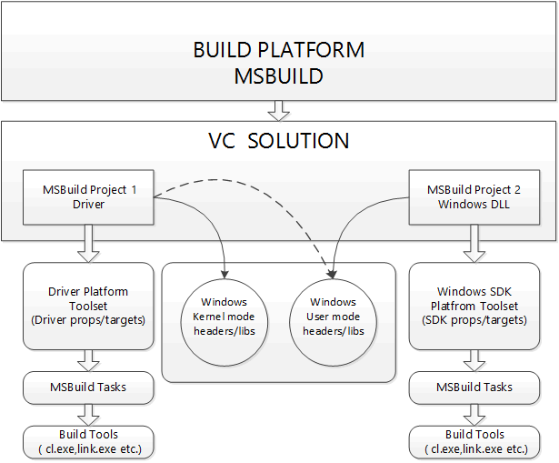

# WDK and MSBuild overview

Visual Studio can manage multiple projects. This section describes the WDK build environment.

A Visual Studio solution can consist of a single project or multiple projects: both driver projects and non-driver projects. Every project is associated with a platform toolset. The platform toolset extends and modifies the build process for a given target architecture in order to build a particular kind of binary. The binary can be a driver, a library, or an executable program.

The following figure shows a typical build process using the MSBuild platform. In the diagram, the driver project (MSBuild Project 1) uses driver platform toolset to build drivers. The driver project can reference Windows kernel-mode and user-mode headers and libraries. The Windows DLL project (MSBuild Project 2) builds a DLL and uses the Windows SDK platform toolset to build applications or user-mode libraries. Every platform toolset has its own set of targets. These targets invoke tasks. These tasks will execute the build tools.

For C/C++ native code (user mode and kernel mode) and managed code, the WDK installs the .NET Full Framework, Windows headers, libraries (user mode or kernel mode) and tools, .NET Tools and the VC compilers, CRT headers, and libraries. Along with these, to be able to build C/C++ projects with MSBuild, all the components required by the compiler must be installed.

 

 

