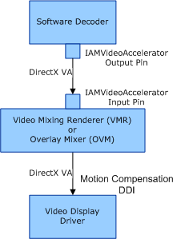

# DirectX VA Relationship to IAMVideoAccelerator API and Motion Compensation DDI

## 

DirectX VA uses the **IAMVideoAcceleratorNotify** and **IAMVideoAccelerator** interfaces (documented in the Microsoft Windows SDK), and the [motion compensation DDI](motion-compensation.md) to specify the format of the data exchanged between the software decoder, the video mixing renderer (VMR) or the overlay mixer (OVM), and the video display driver. The following figure shows the relationship of these interfaces to the software decoder, VMR, and video display driver.

The **IAMVideoAcceleratorNotify** interface retrieves or sets decompressed buffer information for a given video accelerator GUID.

The **IAMVideoAccelerator** interface enables a video decoder filter to access the functionality of a video accelerator and provides video rendering using the video mixing renderer (VMR) or the overlay mixer (OVM).

The motion compensation DDI establishes a common interface to access hardware acceleration capabilities and allow cross-vendor compatibility between user-mode software applications and acceleration capabilities. The DDI notifies the decoder when a video acceleration object is being used, starts and stops the decoding of frame buffers, indicates the uncompressed picture formats that the hardware supports, and notifies the display driver of the macroblocks that need to be rendered. The motion compensation DDI is accessed through the [**DD\_MOTIONCOMPCALLBACKS**](https://msdn.microsoft.com/library/windows/hardware/ff551660) structure.

For more information about the **IAMVideoAccelerator** and **IAMVideoAcceleratorNotify** interfaces, see the Windows SDK documentation. For more information about the motion compensation DDI, see [Motion Compensation](motion-compensation.md) and [Motion Compensation Callbacks](motion-compensation-callbacks.md).

 

 

[Send comments about this topic to Microsoft](mailto:wsddocfb@microsoft.com?subject=Documentation%20feedback%20[display\display]:%20DirectX%20VA%20Relationship%20to%20IAMVideoAccelerator%20API%20and%20Motion%20Compensation%20DDI%20%20RELEASE:%20%282/10/2017%29&body=%0A%0APRIVACY%20STATEMENT%0A%0AWe%20use%20your%20feedback%20to%20improve%20the%20documentation.%20We%20don't%20use%20your%20email%20address%20for%20any%20other%20purpose,%20and%20we'll%20remove%20your%20email%20address%20from%20our%20system%20after%20the%20issue%20that%20you're%20reporting%20is%20fixed.%20While%20we're%20working%20to%20fix%20this%20issue,%20we%20might%20send%20you%20an%20email%20message%20to%20ask%20for%20more%20info.%20Later,%20we%20might%20also%20send%20you%20an%20email%20message%20to%20let%20you%20know%20that%20we've%20addressed%20your%20feedback.%0A%0AFor%20more%20info%20about%20Microsoft's%20privacy%20policy,%20see%20http://privacy.microsoft.com/default.aspx. "Send comments about this topic to Microsoft")

