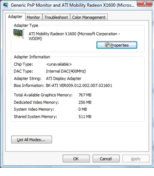
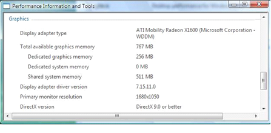
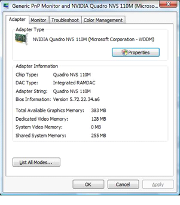
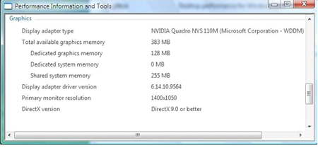
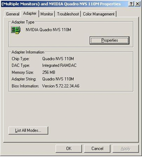
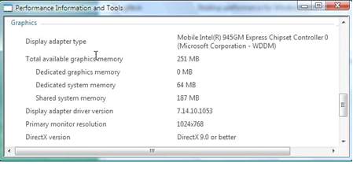
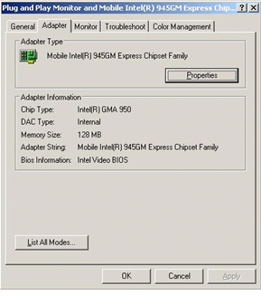

# Examples of Graphics Memory Reporting

The following examples compare numbers that are reported for different adapters and memory configurations on Windows Vista versus Windows XP. The examples show the **Display** application and the WinSAT applet reports of available memory.

### Example 1: 256-MB Dedicated On-board Graphics Memory on a Desktop

The following screen shots show an ATI discrete graphics adapter that has 256 MB of dedicated integrated (on-board) graphics memory. The ATI discrete graphics adapter also shares system memory (511 MB) for graphics purposes.

The following screen shot shows a report of available memory through the **Display** application on Windows Vista.

The following screen shot shows a report of available memory through the WinSAT applet on Windows Vista.

The following screen shot shows a report of available memory through the **Display** application on Windows XP.

**Note**   The single "Memory Size" number that the preceding screen shot shows is just the dedicated on-board graphics memory, which is not an accurate representation of the total amount of available graphics memory.

 

### Example 2: 32-MB Dedicated On-Board Graphics Memory on a Mobile Computer

The following screen shots show an NVIDIA TurboCache technology discrete adapter that is present in a mobile computer. This adapter has some dedicated on-board graphics memory. However, the adapter mostly shares system memory for graphics purposes.

The following screen shot shows a report of available memory through the **Display** application on Windows Vista.

The following screen shot shows a report of available memory through the WinSAT applet on Windows Vista.

The following screen shot shows a report of available memory through the **Display** application on Windows XP.

**Note**   For TurboCache computers like the one shown in the preceding screen shot, the single "Memory Size" number is a combination, but not a total, of dedicated graphics memory and shared system memory. Again, this is not an accurate representation of the total amount of available graphics memory.

 

### Example 3: 256-MB Shared Graphics Memory on a Mobile Computer

The following screen shots show an Intel UMA (Unified Memory Architecture) Mobile adapter that has no dedicated graphics memory on the motherboard. Instead, the adapter shares system memory for all graphics purposes.

The following screen shot shows a report of available memory through the **Display** application on Windows Vista.

The following screen shot shows a report of available memory through the WinSAT applet on Windows Vista.

The following screen shot shows a report of available memory through the **Display** application on Windows XP.

 

 

[Send comments about this topic to Microsoft](mailto:wsddocfb@microsoft.com?subject=Documentation%20feedback%20[display\display]:%20Examples%20of%20Graphics%20Memory%20Reporting%20%20RELEASE:%20%282/10/2017%29&body=%0A%0APRIVACY%20STATEMENT%0A%0AWe%20use%20your%20feedback%20to%20improve%20the%20documentation.%20We%20don't%20use%20your%20email%20address%20for%20any%20other%20purpose,%20and%20we'll%20remove%20your%20email%20address%20from%20our%20system%20after%20the%20issue%20that%20you're%20reporting%20is%20fixed.%20While%20we're%20working%20to%20fix%20this%20issue,%20we%20might%20send%20you%20an%20email%20message%20to%20ask%20for%20more%20info.%20Later,%20we%20might%20also%20send%20you%20an%20email%20message%20to%20let%20you%20know%20that%20we've%20addressed%20your%20feedback.%0A%0AFor%20more%20info%20about%20Microsoft's%20privacy%20policy,%20see%20http://privacy.microsoft.com/default.aspx. "Send comments about this topic to Microsoft")

