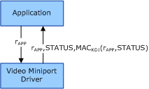

# Status Security and Authenticity

## 

**This section applies only to Windows Server 2003 SP1 and later, and Windows XP SP2 and later.**

The following figure shows an application requesting status messages from the video miniport driver, and then the video miniport driver sending the status messages to the application across the secure channel.

These status messages are contained in an envelope. The envelope contains data and MAC sections. The video miniport driver calculates the MAC of the status data by using the data integrity key and the OMAC. For more information about the MAC and OMAC, see [Cryptographic Primitives Used by COPP](cryptographic-primitives-used-by-copp.md).

The following table describes the values in the preceding figure.

<table>
<colgroup>
<col width="50%" />
<col width="50%" />
</colgroup>
<thead>
<tr class="header">
<th align="left">Value</th>
<th align="left">Description</th>
</tr>
</thead>
<tbody>
<tr class="odd">
<td align="left">
rAPP
</td>
<td align="left">
128-bit random number generated by the application.
</td>
</tr>
<tr class="even">
<td align="left">
STATUS
</td>
<td align="left">
Variable-length status data.
</td>
</tr>
<tr class="odd">
<td align="left">
MACKDI(rAPP, STATUS)
</td>
<td align="left">
128-bit MAC of the status data using the data integrity session key.
</td>
</tr>
</tbody>
</table>

 

 

 

[Send comments about this topic to Microsoft](mailto:wsddocfb@microsoft.com?subject=Documentation%20feedback%20[display\display]:%20Status%20Security%20and%20Authenticity%20%20RELEASE:%20%282/10/2017%29&body=%0A%0APRIVACY%20STATEMENT%0A%0AWe%20use%20your%20feedback%20to%20improve%20the%20documentation.%20We%20don't%20use%20your%20email%20address%20for%20any%20other%20purpose,%20and%20we'll%20remove%20your%20email%20address%20from%20our%20system%20after%20the%20issue%20that%20you're%20reporting%20is%20fixed.%20While%20we're%20working%20to%20fix%20this%20issue,%20we%20might%20send%20you%20an%20email%20message%20to%20ask%20for%20more%20info.%20Later,%20we%20might%20also%20send%20you%20an%20email%20message%20to%20let%20you%20know%20that%20we've%20addressed%20your%20feedback.%0A%0AFor%20more%20info%20about%20Microsoft's%20privacy%20policy,%20see%20http://privacy.microsoft.com/default.aspx. "Send comments about this topic to Microsoft")

