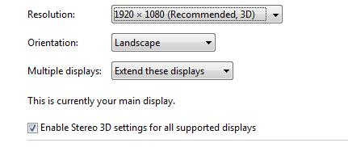

# Stereoscopic 3D

Windows 8 provides a consistent API and device driver interface (DDI) platform for stereoscopic 3-D scenarios such as gaming and video playback.

<table>
<colgroup>
<col width="50%" />
<col width="50%" />
</colgroup>
<tbody>
<tr class="odd">
<td align="left">Minimum Windows Display Driver Model (WDDM) version</td>
<td align="left">1.2</td>
</tr>
<tr class="even">
<td align="left">Minimum Windows version</td>
<td align="left">8</td>
</tr>
<tr class="odd">
<td align="left">Driver implementation—Full graphics</td>
<td align="left">Optional</td>
</tr>
<tr class="even">
<td align="left">[WHCK]( http://go.microsoft.com/fwlink/p/?linkid=258342) requirements and tests</td>
<td align="left">
<strong>Device.Graphics…ProcessingStereoscopicVideoContent</strong>

<strong>Device.Display.Monitor.Stereoscopic3DModes</strong>
</td>
</tr>
</tbody>
</table>

 

Stereoscopic 3-D rendering is only enabled on systems that have all the components that are stereoscopic 3-D-capable. These components include 3-D-capable display hardware, graphics hardware, peripherals, and software applications. The stereo design in the graphics stack is such that the particular visualization or display technology that is used is agnostic to the operating system. The display driver communicates directly to the graphics display and has knowledge about the display capabilities through the standardized Extended Display Identification Data (EDID) structure. The driver enumerates stereo capabilities only when it recognizes that such a display is connected to the system.

To implement stereo capabilities in your display miniport and user-mode drivers, see the lists of new or updated DDIs below.

The stereoscopic display setting is part of the **Screen Resolution** control panel, as shown here:

The **Enable Stereo** setting is a checkbox with the following states:

-   **Not available** (either grayed out or invisible): On systems incapable of rendering on stereo displays.
-   Set to **Enabled** (checked): This is the default setting on systems capable of rendering on stereo displays and implies Stereo-On-Demand. By default, the Desktop Window Manager (DWM) is mono mode. DWM switches to stereo mode only when a stereo app is launched by the user (on-demand). Note that the DWM can be in either mono or stereo mode when this checkbox is checked.
-   Set to **Disabled** (unchecked): DWM is in mono mode if the user has unchecked this setting. Stereo applications present in mono mode in this case.

## Stereoscopic 3-D kernel-mode support

These DDIs are updated for Windows 8 to support stereoscopic 3-D rendering on a VidPN.

-   [**D3D11DDIARG\_CREATERESOURCE**](https://msdn.microsoft.com/library/windows/hardware/ff542062)
-   [**D3DDDI\_ALLOCATIONINFO**](https://msdn.microsoft.com/library/windows/hardware/ff544364)
-   [**D3DKMDT\_VIDPN\_SOURCE\_MODE\_TYPE**](https://msdn.microsoft.com/library/windows/hardware/ff546727)
-   [**D3DKMT\_PRESENTFLAGS**](https://msdn.microsoft.com/library/windows/hardware/ff548179)
-   [**DXGI\_DDI\_ARG\_ROTATE\_RESOURCE\_IDENTITIES**](https://msdn.microsoft.com/library/windows/hardware/ff557476)
-   [**DXGK\_PRESENTFLAGS**](https://msdn.microsoft.com/library/windows/hardware/ff562005)
-   [**DXGK\_SETVIDPNSOURCEADDRESS\_FLAGS**](https://msdn.microsoft.com/library/windows/hardware/ff562052)
-   [**DXGKARG\_OPENALLOCATION**](https://msdn.microsoft.com/library/windows/hardware/ff557609)

## Stereoscopic 3-D swapchain DDIs

These DDIs are new or updated for Windows 8 to support stereoscopic 3-D swapchains.

-   [*BltDXGI*](https://msdn.microsoft.com/library/windows/hardware/ff538252)
-   [*Blt1DXGI*](https://msdn.microsoft.com/library/windows/hardware/hh406235)
-   [*CreateResource(D3D10)*](https://msdn.microsoft.com/library/windows/hardware/ff540691)
-   [*CreateResource(D3D11)*](https://msdn.microsoft.com/library/windows/hardware/ff540694)
-   [*RotateResourceIdentitiesDXGI*](https://msdn.microsoft.com/library/windows/hardware/ff569514)
-   [**D3DDDI\_ALLOCATIONINFO**](https://msdn.microsoft.com/library/windows/hardware/ff544364)
-   [**D3D10DDIARG\_CREATERESOURCE**](https://msdn.microsoft.com/library/windows/hardware/ff541697)
-   [**D3D11DDIARG\_CREATERESOURCE**](https://msdn.microsoft.com/library/windows/hardware/ff542062)
-   [**DXGI\_DDI\_ARG\_ROTATE\_RESOURCE\_IDENTITIES**](https://msdn.microsoft.com/library/windows/hardware/ff557476)
-   [**DXGI\_DDI\_PRESENT\_FLAGS**](https://msdn.microsoft.com/library/windows/hardware/ff557509)
-   [**DXGI\_DDI\_PRIMARY\_DESC**](https://msdn.microsoft.com/library/windows/hardware/ff557511)

## Hardware certification requirements

System builders are encouraged to test their stereo driver packages by using the above settings to ensure correct functionality.

Stereo 3-D functionality can be enabled only on Microsoft DirectX 10–capable hardware and higher. However, since Microsoft Direct3D 11 APIs work on DirectX 9.x and 10.x hardware, all WDDM 1.2 drivers must support Direct3D 11 and be tested thoroughly to ensure that Direct3D 11APIs work on all Windows 8 hardware.

Although stereoscopic 3-D is an optional WDDM 1.2 feature, Direct3D 11 API support is required on all Windows 8 hardware. Therefore, WDDM 1.2 drivers (Full Graphics and Render devices) must support Direct3D 11 APIs by adding support for cross-process sharing of texture arrays. This requirement is to ensure that stereo apps don't have failures in mono modes.

For more info on requirements that hardware devices must meet when they implement this feature, refer to the relevant [WHCK documentation]( http://go.microsoft.com/fwlink/p/?linkid=258342) on **Device.Graphics…Processing Stereoscopic Video Content** and **Device.Display.Monitor.Stereoscopic 3D Modes**.

See [WDDM 1.2 features](wddm-v1-2-features.md) for a review of features added with Windows 8.

 

 

