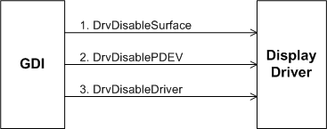

# Unloading Video Hardware

## 

When a surface is no longer required, a GDI call to [**DrvDisableSurface**](https://msdn.microsoft.com/library/windows/hardware/ff556200) informs the display driver that the surface created for the current hardware device by [**DrvEnableSurface**](https://msdn.microsoft.com/library/windows/hardware/ff556214) can be disabled. The driver must also free any resources the surface was using.

After the surface is disabled, GDI calls [**DrvDisablePDEV**](https://msdn.microsoft.com/library/windows/hardware/ff556198) to inform the driver that the hardware device is no longer needed. The driver then frees any memory and resources that were allocated during the processing of [**DrvEnablePDEV**](https://msdn.microsoft.com/library/windows/hardware/ff556211).

Finally, GDI disables the display driver by calling [**DrvDisableDriver**](https://msdn.microsoft.com/library/windows/hardware/ff556196). The driver must free any resources allocated during [**DrvEnableDriver**](https://msdn.microsoft.com/library/windows/hardware/ff556210) and restore the video hardware to its default state. After the driver returns from the *DrvDisableDriver* function, GDI frees the memory it has allocated for the driver and removes driver code and data from memory.

The following figure shows GDI's calling sequence for disabling the video hardware.

 

 

[Send comments about this topic to Microsoft](mailto:wsddocfb@microsoft.com?subject=Documentation%20feedback%20[display\display]:%20Unloading%20Video%20Hardware%20%20RELEASE:%20%282/10/2017%29&body=%0A%0APRIVACY%20STATEMENT%0A%0AWe%20use%20your%20feedback%20to%20improve%20the%20documentation.%20We%20don't%20use%20your%20email%20address%20for%20any%20other%20purpose,%20and%20we'll%20remove%20your%20email%20address%20from%20our%20system%20after%20the%20issue%20that%20you're%20reporting%20is%20fixed.%20While%20we're%20working%20to%20fix%20this%20issue,%20we%20might%20send%20you%20an%20email%20message%20to%20ask%20for%20more%20info.%20Later,%20we%20might%20also%20send%20you%20an%20email%20message%20to%20let%20you%20know%20that%20we've%20addressed%20your%20feedback.%0A%0AFor%20more%20info%20about%20Microsoft's%20privacy%20policy,%20see%20http://privacy.microsoft.com/default.aspx. "Send comments about this topic to Microsoft")

