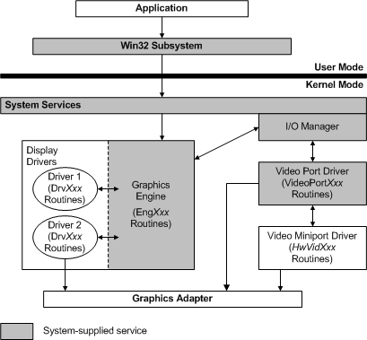

# Video Miniport Driver Within the Graphics Architecture (Windows 2000 Model)

## 

The following figure shows the video miniport driver within the NT-based operating system graphics subsystem.

Each video miniport driver provides hardware-level support for a display driver. The display driver calls the graphics engine [**EngDeviceIoControl**](https://msdn.microsoft.com/library/windows/hardware/ff564838) function to request support from the underlying video miniport driver. **EngDeviceIoControl**, in turn, calls an I/O system service to send the request through the video port driver to the miniport driver.

In most circumstances, the display driver carries out time-critical operations that are visible to the user, while the underlying miniport driver provides support for infrequently requested operations or for truly time-critical operations that cannot be preempted by an interrupt or a context switch to another process.

A display driver cannot handle device interrupts, and only the miniport driver can set up device memory and map it into a display driver's virtual address space.

The video port driver is a system-supplied module provided to support video miniport drivers. It acts as the intermediary between the display driver and video miniport drivers

For more information about NT-based operating system display drivers, see [Introduction to Display (Windows 2000 Model)](introduction-to-display--windows-2000-model-.md) and [Display Drivers (Windows 2000 Model)](display-drivers--windows-2000-model-.md).

 

 

[Send comments about this topic to Microsoft](mailto:wsddocfb@microsoft.com?subject=Documentation%20feedback%20[display\display]:%20Video%20Miniport%20Driver%20Within%20the%20Graphics%20Architecture%20%28Windows%202000%20Model%29%20%20RELEASE:%20%282/10/2017%29&body=%0A%0APRIVACY%20STATEMENT%0A%0AWe%20use%20your%20feedback%20to%20improve%20the%20documentation.%20We%20don't%20use%20your%20email%20address%20for%20any%20other%20purpose,%20and%20we'll%20remove%20your%20email%20address%20from%20our%20system%20after%20the%20issue%20that%20you're%20reporting%20is%20fixed.%20While%20we're%20working%20to%20fix%20this%20issue,%20we%20might%20send%20you%20an%20email%20message%20to%20ask%20for%20more%20info.%20Later,%20we%20might%20also%20send%20you%20an%20email%20message%20to%20let%20you%20know%20that%20we've%20addressed%20your%20feedback.%0A%0AFor%20more%20info%20about%20Microsoft's%20privacy%20policy,%20see%20http://privacy.microsoft.com/default.aspx. "Send comments about this topic to Microsoft")

