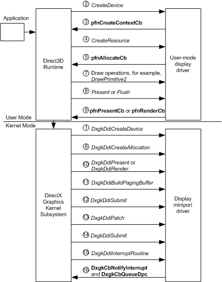

# Windows Display Driver Model (WDDM) Operation Flow

The following diagram shows the flow of Windows Display Driver Model (WDDM) operations that occur from when a rendering device is created to when the content is presented to the display. The sequence in the sections that follow describes the operation flow in more detail.

### Creating a Rendering Device

<table>
<colgroup>
<col width="50%" />
<col width="50%" />
</colgroup>
<tbody>
<tr class="odd">
<td align="left">
1.
</td>
<td align="left">
After an application requests to create a rendering device, the display miniport driver receives a [<strong>DxgkDdiCreateDevice</strong>](https://msdn.microsoft.com/library/windows/hardware/ff559615) call. The display miniport driver initializes direct memory access (DMA) by returning a pointer to a filled [<strong>DXGK_DEVICEINFO</strong>](https://msdn.microsoft.com/library/windows/hardware/ff561047) structure in the <strong>pInfo</strong> member of the [<strong>DXGKARG_CREATEDEVICE</strong>](https://msdn.microsoft.com/library/windows/hardware/ff557570) structure.
</td>
</tr>
<tr class="even">
<td align="left">
2.
</td>
<td align="left">
If the call to the display miniport driver's [<strong>DxgkDdiCreateDevice</strong>](https://msdn.microsoft.com/library/windows/hardware/ff559615) succeeds, the Microsoft Direct3D runtime calls the user-mode display driver's [<strong>CreateDevice</strong>](https://msdn.microsoft.com/library/windows/hardware/ff540634) function.
</td>
</tr>
<tr class="odd">
<td align="left">
3.
</td>
<td align="left">
In the [<strong>CreateDevice</strong>](https://msdn.microsoft.com/library/windows/hardware/ff540634) call, the user-mode display driver must explicitly call the [<strong>pfnCreateContextCb</strong>](https://msdn.microsoft.com/library/windows/hardware/ff568895) function to create one or more contexts—GPU threads of execution on the newly created device. The Direct3D runtime returns information in the <strong>pCommandBuffer</strong> and <strong>CommandBufferSize</strong> members of the [<strong>D3DDDICB_CREATECONTEXT</strong>](https://msdn.microsoft.com/library/windows/hardware/ff544143) structure to initialize the command buffer.
</td>
</tr>
</tbody>
</table>

 

### Creating Surfaces for a Device

<table>
<colgroup>
<col width="50%" />
<col width="50%" />
</colgroup>
<tbody>
<tr class="odd">
<td align="left">
4.
</td>
<td align="left">
After an application requests to create surfaces for the rendering device, the Direct3D runtime calls the user-mode display driver's [<strong>CreateResource</strong>](https://msdn.microsoft.com/library/windows/hardware/ff540688) function.
</td>
</tr>
<tr class="even">
<td align="left">
5.
</td>
<td align="left">
The user-mode display driver's [<strong>CreateResource</strong>](https://msdn.microsoft.com/library/windows/hardware/ff540688) calls the [<strong>pfnAllocateCb</strong>](https://msdn.microsoft.com/library/windows/hardware/ff568893) runtime-supplied function.
</td>
</tr>
<tr class="odd">
<td align="left">
6.
</td>
<td align="left">
The display miniport driver receives a [<strong>DxgkDdiCreateAllocation</strong>](https://msdn.microsoft.com/library/windows/hardware/ff559606) call, which indicates the number and types of allocations to create. <strong>DxgkDdiCreateAllocation</strong> returns information about the allocations in an array of [<strong>DXGK_ALLOCATIONINFO</strong>](https://msdn.microsoft.com/library/windows/hardware/ff560960) structures in the <strong>pAllocationInfo</strong> member of the [<strong>DXGKARG_CREATEALLOCATION</strong>](https://msdn.microsoft.com/library/windows/hardware/ff557559) structure.
</td>
</tr>
</tbody>
</table>

 

### Submitting the Command Buffer to Kernel Mode

<table>
<colgroup>
<col width="50%" />
<col width="50%" />
</colgroup>
<tbody>
<tr class="odd">
<td align="left">
7.
</td>
<td align="left">
After an application requests to draw to a surface, the Direct3D runtime calls the user-mode display driver function related to the drawing operation, for example, [<strong>DrawPrimitive2</strong>](https://msdn.microsoft.com/library/windows/hardware/ff556151).
</td>
</tr>
<tr class="even">
<td align="left">
8.
</td>
<td align="left">
To submit the command buffer to kernel-mode, the Direct3D runtime calls either the user-mode display driver's [<strong>Present</strong>](https://msdn.microsoft.com/library/windows/hardware/ff569176) or [<strong>Flush</strong>](https://msdn.microsoft.com/library/windows/hardware/ff565957) function. Also, the user-mode display driver submits the command buffer if the command buffer is full.
</td>
</tr>
<tr class="odd">
<td align="left">
9.
</td>
<td align="left">
The user-mode display driver calls the [<strong>pfnPresentCb</strong>](https://msdn.microsoft.com/library/windows/hardware/ff568916) runtime-supplied function if [<strong>Present</strong>](https://msdn.microsoft.com/library/windows/hardware/ff569176) was called, or the [<strong>pfnRenderCb</strong>](https://msdn.microsoft.com/library/windows/hardware/ff568923) runtime-supplied function if [<strong>Flush</strong>](https://msdn.microsoft.com/library/windows/hardware/ff565957) was called or the command buffer is full.
</td>
</tr>
<tr class="even">
<td align="left">
10.
</td>
<td align="left">
The display miniport driver receives a call to the [<strong>DxgkDdiPresent</strong>](https://msdn.microsoft.com/library/windows/hardware/ff559743) function if [<strong>pfnPresentCb</strong>](https://msdn.microsoft.com/library/windows/hardware/ff568916) was called, or the [<strong>DxgkDdiRender</strong>](https://msdn.microsoft.com/library/windows/hardware/ff559793) or [<strong>DxgkDdiRenderKm</strong>](https://msdn.microsoft.com/library/windows/hardware/ff559800) function if [<strong>pfnRenderCb</strong>](https://msdn.microsoft.com/library/windows/hardware/ff568923) was called. The display miniport driver validates the command buffer, writes to the DMA buffer in the hardware's format, and produces an allocation list that describes the surfaces used.
</td>
</tr>
</tbody>
</table>

 

### Submitting the DMA Buffer to Hardware

<table>
<colgroup>
<col width="50%" />
<col width="50%" />
</colgroup>
<tbody>
<tr class="odd">
<td align="left">
11.
</td>
<td align="left">
The Microsoft DirectX graphics kernel subsystem calls the display miniport driver's [<strong>DxgkDdiBuildPagingBuffer</strong>](https://msdn.microsoft.com/library/windows/hardware/ff559587) function to create special purpose DMA buffers, known as paging buffers, that move the allocations specified in the allocation list to and from GPU-accessible memory.

<strong>Note</strong>  [<strong>DxgkDdiBuildPagingBuffer</strong>](https://msdn.microsoft.com/library/windows/hardware/ff559587) is not called for every frame.

 

</td>
</tr>
<tr class="even">
<td align="left">
12.
</td>
<td align="left">
The DirectX graphics kernel subsystem calls the display miniport driver's [<strong>DxgkDdiSubmitCommand</strong>](https://msdn.microsoft.com/library/windows/hardware/ff560790) function to queue the paging buffers to the GPU execution unit.
</td>
</tr>
<tr class="odd">
<td align="left">
13.
</td>
<td align="left">
The DirectX graphics kernel subsystem calls the display miniport driver's [<strong>DxgkDdiPatch</strong>](https://msdn.microsoft.com/library/windows/hardware/ff559737) function to assign physical addresses to the resources in the DMA buffer.
</td>
</tr>
<tr class="even">
<td align="left">
14.
</td>
<td align="left">
The DirectX graphics kernel subsystem calls the display miniport driver's [<strong>DxgkDdiSubmitCommand</strong>](https://msdn.microsoft.com/library/windows/hardware/ff560790) function to queue the DMA buffer to the GPU execution unit. Each DMA buffer submitted to the GPU contains a fence identifier, which is a number. After the GPU finishes processing the DMA buffer, the GPU generates an interrupt.
</td>
</tr>
<tr class="odd">
<td align="left">
15.
</td>
<td align="left">
The display miniport driver is notified of the interrupt in its [<strong>DxgkDdiInterruptRoutine</strong>](https://msdn.microsoft.com/library/windows/hardware/ff559680) function. The display miniport driver should read, from the GPU, the fence identifier of the DMA buffer that just completed.
</td>
</tr>
<tr class="even">
<td align="left">
16.
</td>
<td align="left">
The display miniport driver should call the [<strong>DxgkCbNotifyInterrupt</strong>](https://msdn.microsoft.com/library/windows/hardware/ff559545) function to notify the DirectX graphics kernel subsystem that the DMA buffer completed. The display miniport driver should also call the [<strong>DxgkCbQueueDpc</strong>](https://msdn.microsoft.com/library/windows/hardware/ff559559) function to queue a deferred procedure call (DPC).
</td>
</tr>
</tbody>
</table>

 

 

 

