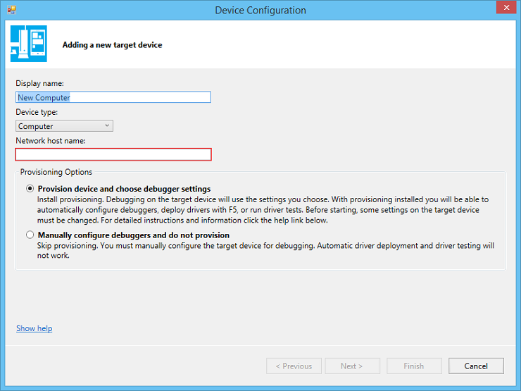

# Provision a computer for driver deployment and testing (WDK 10)

*Provisioning a target or test computer* is the process of configuring a computer for for automatic driver deployment, testing, and debugging. To provision a computer, use Microsoft Visual Studio.

A testing and debugging environment has two computers: the *host computer* and the *target computer*. The target computer is also called the *test computer*. You develop and build your driver in Visual Studio on the host computer. The debugger runs on the host computer and is available in the Visual Studio user interface. When you test and debug a driver, the driver runs on the target computer.

The host and target computers must be able to ping each other by name. This might be easier if both computers are joined to the same workgroup or the same network domain. If your computers are in a workgroup, we recommend that you connect the computers with a router rather than a hub or switch. Provisioning is not supported for virtual machines.

## Prepare the target computer for provisioning

1.  On the target computer, install the operating system that you'll use to run and test your driver.

2.  If Secure Boot is enabled on an x86 or x64 target computer, disable it. For information about Unified Extensible Firmware Interface (UEFI) and Secure Boot, see [UEFI Firmware](http://go.microsoft.com/fwlink/p/?LinkID=309386).

    If the target computer uses an ARM processor, install the Windows Debug Policy. This can be done only by Microsoft or the manufacturer of the target computer. You do not need to disable Secure Boot.

3.  On the target computer, run the WDK Test Target Setup MSI that matches the platform of the target computer. You can find the MSI in the Windows Driver Kit (WDK) installation directory under Remote.

    Example: C:\\Program Files (x86)\\Windows Kits\\10\\Remote\\x64\\WDK Test Target Setup x64-x64\_en-us.msi

4.  If the target computer is running an N or KN version of Windows, install the Media Feature Pack for N and KN versions of Windows:

    -   [Media Feature Pack for N and KN versions of Windows 8.1](http://go.microsoft.com/fwlink/p?linkid=329737)
    -   [Media Feature Pack for N and KN versions of Windows 8](http://go.microsoft.com/fwlink/p?linkid=329738)
    -   [Media Feature Pack for N and KN versions of Windows 7](http://go.microsoft.com/fwlink/p?linkid=329739)

5.  If your target computer is running Windows Server, find the DriverTest folder that was just created by WDK Test Target Setup MSI. (Example: c:\\DriverTest). Right click the **DriverTest** folder, and choose **Properties**. On the **Security** tab, give **Modify** permission to the **Authenticated Users** group.

Verify that the host and target computers can ping each other. Open a Command Prompt window, and enter **ping** *ComputerName*.

If the host and target computers are joined to a workgroup and are on different subnets, you might have to adjust some firewall settings so that the host and target computers can communicate. Follow these steps:

1.  On the target computer, in Control Panel, go to **Network and Internet &gt; Network Sharing Center**. Note your active network. This will be **Public network**, **Private network**, or **Domain**.
2.  On the target computer, in Control Panel, go to **System and Security &gt; Windows Firewall &gt; Advanced settings &gt; Inbound Rules**.
3.  In the list of inbound rules, find all Network Discovery rules for your active network. (For example, find all Network Discovery rules that have a **Profile** of **Private**.) Double click each rule and open the **Scope** tab. Under **Remote IP address**, select **Any IP address**.
4.  In the list of inbound rules, locate all File and Printer Sharing rules for your active network. For each of those rules, double click the rule, and open the **Scope** tab. Under **Remote IP address**, select **Any IP address**.

## Provision the target computer

Now you're ready to provision the target computer from the host computer in Visual Studio.

1.  On the host computer, in Visual Studio, on the **Driver** menu, choose **Test &gt; Configure Devices**.

    Click **Add new device**.

2.  For **Network host name**, enter the name of your target computer. Select **Provision device and choose debugger settings**.

    

    Click **Next**.

3.  Select a type of debugging connection, and enter the required parameters.

    For more information about setting up debugging over various types of connections, see [Setting Up Kernel-Mode Debugging in Visual Studio](http://go.microsoft.com/fwlink/p?linkid=389193) in the CHM or online documentation for [Debugging Tools for Windows](http://go.microsoft.com/fwlink/p/?linkid=223405).

4.  The provisioning process takes several minutes and might automatically reboot the target computer once or twice. When provisioning is complete, click **Finish**.

 

 

[Send comments about this topic to Microsoft](mailto:wsddocfb@microsoft.com?subject=Documentation%20feedback%20[wdkgetstart\wdkgetstart]:%20Provision%20a%20%20computer%20for%20driver%20deployment%20and%20testing%20%28WDK%2010%29%20%20RELEASE:%20%281/20/2017%29&body=%0A%0APRIVACY%20STATEMENT%0A%0AWe%20use%20your%20feedback%20to%20improve%20the%20documentation.%20We%20don't%20use%20your%20email%20address%20for%20any%20other%20purpose,%20and%20we'll%20remove%20your%20email%20address%20from%20our%20system%20after%20the%20issue%20that%20you're%20reporting%20is%20fixed.%20While%20we're%20working%20to%20fix%20this%20issue,%20we%20might%20send%20you%20an%20email%20message%20to%20ask%20for%20more%20info.%20Later,%20we%20might%20also%20send%20you%20an%20email%20message%20to%20let%20you%20know%20that%20we've%20addressed%20your%20feedback.%0A%0AFor%20more%20info%20about%20Microsoft's%20privacy%20policy,%20see%20http://privacy.microsoft.com/default.aspx. "Send comments about this topic to Microsoft")

