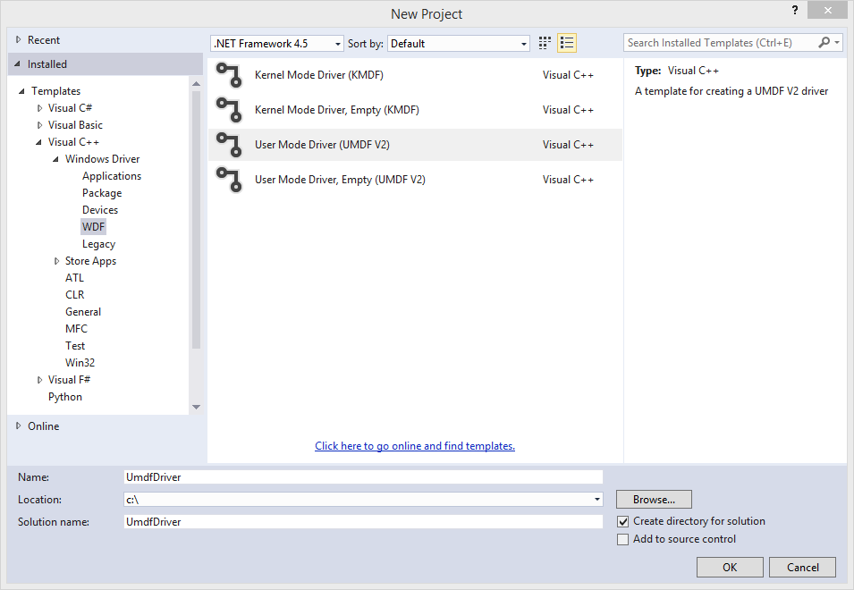
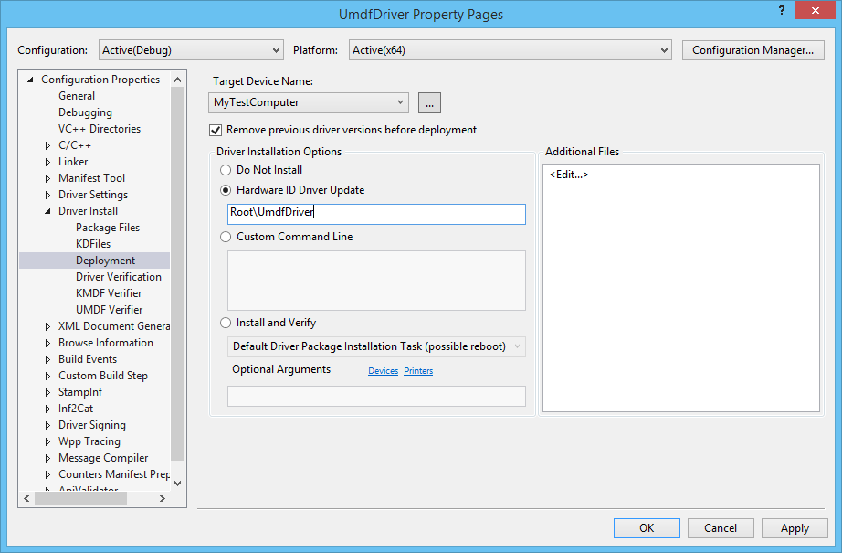

# Write a Universal Windows driver (UMDF 2) based on a template


This topic describes how to write a [Universal Windows driver](https://msdn.microsoft.com/windows-drivers/develop/getting_started_with_universal_drivers) using User-Mode Driver Framework (UMDF) 2. You'll start with a Microsoft Visual Studio template and then deploy and install your driver on a separate computer.

To get started, be sure you have [Microsoft Visual Studio 2015](https://go.microsoft.com/fwlink/p/?LinkId=698539) and the [Windows Driver Kit (WDK) 10](https://go.microsoft.com/fwlink/p/?LinkId=733614) installed.

[Debugging Tools for Windows](http://go.microsoft.com/fwlink/p?linkid=223405) is included when you install the WDK.

## <span id="Create_and_build_a_driver_package"></span><span id="create_and_build_a_driver_package"></span><span id="CREATE_AND_BUILD_A_DRIVER_PACKAGE"></span>Create and build a driver package


1.  Open Visual Studio. On the **File** menu, choose **New &gt; Project**.
2.  In the New Project dialog box, in the left pane, go to **Templates &gt; Visual C++ &gt; Windows Driver &gt; WDF**. Select **User Mode Driver (UMDF V2)**.
3.  In the **Name** field, enter "UmdfDriver" as the project name.

    **Note**  When you create a new KMDF or UMDF driver, you must select a driver name that has 32 characters or less. This length limit is defined in wdfglobals.h.

     

4.  In the **Location** field, enter the directory where you want to create the new project.
5.  Check **Create directory for solution**. Click **OK**.

    

    Visual Studio creates one project and a solution. You can see them in the **Solution Explorer** window. (If the **Solution Explorer** window is not visible, choose **Solution Explorer** from the **View** menu.) The solution has a driver project named UmdfDriver. To see the driver source code, open any of the files under **Source Files**. Driver.cpp and Device.cpp are good places to start.

    

6.  In the **Solution Explorer** window, right-click **Solution 'UmdfDriver' (1 project)**, and choose **Configuration Manager**. Choose a configuration and platform for both the driver project and the package project. For example, choose Debug and x64.

7.  In the **Solution Explorer** window, right-click **UmdfDriver**, and choose **Properties**. Navigate to **Configuration Properties &gt; Driver Settings &gt; General**, and note that **Target Platform** defaults to **Universal.**

8.  To build your driver and create a driver package, choose **Build Solution** from the **Build** menu. Microsoft Visual Studio displays build progress in the **Output** window. (If the **Output** window is not visible, choose **Output** from the **View** menu.)

    Verify that the build output includes:

    ``` syntax
    >  Driver is a Universal Driver.
    ```

    When you've verified that the solution built successfully, you can close Visual Studio.

9.  To see the built driver, in File Explorer, go to your **UmdfDriver** folder, and then to **x64\\Debug\\UmdfDriver**. The directory includes the following files:

    -   UmdfDriver.dll -- the user-mode driver file
    -   UmdfDriver.inf -- an information file that Windows uses when you install the driver

## <span id="Deploy_and_install_the_Universal_Windows_driver"></span><span id="deploy_and_install_the_universal_windows_driver"></span><span id="DEPLOY_AND_INSTALL_THE_UNIVERSAL_WINDOWS_DRIVER"></span>Deploy and install the Universal Windows driver


Typically when you test and debug a driver, the debugger and driver run on separate computers. The computer that runs the debugger is called the *host computer*, and the computer that runs the driver is called the *target computer*. The target computer is also called the *test computer*.

So far, you've used Visual Studio to build a driver on the host computer. Now you need to configure a target computer. Follow the instructions in [Provision a computer for driver deployment and testing (WDK 10)](provision-a-target-computer-wdk-8-1.md). Then you'll be ready to deploy, install, load, and debug your driver:

1.  On the host computer, open your solution in Visual Studio. You can double-click the solution file, UmdfDriver.sln, in your UmdfDriver folder.
2.  In the **Solution Explorer** window, right-click **UmdfDriver**, and choose **Properties**.
3.  In the **UmdfDriver Property Pages** window, go to **Configuration Properties &gt; Driver Install &gt; Deployment**, as shown here.
4.  Check **Remove previous driver versions before deployment**.
5.  For **Target Device Name**, select the name of the computer that you configured for testing and debugging.
6.  Select **Hardware ID Driver Update**, and enter the hardware ID for your driver. In this exercise, the hardware ID is Root\\UmdfDriver. Click **OK**.

    

    **Note**  In this exercise, the hardware ID does not identify a real piece of hardware. It identifies an imaginary device that will be given a place in the [device tree](http://go.microsoft.com/fwlink/p?linkid=399236) as a child of the root node. For real hardware, do not select **Hardware ID Driver Update**; instead, select **Install and Verify**.
    You can see the hardware ID in your driver's information (INF) file. In the **Solution Explorer** window, go to **UmdfDriver &gt; Driver Files**, and double-click UmdfDriver.inf. The hardware ID is under \[Standard.NT$ARCH$\].

    ```ManagedCPlusPlus
    [Standard.NT$ARCH$]
    %DeviceName%=MyDevice_Install,Root\UmdfDriver
    ```

     

7.  On the **Debug** menu, choose **Start Debugging**, or press **F5** on the keyboard.
8.  Wait until your driver has been deployed, installed, and loaded on the target computer. This might take several minutes.

## <span id="related_topics"></span>Related topics


[Developing, Testing, and Deploying Drivers](http://go.microsoft.com/fwlink/p?linkid=399234)

[Debugging Tools for Windows](http://go.microsoft.com/fwlink/p?linkid=223405)

[Write your first driver](writing-your-first-driver.md)

 

 


