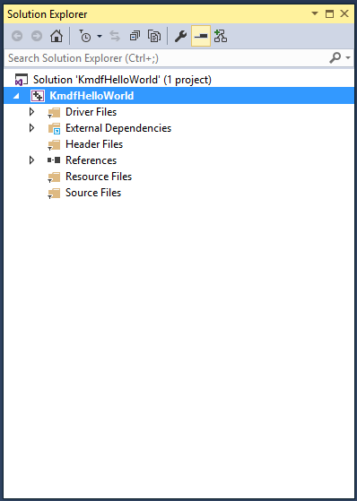
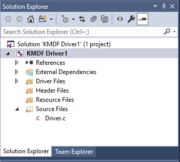

# Write a universal Hello World driver (KMDF)


This topic describes how to write a very small [Universal Windows driver](https://msdn.microsoft.com/windows-drivers/develop/getting_started_with_universal_drivers) using Kernel-Mode Driver Framework (KMDF). 

To get started, be sure you have [Microsoft Visual Studio 2015](https://go.microsoft.com/fwlink/p/?LinkId=698539) and the [Windows Driver Kit (WDK) 10](https://go.microsoft.com/fwlink/p/?LinkId=733614) installed.

[Debugging Tools for Windows](http://go.microsoft.com/fwlink/p?linkid=223405) is included when you install the WDK.

## <span id="Create_and_build_a_driver_package"></span><span id="create_and_build_a_driver_package"></span><span id="CREATE_AND_BUILD_A_DRIVER_PACKAGE"></span>Create and build a driver package


1.  Open Microsoft Visual Studio. On the **File** menu, choose **New &gt; Project**.
2.  In the **New Project** dialog box, select **WDF**.
3.  In the middle pane, select **Kernel Mode Driver, Empty (KMDF)**.
4.  In the **Name** field, enter "KmdfHelloWorld" for the project name.

    > [!NOTE]
    > When you create a new KMDF or UMDF driver, you must select a driver name that has 32 characters or less. This length limit is defined in wdfglobals.h.
     

5.  In the **Location** field, enter the directory where you want to create the new project.
6.  Check **Create directory for solution**. Click **OK**.

    

    Visual Studio creates one project and a solution. You can see them in the **Solution Explorer** window, shown here. (If the Solution Explorer window is not visible, choose **Solution Explorer** from the **View** menu.) The solution has a driver project named KmdfHelloWorld.

    

7.  In the **Solution Explorer** window, right-click **KmdfHelloWorld**, and choose **Properties**. Navigate to **Configuration Properties &gt; Driver Settings &gt; General**, and note that **Target Platform** defaults to **Universal.**

8.  In the **Solution Explorer** window, right-click **KmdfHelloWorld** and choose **Add &gt; New Item**.
9.  In the **Add New Item** dialog box, select **C++ File**. For **Name**, enter "Driver.c".

    > [!NOTE]
    > The file name extension is **.c**, not **.cpp**.

     Click **Add**. The Driver.c file is added under Source Files, as shown here.

    

## Write your first driver code

Now that you've created your empty Hello World project and added the Driver.c source file, you'll write the most basic code necessary for the driver to run by implementing two basic event callback functions. 

1. In Driver.c, start by including these headers:

    ```C++
    #include <ntddk.h>
    #include <wdf.h>
    ```

    [Ntddk.h](https://docs.microsoft.com/windows-hardware/drivers/ddi/content/ntddk) contains core Windows kernel definitions for all drivers, while [Wdf.h](https://docs.microsoft.com/windows-hardware/drivers/ddi/content/_wdf) contains definitions for drivers based on the Windows Driver Framework (WDF). 

2. Next, provide declarations for the two callbacks you'll use:

    ```C++
    DRIVER_INITIALIZE DriverEntry;
    EVT_WDF_DRIVER_DEVICE_ADD KmdfHelloWorldEvtDeviceAdd;
    ```

3. Use the following code to write your *DriverEntry*:

    ```C++
    NTSTATUS 
    DriverEntry(
        _In_ PDRIVER_OBJECT     DriverObject, 
        _In_ PUNICODE_STRING    RegistryPath
    )
    {
        // NTSTATUS variable to record success or failure
        NTSTATUS status = STATUS_SUCCESS;
        
        // Allocate the driver configuration object
        WDF_DRIVER_CONFIG config;
        
        // Print "Hello World" for DriverEntry
        KdPrintEx(( DPFLTR_IHVDRIVER_ID, DPFLTR_INFO_LEVEL, "KmdfHelloWorld: DriverEntry\n" ));

        // Initialize the driver configuration object to register the
        // entry point for the EvtDeviceAdd callback, KmdfHelloWorldEvtDeviceAdd
        WDF_DRIVER_CONFIG_INIT(&config, 
                               KmdfHelloWorldEvtDeviceAdd
                               );

        // Finally, create the driver object
        status = WdfDriverCreate(DriverObject, 
                                 RegistryPath, 
                                 WDF_NO_OBJECT_ATTRIBUTES, 
                                 &config, 
                                 WDF_NO_HANDLE
                                 );
        return status;
    }
    ```

    [*DriverEntry*](https://docs.microsoft.com/windows-hardware/drivers/ddi/content/wdm/nc-wdm-driver_initialize) is the entry point for all drivers, like `Main()` is for many user mode applications. The job of *DriverEntry* is to initialize driver-wide structures and resources. In this example, you printed "Hello World" for *DriverEntry*, configured the driver object to register your *EvtDeviceAdd* callback's entry point, then created the driver object and returned. 

    The driver object acts as the parent object for all other framework objects you might create in your driver, which include device objects, I/O queues, timers, spinlocks, and more. For more information about framework objects, see [Introduction to Framework Objects](../wdf/introduction-to-framework-objects.md).

    > [!TIP]
    > For *DriverEntry*, we strongly recommend keeping the name as "DriverEntry" to help with code analysis and debugging.

4. Next, use the following code to write your *KmdfHelloWorldEvtDeviceAdd*:

    ```C++
    NTSTATUS 
    KmdfHelloWorldEvtDeviceAdd(
        _In_    WDFDRIVER       Driver, 
        _Inout_ PWDFDEVICE_INIT DeviceInit
    )
    {
        // We're not using the driver object,
        // so we need to mark it as unreferenced
        UNREFERENCED_PARAMETER(Driver);

        NTSTATUS status;

        // Allocate the device object
        WDFDEVICE hDevice;    

        // Print "Hello World"
        KdPrintEx(( DPFLTR_IHVDRIVER_ID, DPFLTR_INFO_LEVEL, "KmdfHelloWorld: KmdfHelloWorldEvtDeviceAdd\n" ));
        
        // Create the device object
        status = WdfDeviceCreate(&DeviceInit, 
                                 WDF_NO_OBJECT_ATTRIBUTES,
                                 &hDevice
                                 );
        return status;
    }
    ```

    [*EvtDeviceAdd*](https://docs.microsoft.com/windows-hardware/drivers/ddi/content/wdfdriver/nc-wdfdriver-evt_wdf_driver_device_add) is invoked by the system when it detects that your device has arrived. Its job is to initialize structures and resources for that device. In this example, you simply printed out a "Hello World" message for *EvtDeviceAdd*, created the device object, and returned. In other drivers you write, you might create I/O queues for your hardware, set up a *device context* storage space for device-specific information, or perform other tasks needed to prepare your device.

    > [!TIP]
    > For the device add callback, notice how you named it with your driver's name as a prefix (*KmdfHelloWorld*EvtDeviceAdd). Generally, we recommend naming your driver's functions in this way to differentiate them from other drivers' functions. *DriverEntry* is the only one you should name exactly that.

5. Your complete Driver.c now looks like this:

    ```C++
    #include <ntddk.h>
    #include <wdf.h>
    DRIVER_INITIALIZE DriverEntry;
    EVT_WDF_DRIVER_DEVICE_ADD KmdfHelloWorldEvtDeviceAdd;

    NTSTATUS 
    DriverEntry(
        _In_ PDRIVER_OBJECT     DriverObject, 
        _In_ PUNICODE_STRING    RegistryPath
    )
    {
        // NTSTATUS variable to record success or failure
        NTSTATUS status = STATUS_SUCCESS;
        
        // Allocate the driver configuration object
        WDF_DRIVER_CONFIG config;
        
        // Print "Hello World" for DriverEntry
        KdPrintEx(( DPFLTR_IHVDRIVER_ID, DPFLTR_INFO_LEVEL, "KmdfHelloWorld: DriverEntry\n" ));

        // Initialize the driver configuration object to register the
        // entry point for the EvtDeviceAdd callback, KmdfHelloWorldEvtDeviceAdd
        WDF_DRIVER_CONFIG_INIT(&config, 
                               KmdfHelloWorldEvtDeviceAdd
                               );

        // Finally, create the driver object
        status = WdfDriverCreate(DriverObject, 
                                 RegistryPath, 
                                 WDF_NO_OBJECT_ATTRIBUTES, 
                                 &config, 
                                 WDF_NO_HANDLE
                                 );
        return status;
    }

    NTSTATUS 
    KmdfHelloWorldEvtDeviceAdd(
        _In_    WDFDRIVER       Driver, 
        _Inout_ PWDFDEVICE_INIT DeviceInit
    )
    {
        // We're not using the driver object,
        // so we need to mark it as unreferenced
        UNREFERENCED_PARAMETER(Driver);

        NTSTATUS status;

        // Allocate the device object
        WDFDEVICE hDevice;    

        // Print "Hello World"
        KdPrintEx(( DPFLTR_IHVDRIVER_ID, DPFLTR_INFO_LEVEL, "KmdfHelloWorld: KmdfHelloWorldEvtDeviceAdd\n" ));
        
        // Create the device object
        status = WdfDeviceCreate(&DeviceInit, 
                                 WDF_NO_OBJECT_ATTRIBUTES,
                                 &hDevice
                                 );
        return status;
    }
    ```

6. Save Driver.c.

This example illustrates a fundamental concept of drivers: they are a "collection of callbacks" that, once initialized, sit and wait for the system to call them when it needs something. This could be a new device arrival event, an I/O request from a user mode application, a system power shutdown event, a request from another driver, or a surprise removal event when a user unplugs the device unexpectedly. Fortunately, to say "Hello World," you only needed to worry about driver and device creation.

Next, you'll build your driver.

## Build the driver

1. In the **Solution Explorer** window, right-click **Solution 'KmdfHelloWorld' (1 project)** and choose **Configuration Manager**. Choose a configuration and platform for both the driver project and the package project. For this exercise, we choose Debug and x64.

2. In the **Solution Explorer** window, right-click **KmdfHelloWorld** and choose **Properties**. In **Wpp Tracing &gt; All Options**, set **Run Wpp tracing** to **No**. Click **Apply** and then **OK**.
3. To build your driver and create a driver package, choose **Build Solution** from the **Build** menu. Visual Studio shows the build progress in the **Output** window. (If the **Output** window is not visible, choose **Output** from the **View** menu.) When you have verified that the solution built successfully, you can close Visual Studio.
4. To see the built driver, in File Explorer, go to your **KmdfHelloWorld** folder, and then to **C:\\KmdfHelloWorld\\x64\\Debug**. The folder includes:

    -   KmdfHelloWorld.sys -- the kernel-mode driver file
    -   KmdfHelloWorld.inf -- an information file that Windows uses when you install the driver
    -   KmdfHelloWorld.cat -- a catalog file that the installer uses to verify the test signature for the driver package

## <span id="Deploy_and_install_the_driver"></span><span id="deploy_and_install_the_driver"></span><span id="DEPLOY_AND_INSTALL_THE_DRIVER"></span>Deploy and install the driver

Typically when you test and debug a driver, the debugger and the driver run on separate computers. The computer that runs the debugger is called the *host computer*, and the computer that runs the driver is called the *target computer*. The target computer is also called the *test computer*.

So far you've used Visual Studio to build a driver on the host computer. Now you need to configure a target computer. Follow the instructions in [Provision a computer for driver deployment and testing (WDK 10)](provision-a-target-computer-wdk-8-1.md). Then you can deploy, install, load, and debug your driver:

1.  On the host computer, open your solution in Visual Studio. You can double-click the solution file, KmdfHelloWorld.sln, in your KmdfHelloWorld folder.
2.  In the **Solution Explorer** window, right-click the **KmdfHelloWorld** project, and choose **Properties**.
3.  In the **KmdfHelloWorld Property Pages** window, go to **Configuration Properties &gt; Driver Install &gt; Deployment**, as shown here.
4.  Check **Remove previous driver versions before deployment**.
5.  For **Target Device Name**, select the name of the computer that you configured for testing and debugging. In this exercise, we use a computer named MyTestComputer.
6.  Select **Hardware ID Driver Update**, and enter the hardware ID for your driver. For this exercise, the hardware ID is Root\\KmdfHelloWorld. Click **OK**.

    

    >[!NOTE]
    > In this exercise, the hardware ID does not identify a real piece of hardware. It identifies an imaginary device that will be given a place in the [device tree](device-nodes-and-device-stacks.md) as a child of the root node. For real hardware, do not select **Hardware ID Driver Update**; instead, select **Install and Verify**. You'll see the hardware ID in your driver's information (INF) file. In the **Solution Explorer** window, go to **KmdfHelloWorld &gt; Driver Files**, and double-click KmdfHelloWorld.inf. The hardware ID is located under \[Standard.NT$ARCH$\].

    ```C++
    [Standard.NT$ARCH$]
    %KmdfHelloWorld.DeviceDesc%=KmdfHelloWorld_Device, Root\KmdfHelloWorld
    ```


7.  On the **Debug** menu, choose **Start Debugging**, or press **F5** on the keyboard.
8.  Visual Studio first shows progress in the **Output** window. Then it opens the **Debugger Immediate** window and continues to show progress.

    Wait until your driver has been deployed, installed, and loaded on the target computer. This might take a minute or two.

9.  On the **Debug** menu, choose **Break All**. The debugger on the host computer will break into the target computer. In the **Debugger Immediate** window, you can see the kernel debugging command prompt: **kd&gt;**.

    

10. At this point, you can experiment with the debugger by entering commands at the **kd&gt;** prompt. For example, you could try these commands:

    -   [lm](http://go.microsoft.com/fwlink/p?linkid=399236)
    -   [.sympath](http://go.microsoft.com/fwlink/p?linkid=399238)
    -   [.reload](http://go.microsoft.com/fwlink/p?linkid=399239)
    -   [x KmdfHelloWorld!\*](http://go.microsoft.com/fwlink/p?linkid=399240)

11. To let the target computer run again, choose **Continue** from the **Debug** menu.
12. To stop the debugging session, choose **Stop Debugging** from the **Debug** menu.

## <span id="related_topics"></span>Related topics


[Developing, Testing, and Deploying Drivers](http://go.microsoft.com/fwlink/p?linkid=399234)

[Debugging Tools for Windows](http://go.microsoft.com/fwlink/p?linkid=223405)

[Write your first driver](writing-your-first-driver.md)